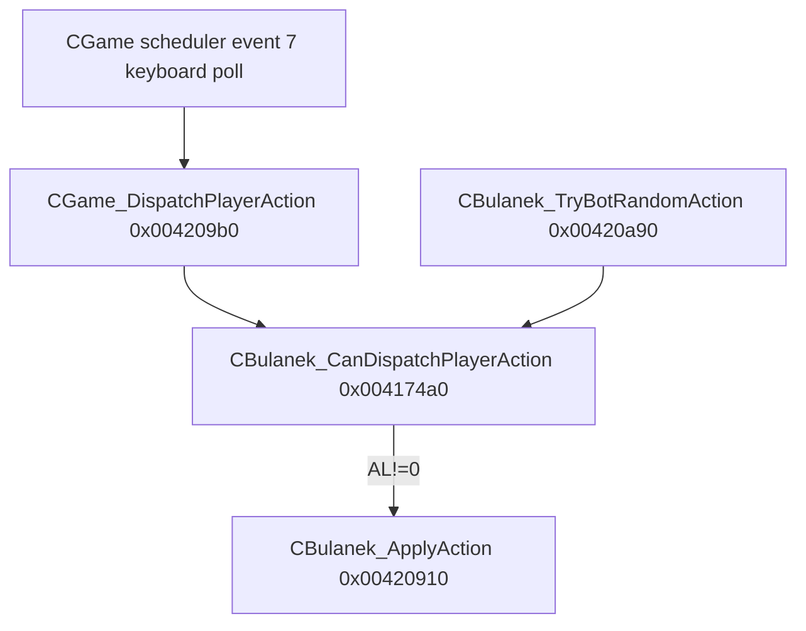

# Round 11 — Task 08 report

## Task

| Field | Value |
|-------|-------|
| **id** | 8 |
| **worker** | 08 / 30 |
| **title** | `CBulanek_CanDispatchPlayerAction` — action gating |
| **archetype** | `core_input` |
| **seed_address** | `0x004174a0` |
| **acceptance** | All rejection conditions per action index; knockdown, ammo, anim band flags with field offsets |

## Status

**DONE** — Live Ghidra MCP decompile + 29-instruction disasm proof @ `0x004174a0`–`0x004174fa`. Two caller xrefs verified. All six action indices mapped to allow/reject predicates. Knockdown (`+0x16A`), ammo (`+0x11C..`), and knockdown anim band (`CBulanek_IsInKnockdownAnimBand`) are **not** tested in this function — documented with downstream sites.

## AI archetype

`core_input` — shared gate for **every** `CBulanek` entity before `CBulanek_ApplyAction`: local keyboard (`CGame_DispatchPlayerAction`), AI bots (`CBulanek_TryBotRandomAction`), and any future caller. No `bIsAiVariant` / slot-kind branch inside the gate.

## Algorithm

### Prototype

```c
uint __thiscall CBulanek_CanDispatchPlayerAction(CBulanek *this, int actionIndex, char pressed);
```

| Arg | Stack | Meaning |
|-----|-------|---------|
| `this` | ECX | `CBulanek *` |
| `actionIndex` | `[ESP+4]` | `0..5` in normal callers (`EAX` at entry) |
| `pressed` | `[ESP+8]` | `0` = release, non-zero = press |

**Return:** low byte `AL` — `1` = dispatch allowed, `0` = rejected. Callers test `(char)result != 0` only (`CGame_DispatchPlayerAction@0x004209d3`, `TryBotRandomAction@0x00420b16`).

**Size:** `0x5a` (90 B) per `mapping.csv`.

### Pseudocode (proven)

```
CanDispatch(this, action, pressed):
  if ( (byte)(this->dwView_flags @ +0x44) & 1 ) == 0:
    return 0                                    // dead / hidden entity

  if action == 4 OR action == 5:                 // fire / weapon cycle
    if pressed == 0: return 0                   // releases never pass
    if this->pWeapon @ +0xF8 == NULL: return 0
    slot = Scheduler_GetEventSlot(&pWeapon->trackManager.scheduler, 0)
         // LEA ECX,[EAX+0xc] @ 0x004174e7 — weapon+0x08 TM + 0x04 sched
    if (slot == NULL) OR ((byte)(slot+8) & 1) == 0: return 0
    return 1                                    // fire-delay cooldown complete (armed)

  // actions 0..3 (and any other index not 4/5)
  if pressed != 0: return 1                     // press always OK when alive
  if action >= 0 AND action == this->videoTrackManager.nCurrentTrackIdx @ +0xD4:
    return 1                                    // release only current walk track
  return 0
```

### Per-action rejection matrix

| `actionIndex` | Role | **Allow** when | **Reject** when |
|---------------|------|----------------|-----------------|
| **0** | Walk left / track 0 | `(+0x44)&1` AND (press OR release with `action==nCurrentTrackIdx@+0xd4`) | Hidden/dead; release while on different track |
| **1** | Walk right / track 1 | same | same |
| **2** | Walk down / track 2 | same | same |
| **3** | Walk up / track 3 | same | same |
| **4** | Primary fire | `(+0x44)&1` AND press AND `pWeapon@+0xf8` AND weapon sched slot **0** armed (`slot+8` bit0) | Dead; release; no weapon; fire-delay active (slot disarmed) |
| **5** | Cycle weapon | same as action 4 | same as action 4 |

**Press vs release (`pressed` @ `[ESP+8]`):**

| Branch | Press (`!=0`) | Release (`==0`) |
|--------|---------------|-----------------|
| 0..3 | Always allowed (if alive bit) | Only if `actionIndex == nCurrentTrackIdx` |
| 4, 5 | Full weapon-sched checks | **Always rejected** |

### Global gate — alive / visible

| Field | Offset | Test | Disasm |
|-------|--------|------|--------|
| `dwView_flags` low bit | `CBulanek+0x44` | `TEST byte [ECX+0x44], 1` — must be **set** | `0x004174a0` `F6 41 44 01` |

Semantics: same bit used by `CGameView_GetWorldCollisionRect` (`view_flags & 1`), `CBulanek_OnTakeDamage` (`dwView_flags & 1` guard), and `CBulanek_TriggerPrimaryActionAndBroadcast`. Cleared when `CDSView__Hide` runs on death (`CBulanek_OnDeath`).

### Fire / weapon — scheduler slot 0 (fire-delay)

| Field | Absolute offset | Test |
|-------|-----------------|------|
| `pWeapon` | `+0xF8` | `MOV EAX,[ECX+0xf8]` @ `0x004174db`; NULL → reject |
| `pWeapon->trackManager.scheduler` | `pWeapon+0x0C` | `LEA ECX,[EAX+0xc]` @ `0x004174e7` |
| Slot 0 armed flag | `slot+0x08` bit 0 | `TEST byte [EAX+0x8], 1` @ `0x004174ef` |

**Armed semantics:** bit 0 **set** = cooldown finished, fire/cycle permitted. After fire, `Scheduler_AckSlot` clears bit 0 until delay elapses and slot re-arms (`main_menu_hover_audio.md`, R6 logic task 22).

**AI correlation:** `CBulanek_TryBotRandomAction@0x00420a90` wraps its body in the **same** weapon slot-0 armed test before calling `CanDispatch` — bots only act when fire-delay slot is armed.

### Movement — current track match on release

| Field | Offset | Test |
|-------|--------|------|
| `videoTrackManager.nCurrentTrackIdx` | `CBulanek+0xD4` (= `+0xA8` embed `+0x2C`) | `CMP EAX, [ECX+0xd4]` @ `0x004174c4` |

Release of a movement key that does **not** match the active walk track is ignored — prevents stopping a facing the player is no longer holding.

### Fields **not** gated here (downstream)

Acceptance asks for knockdown / ammo / anim band — these are enforced **after** `CanDispatch` returns true:

| Concern | Field / fn | Offset | Where gated |
|---------|------------|--------|-------------|
| Hit stun / knockdown lock | `bHitStun` | `+0x16A` | `CBulanek_SetFacingTrack@0x004197b0` — early-out if `!=0` |
| Knockdown anim band | `CBulanek_IsInKnockdownAnimBand` | reads `bPlayerSlot@+0x70` | `CBulanek_OnTakeDamage@0x0041db00` (pain facing only); **not** input gate |
| Corpse / dead body | `pCorpseAnim` | `+0xFC` | `CBulanek_OnTakeDamage` guard |
| Ammo depletion | `bAmmoKind0` etc. | `+0x11C..` | `CWeapon::Fire`, `CBulanek_HasAmmoForCurrentWeapon@0x004173f0` |
| Fire execution | duplicate sched check | `pWeapon+0x0C` slot 0 | `CBulanek_TriggerPrimaryActionAndBroadcast@0x004208c0` re-tests armed bit |
| Match paused | `CGaming` flag | host `+0x44` | `CBulanek_OnTakeDamage` only |

**Implication for reimplementation:** `CanDispatch` is a **lightweight** alive + scheduler + track-match gate. Full combat/input validity requires chaining `ApplyAction` → `SetFacingTrack` / `TriggerPrimaryAction` / `CycleWeaponPickup`.

### Caller graph



| Caller | Address | When |
|--------|---------|------|
| `CGame_DispatchPlayerAction` | `0x004209d9` | Local player key edge → `CanDispatch(slot, action, pressed)` |
| `CBulanek_TryBotRandomAction` | `0x00420b10` | `_rand`→`0..3`, `pressed=1`, after outer weapon-slot-0 armed check |

**Bypass:** `CGaming_OnNetMsg_t0d_PlayerState@0x004209f0` calls `ApplyAction` **directly** (no `CanDispatch`) — network path assumes remote peer already validated.

## Functions table

| Symbol | Address | Role |
|--------|---------|------|
| `CBulanek_CanDispatchPlayerAction` | `0x004174a0` | **Subject** — input gate |
| `Scheduler_GetEventSlot` | `0x0042f1e0` | Sole callee — weapon sched slot 0 lookup |
| `CGame_DispatchPlayerAction` | `0x004209b0` | Keyboard caller |
| `CBulanek_TryBotRandomAction` | `0x00420a90` | AI caller |
| `CBulanek_ApplyAction` | `0x00420910` | Downstream motor (post-gate) |
| `CBulanek_TriggerPrimaryActionAndBroadcast` | `0x004208c0` | Action 4 — repeats `+0x44` + weapon sched checks |
| `CBulanek_SetFacingTrack` | `0x004197b0` | Actions 0..3 — `bHitStun@+0x16A` gate |
| `CBulanek_IsInKnockdownAnimBand` | `0x00416490` | Damage pain only |
| `CBulanek_ArmFireDelayScheduler` | `0x00417260` | Arms player sched slot 2 (AI delay); separate from weapon slot 0 |

## Struct fields

| Offset | Field | Role in `CanDispatch` |
|--------|-------|----------------------|
| `+0x44` | `dwView_flags` | Bit 0 must be set (alive/visible) |
| `+0xA8` | `videoTrackManager` | Embed base |
| `+0xD4` | `videoTrackManager.nCurrentTrackIdx` | Release match for actions 0..3 |
| `+0xF8` | `pWeapon` | Must be non-NULL for actions 4..5 |
| `+0xFC` | `pCorpseAnim` | **Not read** — corpse blocks via `+0x44` after death hide |
| `+0x16A` | `bHitStun` | **Not read** — `SetFacingTrack` blocks movement |
| `+0x11C` | `bAmmoKind0` | **Not read** — `CWeapon::Fire` path |

Weapon interior (for actions 4..5):

| CWeapon abs. | Field | Role |
|--------------|-------|------|
| `+0x08` | `trackManager` | `CDSVideoPlayer` embed |
| `+0x0C` | `trackManager.scheduler` | `Scheduler_GetEventSlot(..., 0)` target |
| slot `+0x08` bit 0 | armed flag | Fire-delay cooldown gate |

## Ghidra deltas

None — symbol `CBulanek_CanDispatchPlayerAction` and body already correct in live program. No `save_program`.

## Decomp fixes

| Issue | Live Ghidra | Correct |
|-------|-------------|---------|
| `this` type | `void *` in `_Globals::` namespace | Should be `CBulanek *` (cosmetic — offsets match) |
| Dead-path return | `return in_EAX & 0xffffff00` on `+0x44` fail | Effectively `return 0` — callers read `AL` only |
| `+0xd4` field name | Raw offset in decompile | `videoTrackManager.nCurrentTrackIdx` |

Disasm ↔ decompile verified for all branches.

## Frida

Not run — static disasm sufficient. Optional hook: `CBulanek_CanDispatchPlayerAction@0x004174a0` log `(this, action, pressed, AL)` on keyboard + bot paths.

## Remaining UNK

| Item | Status |
|------|--------|
| Whether `dwView_flags` bit 0 should be named `bViewVisible` vs `bAlive` | **Cosmetic** — behavior tied to `CDSView__Hide` on death |
| `set_function_this_type(CBulanek *)` on seed | **Deferred** — no behavior change |
| Invalid `actionIndex > 5` press path (else-branch allows press) | **Benign** — callers only pass 0..5 |
| Exact ms values re-arming weapon sched slot 0 after fire | **Weapon scheduler task** — slot 0 delay set in `CWeapon::Fire` / `DecrementWeaponAmmo` |
