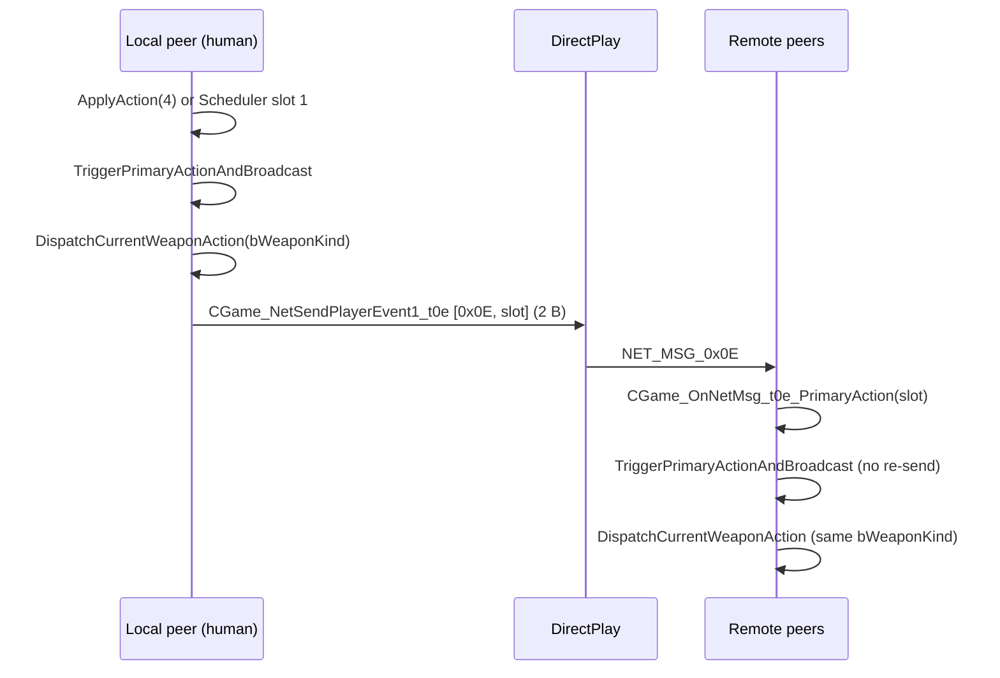

# Round 11 — AI Task 24 Report

## Task

| Field | Value |
|-------|-------|
| **id** | 24 |
| **title** | CBulanek_DispatchCurrentWeaponAction — net weapon sync |
| **archetype** | `shooting_ai` |
| **seed_address** | `0x00420721` |
| **addresses** | `0x00420650`, `0x004208c0`, `0x00420a70`, `0x004212b0` |
| **acceptance** | Switch `bWeaponKind` 0..5; pistol/grenade/mine/det MG; net `0x0E` trigger path |

## Status

**DONE** — Weapon-kind dispatch switch (`CWeapon+0x64`), full net **`0x0E`** send/recv chain, human-vs-AI broadcast gate, and deferred FLX `CWeapon::Fire` path documented with live Ghidra MCP disasm/decompile. Ghidra comments applied on `CWeapon::Fire` and `CBulanek_TriggerPrimaryActionAndBroadcast`; `save_program bulanci.exe`.

## AI archetype

`shooting_ai` — primary fire for all player-like entities (humans `0x00..0x03`, co-op vampires `0x20..0x23`, practice dummies `0x24..0x27`, campaign AI `0x7d..0x7f`). AI uses the **same** `CBulanek_TriggerPrimaryActionAndBroadcast` → `CBulanek_DispatchCurrentWeaponAction` path as humans but **does not** emit net `0x0E` (`CBulanek_IsHumanPlayer` gate).

## Algorithm

### Weapon kind switch — `CBulanek_DispatchCurrentWeaponAction@0x00420650`

```
void DispatchCurrentWeaponAction(CWeapon *weapon) {
    switch (weapon->bWeaponKind) {   // byte @ CWeapon+0x64 — disasm MOVZX EAX,[ECX+0x64]
    case 0: CWeapon_FirePistol(weapon);           return;  // → 0x0041fce0
    case 1: CWeapon_FireGrenade(weapon);          return;  // → 0x0041fdf0
    case 2: CWeapon_PlayFireAnim(weapon);         return;  // → 0x00416780 (TM_Play only)
    case 3: DetonatePlayerMines(weapon);          return;  // → 0x0041ed60
    case 4: CWeapon_FireMachineGunBurstStart(w);  return;  // → 0x00417a20
    case 5: CWeapon_PlayFireAnim(weapon);         return;  // → 0x00416780
    default: return;
    }
}
```

| Kind | HUD / table name | Immediate dispatch | Projectile / hazard |
|------|------------------|--------------------|---------------------|
| **0** | Pistol | `CWeapon_FirePistol` — ammo check, `TM_Play`, spawn `CShot` (`0xB0`, strength `0`) | Synchronous bullet |
| **1** | Special / grenade | `CWeapon_FireGrenade` — `SetAmmo(0xD)`, `TM_Play`, `CShot` strength `1` | Synchronous grenade shot |
| **2** | Mines | `CWeapon_PlayFireAnim` — `TM_Play(&trackManager,0)` only | **Deferred:** FLX opcode `0x0C` → `CWeapon::Fire` + `u16==0` spawns `CMina` (`0x118`) |
| **3** | Remote detonator | `DetonatePlayerMines` — walk `CGaming` entity list, `classId==0x816` + owner match → `_ExplodeMine` | No new entity; plays `TM_Play` if any mine exploded |
| **4** | Machine gun | `CWeapon_FireMachineGunBurstStart` — `DecrementWeaponAmmo`, `TM_Play` | **Deferred:** `CWeapon::Fire` + `u16!=0xFFFF` → burst `CShot` rows (`u16+3` strength) |
| **5** | Rocket launcher | `CWeapon_PlayFireAnim` | **Deferred:** `CWeapon::Fire` + `u16==0` → `CShot` strength `2` (explosive) |

Jump table @ `0x00420680` (disasm `JMP [EAX*4+0x420680]`). Function size **`0x2F`**.

**Seed note:** `0x00420721` lies inside `CGaming_OnCustomEvent@0x004206a0` (unrelated custom-event switch), not inside the dispatch body. Primary dispatch symbol: **`0x00420650`**.

### Primary-action orchestrator — `CBulanek_TriggerPrimaryActionAndBroadcast@0x004208c0`

```
void TriggerPrimaryActionAndBroadcast(CBulanek *player) {
    if (!(player->flags_0x44 & 1)) return;                    // alive / active bit

    slot = Scheduler_GetEventSlot(&player->pWeapon->trackManager.scheduler, 0);
    if (!(slot->armedByte & 1)) return;                       // fire-delay slot must be ARMED

    CBulanek_DispatchCurrentWeaponAction(player->pWeapon);

    if (CBulanek_IsHumanPlayer(player))
        CGame_NetSendPlayerEvent1_t0e(player->pGame, player->bPlayerSlot);
}
```

| Field | Offset | Role |
|-------|--------|------|
| Active gate | `CBulanek+0x44` bit **0** | Must be set |
| `pWeapon` | `CBulanek+0xF8` | `CWeapon*` passed to dispatch |
| Fire-delay scheduler | `pWeapon+0x0C` (`trackManager.scheduler`) slot **0** | `Scheduler_GetEventSlot`; byte at `slot+0x08` bit **0** must be **1** (armed) |
| `pGame` | `CBulanek+0xF4` | `CGame*` for net send |
| `bPlayerSlot` | `CBulanek+0x70` | Wire slot byte |

**Callers (live xrefs):**

| Address | Function | Context |
|---------|----------|---------|
| `0x00420933` | `CBulanek_ApplyAction` | Human/AI **action 4** (Fire key) |
| `0x00420a7c` | `CGame_OnNetMsg_t0e_PrimaryAction` | **Net recv `0x0E`** |
| `0x00420bb9` | `CBulanek_WeaponSchedulerCallback` | **Scheduler slot 1** (post fire-delay timer) |

### Net `0x0E` path



| Direction | Function | Address | Payload |
|-----------|----------|---------|---------|
| **Send** | `CGame_NetSendPlayerEvent1_t0e` | `0x00412b60` | `[0x0E, slot]` — **2 bytes**; weapon kind **not** on wire |
| **Recv** | `CGame_OnNetMsg_t0e_PrimaryAction` | `0x00420a70` | `CGaming_GetObjectAtSlotUnchecked(game, slot)` → `TriggerPrimaryActionAndBroadcast` |

Weapon kind is implicit on all peers — already mirrored via `0x0D` player-state / `0x0C` weapon-loadout (`CBulanek_ApplyPickupEffect` → `CGame_NetSendDamage_t0c`). Bullet/mine spawns that need deterministic coords may additionally use **`0x0F`** (`CGame_NetSendShotSpawn_t0f`) from hit/spawn helpers (separate from this task).

### Deferred spawn — `CWeapon::CWeapon_Fire@0x004212b0`

FLX **opcode `0x0C`** (`BroadcastFrameTimeHint`) invokes IDSChained **vfn[4]** on the weapon overlay. **`param_2` (`u16`)** semantics (R4 task 31):

| `byte @+0x60` | `u16 param_2` | Effect |
|---------------|---------------|--------|
| `2` | `0` | `CMina` alloc `0x118`, `AddEntity`, `DecrementWeaponAmmo`; bot slots `>3` may self-damage |
| `4` | `!= 0xFFFF` | `CShot` spawn; strength = `(u16 + 3)`; `SetAmmo` cooldown |
| `5` | `0` | `CShot` strength `2`; `SetAmmo(7)` |
| any | `0xFFFF` | Empty-ammo UI (`PostMessage 0xD9`), bot `TryBotRandomAction` / `OnTakeDamage` branches |

**Decomp fix:** Dispatch reads **`bWeaponKind @ +0x64`**; `CWeapon::Fire` disasm reads **`byte @ +0x60`** (`CMP [ESI+0x60], imm`). Ghidra labels the dword `dwParamB`. Sole static **write** to `+0x60` is **zero** in `CWeapon_ctor@0x0041dc15`. Runtime mirror of kind into `+0x60` before FLX callback is **UNK** (see Remaining UNK).

### Per-kind immediate callee summary

| Callee | Address | Key behavior |
|--------|---------|--------------|
| `CWeapon_FirePistol` | `0x0041fce0` | `CBulanek_HasAmmoForCurrentWeapon`; on success `SetAmmo(0x15)`, spawn `CShot` at facing offsets `gAPlayerSkinPaletteIds[dir*2+4..5]` |
| `CWeapon_FireGrenade` | `0x0041fdf0` | `SetAmmo(0xD)`, offsets `gAPlayerSkinPaletteIds[dir*2+0xC..0xD]`, `CShot` strength `1` |
| `CWeapon_PlayFireAnim` | `0x00416780` | `TM_Play(pWeapon+0x08, 0)` — arms FLX fire frames |
| `DetonatePlayerMines` | `0x0041ed60` | Iterate `CGaming+0x31C` children; `classId 0x816` + `owner==pOwner`; `_ExplodeMine` |
| `CWeapon_FireMachineGunBurstStart` | `0x00417a20` | `DecrementWeaponAmmo`, `TM_Play` — pellets from FLX `Fire` |

## Functions table

| Address | Ghidra name | Role | Evidence |
|---------|-------------|------|----------|
| `0x00420650` | `CBulanek_DispatchCurrentWeaponAction` | **Seed logic.** `switch(bWeaponKind)` 0..5 | Disasm `MOVZX [ECX+0x64]`; jump table `0x420680` |
| `0x004208c0` | `CBulanek_TriggerPrimaryActionAndBroadcast` | Gate + dispatch + human net send | Xrefs: ApplyAction, net recv, scheduler |
| `0x00420a70` | `CGame_OnNetMsg_t0e_PrimaryAction` | Recv `0x0E` → slot → trigger | 2-byte must-match |
| `0x00412b60` | `CGame_NetSendPlayerEvent1_t0e` | Send `0x0E` | `CDSDirectPlay_Send(..., 2)` |
| `0x004212b0` | `CWeapon::CWeapon_Fire` | FLX deferred mine/MG/rocket | vtable `0x481ed4` slot 4 |
| `0x00420910` | `CBulanek_ApplyAction` | Action **4** → trigger | `player_controls.md` |
| `0x00420b30` | `CBulanek_WeaponSchedulerCallback` | Slot **1** → trigger | AI tournament fire-delay path |
| `0x004174a0` | `CBulanek_CanDispatchPlayerAction` | Fire (action 4) requires slot 0 armed | Same scheduler gate as trigger |
| `0x00416630` | `CBulanek_GetActiveWeaponKind` | Reads `pWeapon+0x64` | `*(pWeapon+100)` |

## Struct fields

| Object | Offset | Name | Dispatch / net use |
|--------|--------|------|-------------------|
| `CWeapon` | `+0x64` | `bWeaponKind` | **Dispatch switch** (kinds 0..5) |
| `CWeapon` | `+0x60` | `dwParamB` | **`CWeapon::Fire` kind gate** (low byte); walk-sync cache |
| `CWeapon` | `+0x08` | `trackManager` | `TM_Play` / FLX fire tracks |
| `CWeapon` | `+0x54` | `pOwner` | `CBulanek*` for ammo, spawn |
| `CBulanek` | `+0xF8` | `pWeapon` | Dispatch target |
| `CBulanek` | `+0x44` | flags | Bit 0 = can act |
| `CBulanek` | `+0x70` | `bPlayerSlot` | Net `0x0E` slot byte |

## Ghidra deltas

| Action | Target | Result |
|--------|--------|--------|
| `set_decompiler_comment` | `0x004212b0` | `+0x60` vs `+0x64` kind-field distinction |
| `set_decompiler_comment` | `0x004208c0` | Gate conditions + three caller paths |
| `save_program` | `bulanci.exe` | saved |

## Decomp fixes

| Issue | Stale / wrong | Live proof | Fix |
|-------|---------------|------------|-----|
| Dispatch kind field | net_protocol “player+0x64” | `MOVZX [ECX+0x64]` @ `0x00420650` | Confirmed `CWeapon.bWeaponKind` |
| `CWeapon::Fire` kind field | Docs say “kind” generically | `CMP [ESI+0x60]` @ `0x004212d8` | Use **`dwParamB` low byte**, not `bWeaponKind` |
| Seed address | Task lists `0x00420721` | `get_function` → `CGaming_OnCustomEvent` | Use **`0x00420650`** for dispatch |

## Frida

**none** — static MCP disasm/decompile closes dispatch and net paths. Recommended if closing UNK: hook `CWeapon::Fire@0x004212b0` and log `*(byte*)(weapon+0x60)` vs `*(byte*)(weapon+0x64)` on mine/MG fire frames.

## Remaining UNK

| Item | Why open |
|------|----------|
| `dwParamB` runtime kind mirror | Only ctor write to `+0x60` is zero; `Fire` branches need `2/4/5` at `+0x60` — static writer not found |
| `0x0F` pairing | Which dispatch kinds also emit shot-spawn on human fire (pistol path spawns locally without auditing send in this pass) |
| Seed `0x00420721` | Misaligned with dispatch fn; treat `0x00420650` as canonical |

## Cross-links

- [CWeapon.md](../struct_recovery/CWeapon.md) — layout `+0x64 bWeaponKind`
- [net_protocol.md](../../netcode/net_protocol.md) — `0x0E` / `0x0F` table
- [player_controls.md](../player_controls.md) — action 4 = Fire
- [r11_ai_task_01_report.md](./r11_ai_task_01_report.md) — scheduler slot 1 fire
- [round4_task_31_report.md](../struct_recovery/round4_task_31_report.md) — `CWeapon::Fire` `u16` matrix
