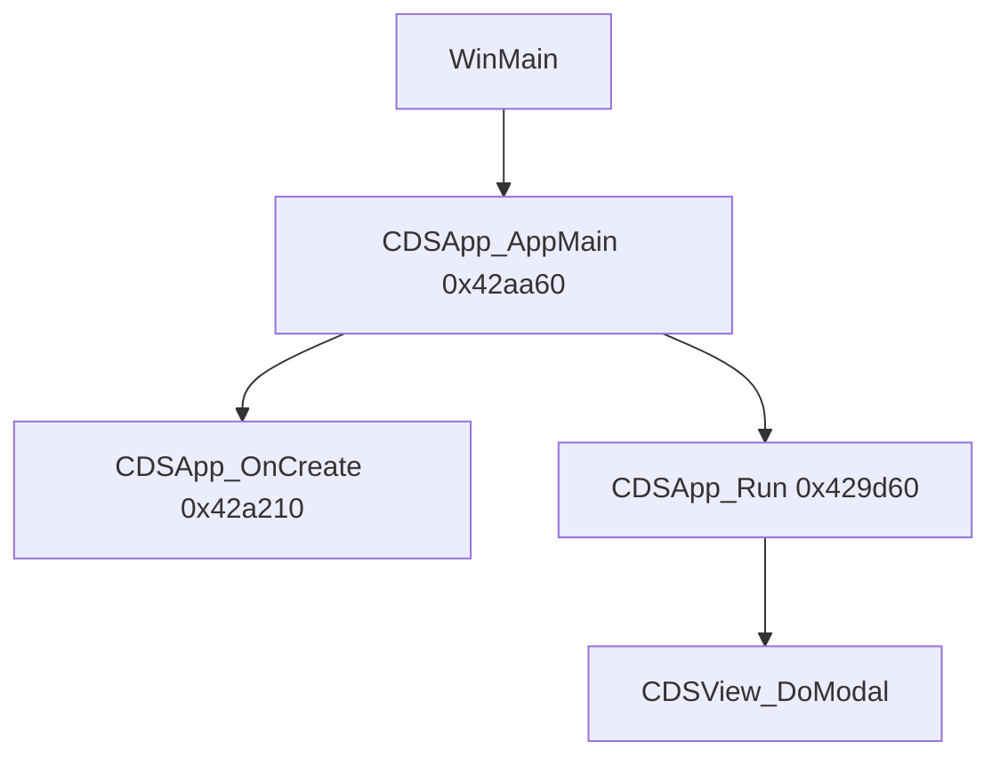

# Round 10 deep — Task 04 Report

## Task

| Field | Value |
|-------|-------|
| **id** | 4 |
| **title** | R6 rerun: sim slice 0x00429d60–0x0042ab28 |
| **kind** | logic_rerun |
| **prior** | R6 task 13 (`round6_logic_task_13_report.md`) |
| **seed** | `0x00429d60` |
| **range** | `0x00429d60`–`0x0042ab28` (22 functions) |

## Status

**DONE** — Live Ghidra MCP re-verified all 22 functions in slice; correlated each with IDA `bulanci.ida.exe.c` at matching VA. Six R6 `FUN_*` / `Catch` symbols were already renamed in Ghidra since R6 (dirty-rect helpers, DDraw HRESULT gate, pre-render bind, SEH log writer). Applied prototype fixes + decompiler comments where IDA/disasm proof contradicted stale Ghidra types; `save_program bulanci.exe` committed.

## Functions / Struct

| Address | Ghidra name | Classification | Evidence |
|---------|-------------|----------------|----------|
| `0x00429d60` | `CDSApp_Run` | **App shell** — CBulanci vtable[29] modal pump entry | Live decomp; IDA `sub_429D60`; DATA xref vftable; calls `CDSView_DoModal` → `CDSView_SetActive(0)` / `SetModalEligible(0)`; returns modal exit `uint16` |
| `0x00429d90` | `CGaming_ClearSchedulerSlotFlags` | **Scheduler** — clear bit2 across 256 B at `param+0x200` | Live decomp; IDA `sub_429D90` (`*result &= ~4` loop); **xref** `CGame_NetSendRoundResult@0x004131bb` → `CGaming_ClearSchedulerSlotFlags((int)pEntitySlots[0x49])` |
| `0x00429db0` | `CDSApp_DispatchInputEvent` | **Input router** — keyboard vs mouse on `CDSApp*` | Live decomp; IDA `sub_429DB0`; `pKeyDownBitmap` @ `+0xF0`, `g_pModalFocus` / `g_pInputChainHead` vtbl walks |
| `0x00429f70` | `CGaming_SyncKeyLatchAfterModal` | **Input latch replay** after pre-match modal | Live decomp; IDA `sub_429F70`; **xref** `CGaming_RunPreMatchModal@0x0041c4d3` → `CGaming_SyncKeyLatchAfterModal(g_pApp, local_120)`; diff `param_1` vs `this+0x100`, `CDSApp_KeybQueue` on bit0/bit1 edges |
| `0x0042a000` | `CDSView_OnKeyDown` | **View override** — ALT+X → `EndModal(0x8004)` | Live decomp; IDA `sub_42A000`; vtable slot 22 per `app_shell.md` |
| `0x0042a040` | `TArray16_ZeroRange` | **Vector util** — zero `param_2` × 16-byte records | Live decomp; IDA `sub_42A040`; callee of `CDSApp_DirtyRectList_SetSize` |
| `0x0042a070` | `CDSApp_DirtyRectList_FindIndex` | **Dirty-rect vector** — linear or binary search on 16 B `RECT` records | Live decomp; IDA `sub_42A070`; **xref** `CDSApp_DirtyRectList_UpsertRect@0x0042ae70` |
| `0x0042a130` | `CDSApp_DirtyRectList_SlideRecords` | **Dirty-rect vector** — memmove tail for insert | Live decomp; IDA `sub_42A130`; **xref** `CDSApp_DirtyRectList_InsertAt@0x0042ac4a` |
| `0x0042a1c0` | `CBulanci_RebuildBackBufferSurface` | **Display** — rebind `CDSBackBuffer` @ `CDSApp+0x7c` | Live decomp; IDA `sub_42A1C0` on `this+124`; **sole xref** `CBulanci_ResizeClientAndDisplayMode@0x0042a49c` |
| `0x0042a210` | `CDSApp_OnCreate` | **Boot** — vtable[28]: window class, `InitDirectDraw`, `CDSDirectSound_InitPrimary` @ `+0x200` | Live decomp; IDA `sub_42A210`; `app_shell.md` §OnCreate |
| `0x0042a330` | `CBulanci_ResizeClientAndDisplayMode` | **Display** — mode enum fallback 6→5→4, DInput surface, calls rebuild | Live decomp; IDA `sub_42A330`; **xrefs** `CBulanci_OnCreate@0x00402b97`, `CDSApp_SetWindowed@0x0042a543` |
| `0x0042a500` | `CDSApp_SetWindowed` | **Display** — fullscreen/windowed toggle (`bWindowed` @ `+0xe4`) | Live decomp; IDA `sub_42A500`; caller `CDSApp_WndProcDispatch` WM_SYSKEYUP VK_RETURN |
| `0x0042a550` | `CBulanci_HandleDirtyRectBitBltHresult` | **Render** — HRESULT gate after `BitBlt` in flush path | Live decomp; IDA `sub_42A550`; **xrefs** `CDSApp_FlushDirtyRects@0x0042bb5b`, `0x0042bbbc` |
| `0x0042a590` | `CDSApp_TryBindBackBufferSurface` | **Render** — pre-frame back-buffer bind / surface-restore retry | Live decomp; IDA `sub_42A590`; **xref** `CDSApp_RenderFrame@0x0042bc1f` |
| `0x0042a5c0` | `CDSApp_MouseQueue` | **Input** — pack Win32 mouse → 20 B `CDSEventRecord`, windowed rescale | Live decomp; IDA `sub_42A5C0`; WndProc `0x200`–`0x206` via `CDSApp_WndProcDispatch` |
| `0x0042a660` | `CDSApp_WndProcDispatch` | **App shell** — vtable[32] WM_* → Keyb/Mouse queue, destroy, ALT+ENTER | Live decomp; IDA `sub_42A660`; `app_shell.md` WndProc table |
| `0x0042a910` | `CDSApp_DirtyRectList_SetSize` | **Dirty-rect vector** — resize 16 B array (`param<<4` realloc) | Live decomp; IDA `sub_42A910` region; global `DAT_004b7c94` dirty list |
| `0x0042a980` | `CDSApp_DirtyRectList_EnsureCapacity` | **Dirty-rect vector** — grow before insert | Ghidra sig; paired with `InsertAt@0x0042ac20` (task 14) |
| `0x0042a9c0` | `Catch_0042ab28_WriteExceptionLog` | **SEH / logging** — write exception text to `%s.txt` stream | Live decomp; IDA `sub_42A9C0`; **xref** `Catch@0042ab28@0x0042ab8d` |
| `0x0042aa30` | `CDSMouse_Factory` | **Factory** — `OperatorNew(0x0C)`, class id 0x1d vtables | Live decomp; IDA `sub_42AA30`; registry-only (no code xrefs) |
| `0x0042aa60` | `CDSApp_AppMain` | **Boot** — `CoInitialize` → factory → vtbl SetCmdLine/OnCreate/Run/dtor | Live decomp; IDA `sub_42AA60`; `main_menu.md` WinMain chain |
| `0x0042ab28` | `Catch@0042ab28` | **SEH unwind** on `CDSApp_AppMain` startup | Live decomp; EH table; pairs `Catch_0042ab28_ShowMessageAndRelease` (task 14) |

### Boot → pump (reconfirmed)

## Ghidra deltas

| Action | Target | Rationale |
|--------|--------|-----------|
| `set_function_prototype` | `0x00429d60` | `ushort CDSApp_Run(void)` **`__thiscall`** — was `__fastcall CDSView*`; IDA `sub_429D60` + vtable slot 29 |
| `set_function_prototype` | `0x0042a590` | `uchar CDSApp_TryBindBackBufferSurface(void)` **`__thiscall`** — was `__fastcall` global; ECX=`CDSApp*` per render caller |
| `set_decompiler_comment` | `0x00429d60`, `0x00429d90`, `0x00429f70`, `0x0042a590` | Document vtable role, scheduler bank caller, `g_pApp` latch replay, render gate |
| `force_decompile` | above + prior batch | Refresh decompiler cache |
| `save_program` | `bulanci.exe` | Persist batch |

**Not applied:** `set_function_this_type` — tool unavailable in current MCP bridge; `CGaming_SyncKeyLatchAfterModal` still decompiles `this` as `CGaming*` though caller passes `g_pApp` (documented in plate comment).

**No new renames** — all slice symbols already carry xref-backed names from R5–R6 passes; live xrefs confirm:

- `CDSApp_DirtyRectList_FindIndex` ← `UpsertRect@0x0042ae70`
- `CDSApp_DirtyRectList_SlideRecords` ← `InsertAt@0x0042ac4a`
- `CBulanci_HandleDirtyRectBitBltHresult` ← `FlushDirtyRects@0x0042bb5b`
- `CDSApp_TryBindBackBufferSurface` ← `RenderFrame@0x0042bc1f`
- `Catch_0042ab28_WriteExceptionLog` ← `Catch@0042ab28@0x0042ab8d`

## Decomp corrections (IDA vs Ghidra)

| VA | Issue | Resolution |
|----|-------|------------|
| `0x00429d60` | Ghidra had `__fastcall CDSView*` | Fixed to `__thiscall ushort CDSApp_Run(CBulanci*)`; matches IDA `sub_429D60` callees `sub_42D1A0`/`sub_42C290`/`sub_42BED0` |
| `0x00429d90` | IDA `__thiscall char*` on object; Ghidra `__fastcall int` | Both agree on `+0x200` 256-byte `&=~4` loop; param is `pEntitySlots[0x49]` bank pointer, not `CGaming::this` |
| `0x00429f70` | Ghidra `CGaming* this` uses `pEntitySlots+0xe` shadow | IDA `this+256` (`+0x100`); caller passes **`g_pApp`** — shadow is `keyLatchByVk@+0x100`; comment applied, `this` type blocked by API |
| `0x0042a1c0` vs `0x0042a330` | R6 manifest/`CDSBackBuffer.md` naming swap | **Resolved:** `0x0042a1c0`=rebuild (1 xref from resize tail); `0x0042a330`=resize (callers OnCreate/SetWindowed) |
| `0x0042a590` | Was `__fastcall` free function | Fixed `__thiscall`; IDA `sub_42A590(int this)` uses `this` for `RestoreLostSurfaces` |
| `0x0042a9c0` | R6 labeled “DirectX helper” | Live decomp + IDA `sub_42A9C0` = wide-string exception log writer in SEH path, not DDraw |

## Frida

**none** — static xref + IDA correlation sufficient for app-shell / input / dirty-rect / display slice.

## Remaining UNK

| Item | Reason |
|------|--------|
| `CGaming_ClearSchedulerSlotFlags` `param+0x200` field name | Proven 256 B bit-2 clear on scheduler bank from `pEntitySlots[0x49]`; struct member name not in RTTI |
| `CGaming_SyncKeyLatchAfterModal` `this` type in decompiler | `set_function_this_type` unavailable; behavior proven via IDA + caller `g_pApp` |
| `CDSApp_DirtyRectList_*` `this` as `void*` | Global dirty list `DAT_004b7c94`; no `CDSApp+0x254` struct field typing without struct pass |
| `Catch@0042ab28` fault taxonomy | EH frame only; handler body in task 14 sibling |

## Cross-links

- [round6_logic_task_13_report.md](../logic_recovery/round6_logic_task_13_report.md) — prior PARTIAL pass
- [round6_logic_task_14_report.md](../logic_recovery/round6_logic_task_14_report.md) — dirty-rect insert/search consumers
- [round6_logic_task_15_report.md](../logic_recovery/round6_logic_task_15_report.md) — render flush / `TryBindBackBufferSurface`
- [app_shell.md](../app_shell.md) — pump, WndProc, input dispatch
- [CDSBackBuffer.md](../struct_recovery/CDSBackBuffer.md) — rebuild @ `0x0042a1c0`
