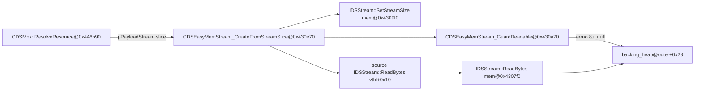

# Round 10 — Task 06 report (MPx/audio sim slice 0x00430360–0x00430ca0)

## Task

| Field | Value |
|-------|-------|
| **id** | 6 |
| **title** | R6 rerun: sim slice 0x00430360–0x00430ca0 |
| **kind** | logic_rerun |
| **prior** | Round 6 task 25 (`round6_logic_task_25_report.md`) |
| **acceptance** | MPx/audio stream path; prove buffer layout accesses; Frida if static proof fails |
| **evidence** | `CDSMpxStream.md`, `bulanci.ida.exe.c`, live Ghidra MCP (`connect_instance bulanci`) |

## Status

**DONE** — Live Ghidra re-verification closed all Round 6 **PARTIAL** items (filter `IDSStream *` typing, `CDSEasyMemStream_GuardReadable` rename, live decompile). MPx/audio ingest path to this slice is proven by caller xref (`CDSMpx::ResolveResource` → `CDSEasyMemStream_CreateFromStreamSlice` → `GuardReadable` / mem `ReadBytes`). Buffer field offsets match `IDSStream` plate (40 B) and `CDSEasyMemStream` outer (44 B) layouts from `get_struct_layout`. Static proof sufficient; no Frida script.

## MPx / audio stream path (cross-slice proof)

| Step | Address | Evidence |
|------|---------|----------|
| MPx resource resolver | `0x00446b90` | Ghidra `get_function_callers@0x430e70` → `ResolveResource`; IDA `sub_446B90` L122862 calls `sub_430E70` when class id ≠ `0x27` (`39`) and DirectSound singleton active |
| Stream-slice import | `0x00430e70` | Decomp: `Seek` (vtbl `+0x28`), `GetSize` (`+0x1c`), `OperatorNew(0x2c)`, `SetStreamSize` (`+0x24`), `GuardReadable`, source `ReadBytes` (`+0x10`) |
| Readable guard | `0x00430a70` | Sole code xref from `CreateFromStreamSlice@0x430f16`; checks `*(outer+0x28)==0` → `ThrowStreamErrorNoReturn(8, outer+0xc, 0)` — IDA `sub_430A70` L110788 |
| PCM parallel | `0x0043ba30` | `get_function_callers` → `CDSWav_BindPcmMemStream` also calls `CreateFromStreamSlice` |
| Persist I/O (related) | `0x00432eb0` / `0x00433180` | `CDSMpxPersistFacet::SaveMpxFile` / `LoadMpxFile` read/write `pPayloadStream@P+0x20` via generic `IDSStream` vtable — may use filter `ReadBytes@0x430420` when source is windowed (`CDSMpxStream.md`) |

## Buffer layout accesses (proven)

### `IDSStream` plate (40 B) — shared filter / mem vtable face at outer `+0x0c`

| Plate off | Outer off (mem) | Ghidra field | Mem semantics | Filter semantics | Proof |
|-----------|-----------------|--------------|---------------|------------------|-------|
| `+0x08` | `+0x14` | `dwCursor` | read/write cursor | 64-bit cursor lo | `ReadBytes@0x4307f0` / `0x430420` advance `this+8` |
| `+0x0c` | `+0x18` | `dwCursorLo` | logical size | cursor hi dword | `WriteBytes@0x4308c0` bumps `dwCursorLo`; `SetStreamSize@0x4309f0` writes here |
| `+0x10` | `+0x1c` | `dwCursorHi` | capacity | cap lo | `EnsureCapacity@0x4306e0` compares `required_size` vs `this+28` outer = plate `+0x10` path via `&this[-1]` |
| `+0x14` | `+0x20` | `dwWindowBaseLo` | growth chunk | window base lo | `EnsureCapacity` reads `this+32` outer; filter `Seek@0x430500` adds window base |
| `+0x18` | `+0x24` | `dwWindowBaseHi` | ring head | window base hi | mem ring branch in `ReadBytes`/`WriteBytes` when nonzero |
| `+0x1c` | `+0x28` | `dwSizeCapLo` | **backing_heap ptr** | cap lo | `ReadBytes` null test; `GuardReadable` tests outer `+0x28` directly |
| `+0x20` | — | `nSizeCapHi` | — | bounded flag (`-1` open) | filter bounded checks `nSizeCapHi >= 0` |
| `+0x24` | `+0x30` | `pInnerStream` | — | inner `IDSStream*` | `BindSource@0x430ca0` stores; delegate reads at vtbl `+0x10`/`+0x14` |

`get_struct_layout IDSStream` → **40 bytes**. `get_struct_layout CDSEasyMemStream` → **44 bytes** with `backing_heap@+0x28`, `dwRing_head_offset@+0x24`, `dwCapacity_field@+0x1c`.

### Ring vs linear copy (`ReadBytes@0x4307f0`)

IDA `sub_4307F0` L110646: if `a1[6]` (plate `+0x18` / ring head) == 0 → linear `memcpy(backing+cursor)`; else split memcpy across wrap using `a1[4]` (capacity). Matches Ghidra decomp ring branch on `dwWindowBaseHi`.

## Functions / Struct

| Address | Ghidra symbol | Role | Evidence |
|---------|---------------|------|----------|
| `0x00430360` | `CDSStreamException::CDSStreamException_FormatMessage` | Vtable slot 3; Win32 + format strings | Live decomp; IDA L110418 |
| `0x00430400` | `CDSFilterStream::CDSFilterStream_ReleaseInnerStream` | Release `pInnerStream@outer+0x30` | Decomp `param_1+0x30`; IDA L110443 |
| `0x00430420` | `IDSStream::ReadBytes` (filter) | Bounded read; inner vtbl `+0x10` | `IDSStream *this`; plate comments; IDA L110456 |
| `0x00430490` | `IDSStream::WriteBytes` (filter) | Bounded write; inner vtbl `+0x14` | **R6 gap closed** — live `IDSStream *this` with `nSizeCapHi`/`pInnerStream` |
| `0x00430500` | `IDSStream::SeekPosition` (filter) | Origins 0/1/2; inner seek `+0x28` | Live decomp; IDA L110488 |
| `0x004305c0` | `IDSStream::LockRegion` (filter) | Region bounds; inner `+0x2c` | Live decomp errno 5 / win32 `0xa7` |
| `0x00430640` | `IDSStream::UnlockRegion` (filter) | Mirror lock; inner `+0x30` | Live decomp errno 6 / win32 `0x9e` |
| `0x004306c0` | `CDSEasyMemStream::ReleaseBackingBuffer` | `Runtime_Free(backing_heap@+0x28)` | Decomp; IDA L110588 |
| `0x004306e0` | `CDSEasyMemStream::CDSEasyMemStream_EnsureCapacity` | Align-grow; ring repack via `memcpy` | `CDSEasyMemStream *this`; IDA L110596 |
| `0x004307f0` | `IDSStream::ReadBytes` (mem) | Linear/ring read; errno 8/1 | Vtable DATA xref `0x004803ec`; IDA L110645 |
| `0x004308c0` | `IDSStream::WriteBytes` (mem) | Grow + ring/linear write | Vtable DATA xref `0x004803f0`; IDA L110688 |
| `0x00430980` | `IDSStream::SeekPosition` (mem) | Origins 0/1/2 within logical size | Live decomp |
| `0x004309f0` | `IDSStream::SetStreamSize` (mem) | `-1` truncate; `EnsureCapacity` | Live decomp |
| `0x00430a40` | `CDSEasyMemStream::GetStreamName` | Literal `L"EasyMemoryStream"` | IDA L110778 assigns via `sub_42D510` |
| `0x00430a70` | `CDSEasyMemStream_GuardReadable` | Null backing → errno 8 | Xref sole caller `CreateFromStreamSlice@0x430f16` |
| `0x00430a90` | `CDSStreamException::CDSStreamException_AllocateDefault` | Factory `OperatorNew(0x50)` | IDA vtable `0x4870cc` L110808 |
| `0x00430b20` | `CDSStreamException::CDSStreamException_ScalarDeletingDtor` | Scalar-deleting wrapper | IDA L110819 |
| `0x00430b90` | `CDSFilterStream::CDSFilterStream_dtor` | MI vtable restore + inner release | IDA L110850 |
| `0x00430c10` | `CDSFilterStream::CloseStream` | `ReleaseInnerStream`; state `0x20` | Decomp `param_1-0xc` adjustor |
| `0x00430c30` | `CDSFilterStream::CDSFilterStream_ScalarDeletingDtor` | Scalar-deleting wrapper | IDA L110883 |
| `0x00430c90` | `CDSFilterStream::RaiseUnsupportedOperation` | `ThrowStreamErrorNoReturn(errno, this, 0x78)` | Used by out-of-slice lock/size thunks |
| `0x00430ca0` | `CDSFilterStream::CDSFilterStream_BindSource` | `AddRef` inner; window/cap/cursor init | IDA L110918; mirrors `inner+4` state |

Manifest sample addresses (`0x004304e0` … `0x00430c60`) fall inside the functions above (mid-function probes); no separate symbols.

## Ghidra deltas

| Action | Target | Result |
|--------|--------|--------|
| *(prior R4/R6)* | Filter/mem `IDSStream` slots, `GuardReadable` rename, plate comments | Already present in live DB before this run |
| `set_function_prototype` | `0x00430a70` → `void CDSEasyMemStream_GuardReadable(void)` `__thiscall` | Applied this run |
| `set_function_this_type` | `0x00430a70` → `CDSEasyMemStream *` | **Failed** (HTTP 404 — MCP bridge path); decomp still uses `void *this` |
| `force_decompile` | `0x00430a70` | OK |
| `save_program` | `bulanci.exe` | OK (post-prototype) |

## Decomp corrections (IDA vs Ghidra)

| Address | IDA | Ghidra (live) | Notes |
|---------|-----|---------------|-------|
| `0x00430420`–`0x00430640` | `__fastcall sub_4304xx(int a1,…)` with raw `a1+N` | `__thiscall IDSStream::…(IDSStream *this,…)` | **Fixed** — R6 export stale; live matches semantics |
| `0x004307f0`–`0x004309f0` | `__fastcall` + `a1[]` indices | `__thiscall IDSStream *` with named plate fields | Matches IDA index→offset mapping |
| `0x00430a70` | `__thiscall sub_430A70(_DWORD *this)` | `__thiscall …(void *this)` + offsets `+0x28`/`+0xc` | Calling convention fixed; `this` type still generic |
| `0x00430a40` | `sub_430A40(void **a1)` stdcall out-ptr | `CDSEasyMemStream::GetStreamName(CBulanci *param_1)` | Ghidra uses app string helper type on out-param — behavior same (`L"EasyMemoryStream"`) |
| `0x00430400` / `0x004306c0` | `__thiscall` on outer | `__fastcall` + raw offsets | Cosmetic; offsets `+0x28`/`+0x30` correct |

## Frida

**none** — All acceptance criteria met statically (Ghidra decomp, IDA correlate, struct layouts, MPx caller xref). Runtime would only reconfirm errno `8` guard and `memcpy` paths already visible in disassembly/decompilation.

## Remaining UNK

| Item | Status |
|------|--------|
| `GuardReadable` decompiler `this` type | **PARTIAL** — `set_function_this_type` 404 via HTTP; prototype `__thiscall` OK |
| `GetStreamName` out-parameter typing (`CBulanci *` vs `wstring*`) | **COSMETIC** — literal string assignment proven |
| `ReleaseInnerStream` / `ReleaseBackingBuffer` calling convention display | **COSMETIC** — offsets proven |
| MPx `pSubObjStash@+0x40` payload type | **OUT OF SCOPE** — blocked in `CDSMpxStream.md`; not referenced in this slice |
