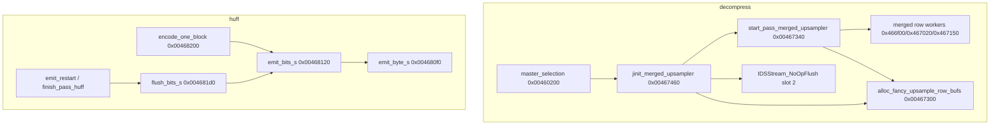

# Round 10 — Deep Task 08 Report

## Task

| Field | Value |
|-------|-------|
| **id** | 8 |
| **title** | R6 rerun: IJG slice 0x00466f00–0x004681d0 (live Ghidra apply) |
| **kind** | codec_rerun |
| **prior_round** | 6 / task 48 |
| **seed_address** | `0x00466f00` |
| **addresses** | 18 IJG decompress merged-upsampler + compressor coef/Huffman helpers (see table) |

## Status

**DONE** — Live Ghidra MCP (`connect_instance bulanci`, 2026-06-07) confirms R6 task 48 classification. Deferred IJG renames (`emit_byte_s`, `flush_bits_s`, `jinit_merged_upsampler`) were already applied in R6 apply pass; verified present with live xrefs. Fixed `CDSApp_PreCreateHook` misname → `IDSStream_NoOpFlush` + `__cdecl void` prototype + plate comment. Program saved.

## Functions / Struct

| Address | Ghidra name | IDA symbol | Role summary | Evidence |
|---------|-------------|------------|--------------|----------|
| `0x00466f00` | `merged_upsample_row_non_rgb` | `sub_466F00` | Decompress merged-upsample row worker (`num_components != 3`) | Live name; IDA `__cdecl` @ `bulanci.ida.exe.c:139314`; fn ptr install @ `start_pass_merged_upsampler` when `cinfo[0x13]==1` && `num_components!=3` |
| `0x00467020` | `h2v1_merged_upsample_rgb_row` | `sub_467020` | Merged-upsample RGB (3 components) row worker | IDA @ `139403`; sibling of `merged_upsample_row_non_rgb` |
| `0x00467150` | `h2v2_fancy_upsample_row` | `sub_467150` | Fancy-upsample pass (`cinfo[0x13]==2`) | IDA @ `139487`; distinct from `h2v2_fancy_upsample@0x00464660` |
| `0x00467300` | `alloc_fancy_upsample_row_bufs` | `sub_467300` | Merged-upsampler per-component row buffer alloc | IDA @ `139610`; callers `start_pass_merged_upsampler`, `jinit_merged_upsampler` tail |
| `0x00467340` | `start_pass_merged_upsampler` | `sub_467340` | Merged-upsampler `start_pass` — installs method ptr at `upsample+4` | IDA @ `139636`; sole DATA xref from `jinit_merged_upsampler+0x19` (`0x00467479`) |
| `0x00467430` | **`IDSStream_NoOpFlush`** (was `CDSApp_PreCreateHook`) | `nullsub_2` | Shared 1-byte `RET` — **not** app hook | **Fix this round.** 21 live xrefs: 1× `CALL` (`CGaming_EnqueuePreMatchSchedulerSlots@0x0041baba`), 20× DATA (vtable slots incl. `jinit_merged_upsampler+0x1f`, stream vtables). IDA `nullsub_2(this+272)` @ `93547` is direct no-op call, not `CDSApp` vfn |
| `0x00467460` | `jinit_merged_upsampler` | `sub_467460` | `jinit_merged_upsampler` — `alloc_large(0x58)`, vtable wiring | **Rename pre-applied.** IDA @ `139708`: `*v1=sub_467340; v1[2]=nullsub_2; v1[3]=sub_467440`. Caller: `master_selection@0x00460278` |
| `0x00467600` | `jinit_c_main_controller` | `sub_467600` | Compressor scanline-controller init | IDA @ `139819`; caller `jinit_compress_master` path |
| `0x00467690` | `start_iMCU_row` | `sub_467690` | Coef-controller scan cursor reset after iMCU pass | IDA `__thiscall` @ `139863`; tail from `jpeg_compress_data`, `compress_output` |
| `0x004676e0` | `jpeg_compress_data` | `sub_4676E0` (body) | IJG `compress_data` / write-scanlines coef path | Named in prior rounds; MCU nested loops + `IJG_jzero_far` |
| `0x00467930` | `compress_output` | `sub_467930` | Multi-scan MCU coordinator | IDA @ `140050`; caller tail `compress_first_pass` |
| `0x00467af0` | `compress_first_pass` | `sub_467AF0` (body) | First-pass downsample/DCT feed | IJG stock; wires `compress_output` finish |
| `0x00467d10` | `start_pass_coef` | `sub_467D10` (body) | Coef `start_pass` dispatcher by `pass_mode` | Installs `jpeg_compress_data` / `compress_output` / `compress_first_pass` |
| `0x00467dc0` | `jinit_c_coef_controller` | `sub_467DC0` (body) | `jinit_c_coef_controller` — `alloc_large(0x68)` → `cinfo+0x148` | Caller `jinit_compress_master` |
| `0x00467ed0` | `jpeg_make_c_derived_tbl` | `sub_467ED0` (body) | Derived Huffman table build (`JERR_BAD_HUFF_TABLE`) | Stock IJG `jchuff.c` |
| `0x004680f0` | `emit_byte_s` | `sub_4680F0` | `jchuff.c` dest-mgr byte refill when `free_in_buffer==0` | **Rename pre-applied.** IDA @ `140564` `__usercall`; 4× caller xref: `emit_bits_s`×2, `emit_restart`×2 |
| `0x00468120` | `emit_bits_s` | `sub_468120` | IJG short bit emitter (`put_buffer@+8`, `put_bits@+0xc`, 0xFF stuff) | R5 w49 rename; 7× caller from `encode_one_block` + `flush_bits_s` |
| `0x004681d0` | `flush_bits_s` | `sub_4681D0` | Flush trailing bits: `emit_bits_s(7,127)` then zero bit state | **Rename pre-applied.** IDA @ `140627`; 2× live CALL: `emit_restart@0x004683ab`, `finish_pass_huff@0x004685e2` |

### Live xref highlights (Ghidra MCP)

| Target | Callers / installs | Count |
|--------|-------------------|------:|
| `jinit_merged_upsampler@0x00467460` | `master_selection@0x00460278` | 1 CALL |
| `emit_byte_s@0x004680f0` | `emit_bits_s`×2, `emit_restart`×2 | 4 CALL |
| `emit_bits_s@0x00468120` | `encode_one_block`×6, `flush_bits_s`×1 | 7 CALL |
| `flush_bits_s@0x004681d0` | `emit_restart`, `finish_pass_huff` | 2 CALL |
| `IDSStream_NoOpFlush@0x00467430` | `CGaming_EnqueuePreMatchSchedulerSlots` + 20 DATA vtable slots | 21 |

### Caller / install graph (live + IDA corroborated)

## Ghidra deltas

| Action | Target | Result |
|--------|--------|--------|
| (pre-existing) `rename_function_by_address` | `0x004680f0` → `emit_byte_s` | Verified present (R6 apply log) |
| (pre-existing) `rename_function_by_address` | `0x004681d0` → `flush_bits_s` | Verified present (R6 apply log) |
| (pre-existing) `rename_function_by_address` | `0x00467460` → `jinit_merged_upsampler` | Verified present (R6 dispatch codec apply) |
| `rename_function_by_address` | `0x00467430` → `IDSStream_NoOpFlush` | **Applied** — from `CDSApp_PreCreateHook` |
| `set_function_prototype` | `0x00467430` | `void __cdecl IDSStream_NoOpFlush(void)` — clears erroneous `__thiscall CDSApp*` |
| `set_plate_comment` | `0x00467430` | Shared linker-deduped no-op; IDSStream Flush + IJG vtable slot 2 |
| `save_program` | `bulanci.exe` | Saved once |

## Decomp corrections (IDA vs Ghidra)

| Issue | Pre-R10 Ghidra | IDA ground truth | Post-R10 live Ghidra |
|-------|----------------|------------------|----------------------|
| `0x00467430` symbol | `CDSApp_PreCreateHook` (`__thiscall CDSApp*`) | `nullsub_2` — shared 1-byte RET, 20+ vtable DATA refs | `IDSStream_NoOpFlush`, `void __cdecl(void)` |
| `emit_byte_s` / `flush_bits_s` | R6 export still `FUN_*` | `sub_4680F0` / `sub_4681D0` — `jchuff.c` working-state helpers | Correct names; bodies match IDA |
| `jinit_merged_upsampler` | R6 export `FUN_00467460` | `sub_467460` — vtable `start_pass`/`nullsub_2`/`sub_467440` | Correct name; 1 caller xref |
| `emit_bits_s` calling convention | `__thiscall void*` (Ghidra) | `__usercall` with `eax`/`ecx` state ptr (IDA) | **Cosmetic UNK** — behavior proven via xrefs; fix deferred to global IJG prototype sweep |

## Frida

**none** — Static IJG codec plumbing; no gameplay-visible state. JPEG round-trip blocked on sample assets per `formats/status.md`, not on these helpers.

## Remaining UNK

| Item | Status |
|------|--------|
| Exact upstream `jdmerge.c` export names for `merged_upsample_row_non_rgb` / `h2v1_merged_upsample_rgb_row` / `h2v2_fancy_upsample_row` | **Cosmetic** — control-flow proven; Ghidra names descriptive |
| `alloc_fancy_upsample_row_bufs` vs IJG `start_pass` alloc symbol | **Cosmetic** — role proven |
| `emit_bits_s` / `emit_byte_s` / `flush_bits_s` formal prototypes (`__usercall` / `working_state *`) | **Deferred** — needs `jpeglib.h` struct types in Ghidra DT manager |
| Whether `IDSStream_NoOpFlush` should also annotate `CDSApp` vtable slot 30 in `app_shell.md` | **Doc-only** — PE shares one RET for both roles via linker dedupe |
