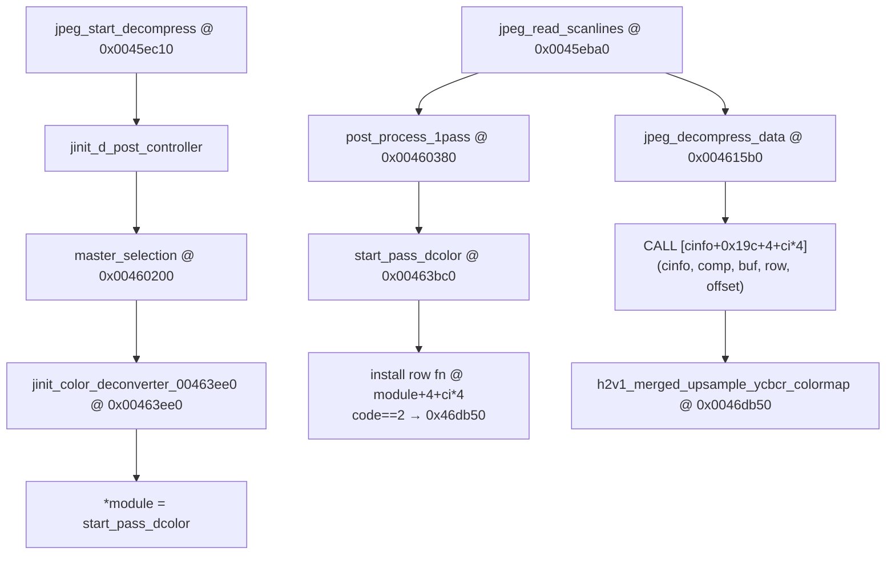

# Round 10 Deep — Task 17 Report

## Task

| Field | Value |
|-------|-------|
| **id** | 17 |
| **round** | 10 |
| **kind** | codec |
| **prior_round** | 8 |
| **seed_address** | `0x0046db50` |
| **title** | Codec follow-up: FUN_0046DB50 dispatch UNK |
| **acceptance** | Caller chain + algorithm ID; Frida if static inconclusive |
| **prior art** | [round8_fun_task_19_report.md](../fun_recovery/round8_fun_task_19_report.md); [r9_globals_task_063_report.md](../fun_recovery/r9_globals_task_063_report.md) |

## Status

**DONE** — Live Ghidra MCP re-verification (`connect_instance bulanci`, 2026-06-07): full **caller chain** from decompress init through pass-start install to runtime indirect `CALL`; **algorithm ID 2** (H2V1 sampling code) dispatch proven by `start_pass_dcolor` jump table disasm @ `0x00463c22`. Role: IJG **`jdcolor.c` H2V1 merged upsample + YCbCr→colormap row helper** (distinct from stock `h2v1_merged_upsample` @ `0x00465180` on the `jdmerge` RGB path). **Rename retained:** `h2v1_merged_upsample_ycbcr_colormap` (R9 batch) with **bulanci symbol proof** (`mapping.csv`, `_Globals.h`, `_Globals.cpp`). No Ghidra mutations this pass.

## Functions / Struct

| Address | Ghidra (before) | Ghidra (after) | Role | Evidence |
|---------|-----------------|----------------|------|----------|
| `0x0046db50` | `FUN_0046db50` | **`h2v1_merged_upsample_ycbcr_colormap`** | **H2V1 merged upsample + YCbCr→colormap quantize row helper:** bilinear-style chroma blend (`0x73fc`/`-0x28ba`/`0x1b37`/`-0x1712`, `>> 0xd`); maps blended Y/Cb/Cr through `cinfo+0x120` colormap LUT (`+0x80` base, index `>> 0x14 & 0x3ff`); writes **two** output bytes per row pair | `void __cdecl` 5-arg; body `0x0046db50`–`0x0046dfbf` (**0x470** B); **2× DATA** xref from `start_pass_dcolor`; leaf (no calls); live decompile + disasm |

### Algorithm ID dispatch (`start_pass_dcolor@0x00463bc0`)

Per-component switch on `comp_info[].component_id` at `comp_info+0x24` (IJG sampling-factor encoding `h_samp * (v_samp==2 ? 4 : 1)`):

| Code | Factors | Method installed @ `color_deconverter+4+ci*4` |
|------|---------|-----------------------------------------------|
| 1 | H1V1 | `LAB_0046dfc0` |
| **2** | **H2V1** | **`h2v1_merged_upsample_ycbcr_colormap` (`0x0046db50`)** |
| 4 | H1V2 | `LAB_0046d830` |
| 8 | H2V2 | `LAB_0046c9a0` / `LAB_0046cec0` / `LAB_0046d2a0` (dither mode via `cinfo+0x44`) |

Install disasm (live Ghidra):

```
00463c20  XOR EBP,EBP
00463c22  MOV dword ptr [ESP+0x10],0x46db50    ; case 2 → h2v1_merged_upsample_ycbcr_colormap
00463cbb  MOV dword ptr [ESI-0x28],EDX           ; store @ color_deconverter+4+ci*4 (ESI+=4/loop)
```

### Caller chain (init → pass start → runtime)



| Step | Function | VA | Mechanism | Evidence |
|------|----------|-----|-----------|----------|
| 1 | `jinit_color_deconverter_00463ee0` | `0x00463ee0` | `alloc_small(0x54)` → `cinfo+0x19c`; `*module = start_pass_dcolor` | `get_xrefs_to` → sole caller `master_selection@0x004602ed`; decompile |
| 2 | `post_process_1pass` | `0x00460380` | `(**(code**)cinfo[0x67])(cinfo)` → `start_pass_dcolor` | `bulanci.ghidra.exe.c` export; vtable slot 0 on color deconverter |
| 3 | `start_pass_dcolor` | `0x00463bc0` | case **2**: `local_14 = h2v1_merged_upsample_ycbcr_colormap`; store per-component | DATA xref @ `0x00463c22`, `0x00463cbb`; jump table disasm |
| 4 | `jpeg_decompress_data` | `0x004615b0` | `pc = *(code**)(cinfo+0x19c+4+ci*4)`; `CALL pc` 5-arg | Disasm `0x0046166b`–`0x00461700`; decompile @ `bulanci.ghidra.exe.c:156371` |
| 5 | *(game entry)* | `0x00431b70` | `CDSJpegImage::DecompressToImage` → JPEG API | [round6_logic_task_41_report.md](../logic_recovery/round6_logic_task_41_report.md) |

### Runtime indirect call (disasm @ `jpeg_decompress_data`)

```
0046166b  MOV EDX,dword ptr [EBP+0x19c]       ; color_deconverter module
00461671  ADD EAX,EAX / ADD EAX,EAX             ; ci * 4
00461675  MOV EDX,dword ptr [EDX+EAX*1+0x4]     ; row method for component ci
004616fc  CALL dword ptr [ESP+0x50]             ; (cinfo, comp_info, sample_buf, out_row, col_offset)
```

### Parameter roles (decompile)

| Param | Role |
|-------|------|
| `param_1` | `jpeg_decompress_struct*` — colormap base `*(param_1+0x120)+0x80` |
| `param_2` | Component workspace — quant row `*(param_2+0x50)` |
| `param_3` | Short sample row buffer (+ `0x30` initial offset) |
| `param_4` | Output row pointer array (two rows) |
| `param_5` | Byte offset into each output row |

### Xref closure

| From | Site | Type | Notes |
|------|------|------|-------|
| `start_pass_dcolor` | `0x00463c22` | **DATA** | case 2: `MOV [ESP+0x10], 0x46db50` |
| `start_pass_dcolor` | `0x00463cbb` | **DATA** | `MOV [ESI-0x28], EDX` — per-component store |

No direct `CALL` xrefs — invoked only via function-pointer slot installed at pass start.

### Distinction from stock `h2v1_merged_upsample`

| | `h2v1_merged_upsample` @ `0x00465180` | `h2v1_merged_upsample_ycbcr_colormap` @ `0x0046db50` |
|--|--------------------------------------|-----------------------------------------------------|
| Source cluster | `jdmerge.c` merged-upsampler | `jdcolor.c` color-deconverter + colormap quant |
| Install gate | `start_pass_merged_upsampler@0x00467340` (`cinfo+0x4c==1`) | `start_pass_dcolor` sampling code **== 2** |
| Output | RGB bytes via AC tables | **Colormap indices** via `cinfo+0x120` LUT |
| Runtime slot | `upsample+4` @ `cinfo+0x1a8` | `color_deconverter+4+ci*4` @ `cinfo+0x19c` |

### Callees

| Callee | Role |
|--------|------|
| — | Leaf — LUT indexing only |

## Ghidra deltas

| Action | Target | Result |
|--------|--------|--------|
| `connect_instance` | `bulanci` | OK |
| `get_xrefs_to` | `0x0046db50` | 2× DATA from `start_pass_dcolor` |
| `get_xrefs_to` | `0x00463bc0` | 1× DATA from `jinit_color_deconverter_00463ee0` |
| `decompile_function` | `0x0046db50`, `0x00463bc0`, `0x004615b0` | OK |
| `disassemble_function` | `0x00463bc0`, `0x004615b0` | Install + runtime CALL verified |
| *(none)* | — | No rename/prototype/comment change; no `save_program` |

**Prior rename (R9):** `rename_function_by_address` `FUN_0046db50` → `h2v1_merged_upsample_ycbcr_colormap` per `r9_partial_renames_applied.json`, `mapping.csv`, `_Globals.h`, `_Globals.cpp`.

## Decomp corrections

| Issue | IDA (`bulanci.ida.exe.c`) | Ghidra | Resolution |
|-------|---------------------------|--------|------------|
| Return type @ `0x0046db50` | `char __cdecl sub_46DB50(...)` | `void __cdecl h2v1_merged_upsample_ycbcr_colormap(...)` | **Ghidra + `mapping.csv` correct** — body only writes output bytes; no meaningful return |
| `start_pass_dcolor` return | `int __cdecl sub_463BC0(...)` | `void __cdecl start_pass_dcolor(...)` | **Ghidra correct** — pass-setup stub returns without value |
| vs stock `h2v1_merged_upsample` | `sub_465180` separate symbol | Same | **Not the same function** — colormap jdcolor path vs jdmerge RGB path |

## Frida

**none** — Full static closure: 2× DATA install xrefs, jump-table disasm for algorithm ID 2, and runtime indirect `CALL` proof in `jpeg_decompress_data` sufficient.

## Remaining UNK

| Item | Status |
|------|--------|
| Exact upstream IJG `METHODDEF` static name | **Cosmetic** — LOCAL in modified `jdcolor.c`; bulanci uses `h2v1_merged_upsample_ycbcr_colormap` |
| Sibling helpers `LAB_0046dfc0` / `LAB_0046d830` / H2V2 cluster | **Out of scope** — separate R8 tasks |
| `start_pass_dcolor` / `jinit_color_deconverter_00463ee0` in `_Globals.cpp` | Still `STUB_BODY()` — WRITE done for `0x0046db50` only (R9 task 63) |

## Cross-links

- [round8_fun_task_19_report.md](../fun_recovery/round8_fun_task_19_report.md) — initial R8 PARTIAL closure
- [r9_globals_task_063_report.md](../fun_recovery/r9_globals_task_063_report.md) — `_Globals.cpp` body + prototype fix
- [round6_logic_task_45_report.md](../logic_recovery/round6_logic_task_45_report.md) — `start_pass_dcolor` / jdcolor slice
- [round8_fun_task_12_report.md](../fun_recovery/round8_fun_task_12_report.md) — sibling merged-upsampler path (`jdmerge` @ `cinfo+0x1a8`)
- [r10_deep_task_16_report.md](r10_deep_task_16_report.md) — peer codec R10 report format
