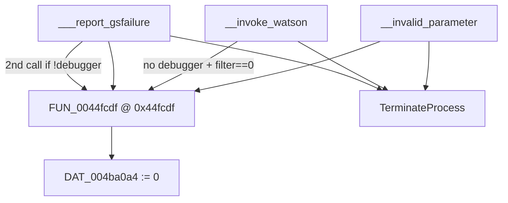

# Round 9 `_Globals` — Task 036 Report

## Task

| Field | Value |
|-------|-------|
| **id** | 36 |
| **round** | 9 |
| **namespace** | `_Globals` |
| **band** | sim |
| **seed_address** | `0x0044fcdf` |
| **ghidra_name** | `FUN_0044FCDF` |
| **prior_hint** | R6 — sim cluster |
| **prior art** | R8 FUN task 16 (`round8_fun_task_16_report.md`) |

## Status

**PARTIAL** — R9 live Ghidra re-verify: role proven (clears `DAT_004ba0a4` via `AND dword,0` on four MSVCRT fatal-exit paths before `TerminateProcess`). **No rename** — global has no static readers; not a documented bulanci game symbol or unique CRT export name (protocol forbids guess).

## Function

| Address | Ghidra name | Role | Evidence |
|---------|-------------|------|----------|
| `0x0044fcdf` | `FUN_0044fcdf` | `void`: sole writer of `DAT_004ba0a4` (`_DAT_004ba0a4 = 0`); hook on CRT invalid-parameter / Watson / GS-failure termination paths | **Disasm (2 insns, 8 B):** `0044fcdf AND dword ptr [0x004ba0a4],0x0` / `0044fce6 RET`. **Decompile:** `_DAT_004ba0a4 = 0; return;`. **Program-wide insn search** for operand `004ba0a4`: **1 match** (this function only). **Xrefs_to (4):** `__invalid_parameter@0x0044aa60`; `__invoke_watson@0x0044aa1a` (when `UnhandledExceptionFilter==0` and entry `IsDebuggerPresent==0`); `___report_gsfailure@0x0044be72` (after `IsDebuggerPresent` → `DAT_004b87b0`); `___report_gsfailure@0x0044be96` (when saved `DAT_004b87b0==0`) |

### Caller closure (MSVCRT fatal termination)

| Caller | Call site | When invoked |
|--------|-----------|--------------|
| `Runtime::MSVCRT::__invalid_parameter` | `0x0044aa60` | Default handler pointer null; before tail `__invoke_watson` |
| `Runtime::MSVCRT::__invoke_watson` | `0x0044aa1a` | After synthetic `UnhandledExceptionFilter`; filter returned 0 and no debugger at entry |
| `Runtime::MSVCRT::___report_gsfailure` | `0x0044be72` | Immediately after `IsDebuggerPresent` snapshot to `DAT_004b87b0` |
| `Runtime::MSVCRT::___report_gsfailure` | `0x0044be96` | After `UnhandledExceptionFilter`; only if entry `IsDebuggerPresent` was false |

All four paths continue to `TerminateProcess` with `0xC000000D` (`__invoke_watson`) or `0xC0000409` (`___report_gsfailure`).

### Global `DAT_004ba0a4`

| Fact | Detail |
|------|--------|
| Location | BSS @ `0x004ba0a4` (adjacent `DAT_004ba0a8` in `_externs.h`) |
| Writers | **Only** `FUN_0044fcdf` (insn search + decompile) |
| Readers | **None** in static closure (`get_xrefs_to` empty; no other insn touches `0x004ba0a4`) |
| Decl | `unsigned char DAT_004ba0a4` in `include/bulanci/_externs.h` (disasm clears full dword) |

### Control flow



### mapping.csv / stub (not trusted)

```
;_Globals::FUN_0044fcdf;0x44fcdf;0x8;__stdcall;;void
```

Size `0x8` matches Ghidra body `0044fcdf`–`0044fce6`. `_Globals.cpp` is `STUB_BODY()` only.

## Ghidra deltas

| Action | Target | Result |
|--------|--------|--------|
| *(none this session)* | — | R8 deltas already present: `void __stdcall FUN_0044fcdf(void)`, R8 decompiler comment, namespace `_Globals` |

**Not applied:** `rename_function_by_address` — no unique bulanci/CRT symbol; `DAT_004ba0a4` purpose still UNK. **No `save_program`** — no mutations.

## Frida

**none** — Static xref closure on MSVCRT library functions sufficient.

## Remaining UNK

| Item | Reason |
|------|--------|
| `DAT_004ba0a4` semantic name | No static readers; may be dead store, packed CRT state, or runtime-only consumer |
| Why double-call in `___report_gsfailure` | Pre- and post-`UnhandledExceptionFilter` hook; intent unclear without global meaning |
| R6 “sim cluster” label | Manifest band only — this VA is CRT fatal-hook glue, not BlitTable/sim math |

## Cross-links

- R8 FUN task 16 (`round8_fun_task_16_report.md`) — first full xref/disasm proof
- R8 `agent_todos_50_fun_r8_results.jsonl` id 16 — PARTIAL
- `config/bulanci/mapping.csv` row @ `0x44fcdf`
