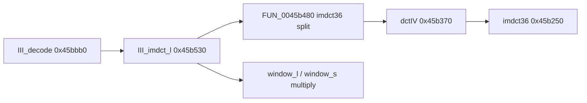

# Round 9 `_Globals` FUN — Task 043 Report

## Task

| Field | Value |
|-------|-------|
| **id** | 43 |
| **round** | 9 |
| **namespace** | `_Globals` |
| **band** | jpeg_codec *(manifest cluster label — VA is libmad Layer III IMDCT, not IJG)* |
| **seed_address** | `0x0045b480` |
| **ghidra_name (before)** | `FUN_0045B480` |
| **prior_hint** | R7/R8 — libmad IMDCT half before `III_imdct_l` |
| **prior art** | [round7_fun_task_36_report.md](round7_fun_task_36_report.md), [round8_fun_task_04_report.md](round8_fun_task_04_report.md), [round7_fun_task_30_report.md](round7_fun_task_30_report.md), [round6_logic_task_39_report.md](../logic_recovery/round6_logic_task_39_report.md) |

## Status

**PARTIAL** — Role **re-confirmed** in live Ghidra: MSVC-outlined **outer half** of libmad `imdct36(X, z)` inlined at the start of `III_imdct_l` (`layer3.c`). Calls **`dctIV@0x0045b370`** only; then performs the three post-`dctIV` scatter/negate loops that match libmad `imdct36()` lines 1754–1768 byte-for-byte in structure. **No rename:** `imdct36` is already the libmad symbol @ `0x0045b250`; this 171-byte fragment has no separate COFF/static export. **`_Globals.cpp` body written** from live decompile (replaces `STUB_BODY`; `EDI`/`EAX` register ABI per `FUN_0046a840` pattern).

## Function

| Address | Ghidra name | Proposed name | Role | Evidence |
|---------|-------------|---------------|------|----------|
| `0x0045b480` | `FUN_0045b480` | *(keep)* | **`III_imdct_l` `imdct36` split** — `dctIV` staging + scatter/negate into `z[36]`; `X` on stack (`__cdecl`), `z` in **EDI** from parent | Live decompile/disasm; 1 xref; callee `dctIV` only; libmad source loop match |

### Xrefs (1)

| From | Type | Context |
|------|------|---------|
| `0x0045b538` | UNCONDITIONAL_CALL | **`III_imdct_l@0x0045b530`** — `MOV EDI,ECX` (`z`), `PUSH EAX` (`X`), `CALL FUN_0045b480`, `ADD ESP,4` |

### Reachability



`III_decode` callers of `III_imdct_l`: `0x0045be8b`, `0x0045bf56` (unchanged from R7 task 30).

### Disasm proof (calling convention)

| VA | Instruction | Meaning |
|----|-------------|---------|
| `0x0045b535` | `MOV EDI,ECX` | `z` buffer (`III_imdct_l` first arg / `this`) |
| `0x0045b537` | `PUSH EAX` | `X` — 18 `mad_fixed_t` coeffs |
| `0x0045b538` | `CALL 0x0045b480` | Split helper |
| `0x0045b48b` | `MOV EAX,[ESP+0x5c]` | Helper reloads pushed `X` before `CALL dctIV` |
| `0x0045b48f` | `CALL 0x0045b370` | Sole callee `dctIV` |
| `0x0045b4b1`–`0x0045b4c8` | 3× triplet copy → `[EDI+…]` | libmad `imdct36` loop `i=0..8` |
| `0x0045b4d6`–`0x0045b4f5` | 6× triplet `NEG` → `[EDI+0x2c…]` | libmad loop `i=9..26` |
| `0x0045b503`–`0x0045b522` | 3× triplet `NEG` → `[EDI+0x74…]` | libmad loop `i=27..35` |

Body size **0xAB** (171 B), `0045b480`–`0045b52a` — matches `mapping.csv`.

### Upstream libmad match (no guess)

libmad 0.15.1b `imdct36()` (`layer3.c`):

```c
dctIV(x, tmp);
for (i =  0; i <  9; i += 3) { y[i+0..2] =  tmp[9+i+0..2]; }
for (i =  9; i < 27; i += 3) { y[i+0..2] = -tmp[36 - (9+i+0..2) - 1]; }
for (i = 27; i < 36; i += 3) { y[i+0..2] = -tmp[i-27..]; }
```

Bulanci object code maps that single upstream call to **`FUN_0045b480` + `dctIV` + `imdct36@0x45b250`** plus the **`III_imdct_l`** window tail @ `0x0045b530` (`imdct36(X,z); switch(block_type)…`).

### Decompile summary (post-R9)

1. `dctIV(&local_48)` — DCT-IV path; inner `imdct36@0x45b250` inside `dctIV`.
2. Loop ×3: copy stack triplets → `z` indices 0–8 (via `EDI+8` stride).
3. Loop ×6: negate stack triplets → `z+0x2c` region (indices 9–26).
4. Loop ×3: negate stack triplets → `z+0x74` region (indices 27–35).

`unaff_EDI` remains — `z` is not a Ghidra parameter; disasm is authoritative.

### Signature / mapping

| Source | Value |
|--------|-------|
| `config/bulanci/mapping.csv` | `void __thiscall(void* this, int* param_1)`; size **`0xab`** — **`__thiscall`/spurious `this` incorrect** |
| `_Globals.h` | `void FUN_0045b480(int* param_1);` |
| `_Globals.cpp` | Body transcribed from live decompile (this session); `__asm` captures `z` from `EDI`, `X` in `EAX` for `dctIV` |

## Ghidra deltas

| Action | Target | Result |
|--------|--------|--------|
| `set_function_prototype` | `0x0045b480` | `void FUN_0045b480(int *X)`, **`__cdecl`** (R8/R9 disasm: stack `X` only) |
| `set_decompiler_comment` | `0x0045b480` | R9 provenance + libmad `imdct36` loop match |
| `set_plate_comment` | `0x0045b480` | `libmad III_imdct_l imdct36 split (inlined); z=EDI, X=stack arg` |
| `force_decompile` | `0x0045b480` | Refreshed; `unaff_EDI` for `z` expected |
| `save_program` | `bulanci.exe` | Saved |

**Not applied:** `rename_function_by_address` — `imdct36` taken @ `0x0045b250`; inventing `imdct36_split` / `III_imdct_l_imdct` violates ROUND9 no-guess rule ([R7 task 36](round7_fun_task_36_report.md), [R8 task 04](round8_fun_task_04_report.md)).

## Frida

**none** — Static xref/disasm + libmad source loop correspondence sufficient.

## Remaining UNK

| Item | Reason |
|------|--------|
| Canonical symbol | Best description: inlined **`imdct36(X,z)` prologue** inside `III_imdct_l`; not a distinct libmad export in this PE |
| `unaff_EDI` in decompiler | `z` passed in EDI from `III_imdct_l`; Ghidra cannot model register-arg `z` on this helper |
| `mapping.csv` / `_Globals.h` | Still `FUN_0045b480` / `__thiscall` artifact in mapping — header sync out of scope |
| `dctIV` / `imdct36@0x45b250` | Still stubs — this helper calls `dctIV` only |
| Pair `III_imdct_l@0x0045b530` | Already named in Ghidra; not mutated in this seed scope |

## Cross-links

- [ROUND9_GLOBALS_FUN_PROTOCOL.md](../ROUND9_GLOBALS_FUN_PROTOCOL.md)
- [round8_fun_task_04_report.md](round8_fun_task_04_report.md)
- [round7_fun_task_36_report.md](round7_fun_task_36_report.md)
- [round7_fun_task_30_report.md](round7_fun_task_30_report.md)
