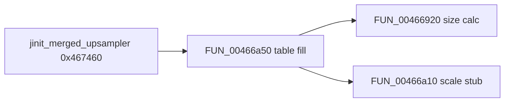

# Round 9 `_Globals` — Task 049 Report

## Task

| Field | Value |
|-------|-------|
| **id** | 49 |
| **round** | 9 |
| **namespace** | `_Globals` |
| **band** | jpeg_codec |
| **seed_address** | `0x00466a10` |
| **ghidra_name** | `FUN_00466A10` |
| **prior_hint** | *(empty in manifest)* |
| **prior art** | [round8_fun_task_31_report.md](round8_fun_task_31_report.md); R6 `0x466a` band slice; R7/R8 merged-upsampler path via `FUN_00466a50` / `FUN_00466920` |

## Status

**PARTIAL** — Live Ghidra MCP re-verify (`connect_instance("bulanci")`, 2026-06-04) confirms R8 closure. **No rename:** 21-byte compiler-outlined **rounded index→byte scale** stub; sole caller `FUN_00466a50`; no unique IJG COFF/export symbol (ROUND9 no-guess rule). Name stays `FUN_00466A10`.

## Function

| Address | Ghidra name | Role | Evidence |
|---------|-------------|------|----------|
| `0x00466a10` | `FUN_00466a10` | **Rounded index→byte scale** for merged-upsampler ordered-dither sample fill: `(ECX×0xff + ESI/2) / ESI` with **ECX** = stripe index and **ESI** = `max_idx = bound−1` loaded by caller immediately before `CALL` | Live disasm + decompile + **1×** CODE xref; init chain `jinit_merged_upsampler` → `FUN_00466a50` → this stub |

### Signature / size

| Source | Value |
|--------|-------|
| Ghidra (live) | `int __fastcall FUN_00466a10(int param_1)` — body `00466a10`–`00466a24` → **21 B** (`0x15`) |
| `config/bulanci/mapping.csv` | `__fastcall`; `int`; size **`0x15`** — matches |
| `_Globals.cpp` | Stub only — not trusted |

### Formula (live disasm)

```
return (index * 0xff + max_idx / 2) / max_idx;
```

Where `index` is **ECX** (`param_1` / `[ESP+0x10]` at call site) and `max_idx` is **ESI** (`LEA ESI,[ECX-0x1]` using bound from `[ESP+0x1c]`).

### Disassembly (live Ghidra)

```
00466a10  IMUL ECX,ECX,0xff
00466a16  MOV EAX,ESI
00466a18  CDQ
00466a19  SUB EAX,EDX
00466a1b  SAR EAX,0x1
00466a1d  ADD ECX,EAX
00466a1f  MOV EAX,ECX
00466a21  CDQ
00466a22  IDIV ESI
00466a24  RET
```

### Decompiled body (live Ghidra)

```c
int __fastcall _Globals::FUN_00466a10(int param_1)
{
  int unaff_ESI;
  return (param_1 * 0xff + unaff_ESI / 2) / unaff_ESI;
}
```

Decompiler pre-comment (R8, verified present): rounded scale; **ESI** set by `FUN_00466a50@0x466ad4`; sole caller merged-upsampler dither fill; **not** `zlib::gen_codes`.

### Call-site proof (`FUN_00466a50@0x00466adb`)

| VA | Instruction | Meaning |
|----|-------------|---------|
| `0x00466ad0` | `MOV ECX,[ESP+0x1c]` | Per-component table width `iVar2` |
| `0x00466ad4` | `LEA ESI,[ECX-0x1]` | Divisor **ESI** = `max_idx` |
| `0x00466ad7` | `MOV ECX,[ESP+0x10]` | Index **ECX** = `iStack_20` (0 … `iVar2−1`) |
| `0x00466adb` | `CALL 0x00466a10` | Scaled byte → **AL** |
| `0x00466af9` | `MOV byte ptr [ESI+EDX],AL` | Replicate scaled byte into alloc buffer stripes |

Caller loop (live decompile excerpt):

```c
iVar6 = FUN_00466a10(iStack_20);
*(char *)(iVar12 + iVar8) = (char)iVar6;
```

### Xref closure

| Direction | Address | Symbol | Notes |
|-----------|---------|--------|-------|
| **Caller (sole CODE)** | `0x00466adb` | `FUN_00466a50` | `UNCONDITIONAL_CALL` — merged-upsampler colormap index-table fill |
| **Init chain** | `0x004674db` | `jinit_merged_upsampler` | Calls `FUN_00466a50`; sibling size helper `FUN_00466920` (R9 task 048) |

### Relation to sibling `0x466a` helpers

| VA | Helper | Caller | Formula |
|----|--------|--------|---------|
| `0x00466a10` | **this task** | `FUN_00466a50` only | `(idx×255 + max/2) / max` |
| `0x00466a30` | R8 task 01 | `zlib::gen_codes` (2×) | Different idiv biasing — **not** this path |

R6 attributed `FUN_00466a50` to zlib Huffman; R7/R8 corrected to **IJG merged-upsampler** ordered-dither table build.



## Ghidra deltas

| Action | Result |
|--------|--------|
| **none** | R8 decompiler comment verified intact on `_Globals::FUN_00466a10`; prototype `int __fastcall`; no `rename_function_by_address`; no `save_program` |

## Frida

**none** — static disasm + single-caller xref + `jinit_merged_upsampler` chain sufficient.

## Remaining UNK

| Item | Reason |
|------|--------|
| Exact IJG static/export name | 21-byte outlined stub; no COFF/string match in `bulanci.exe` |
| `__fastcall` vs caller-set **ESI** | Ghidra models one ECX param + `unaff_ESI`; true ABI use is **ECX** + **ESI** at call |
| `FUN_00466a50` rename | Out of scope (separate R9 task @ `0x00466a50`) |
| `mapping.csv` / `_Globals.cpp` stub update | Export regen out of scope for FUN-only task |

## Cross-links

- [ROUND9_GLOBALS_FUN_PROTOCOL.md](../ROUND9_GLOBALS_FUN_PROTOCOL.md)
- [round8_fun_task_31_report.md](round8_fun_task_31_report.md)
- [r9_globals_task_048_report.md](r9_globals_task_048_report.md) — sibling size calc on same init chain
- [round8_fun_task_13_report.md](round8_fun_task_13_report.md) — `FUN_00466a50` caller context
- [round6_logic_task_47_report.md](../logic_recovery/round6_logic_task_47_report.md) — initial `0x466a` band (R6 zlib attribution superseded)
