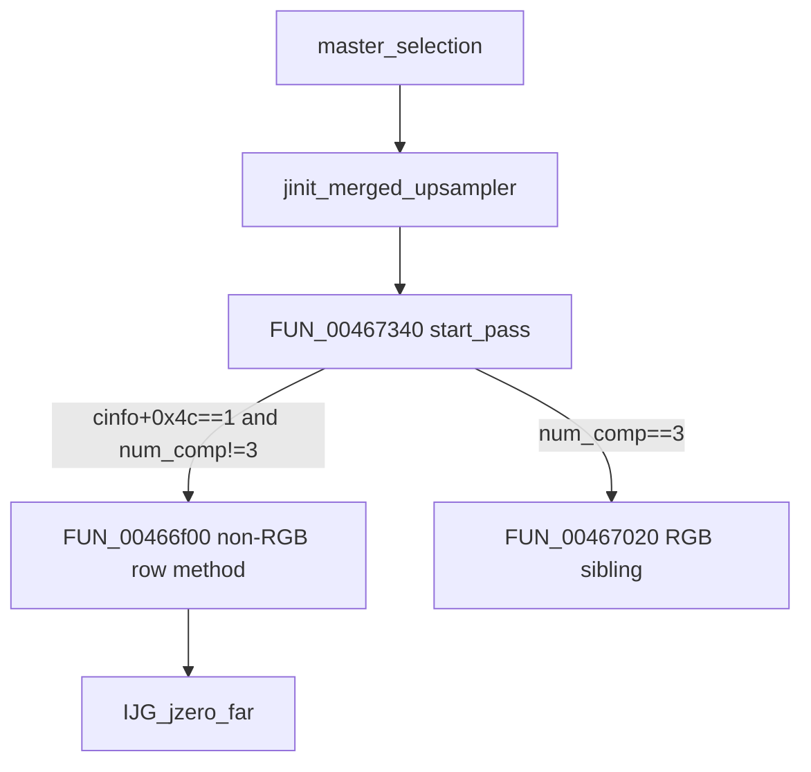

# Round 9 `_Globals` — Task 054 Report

## Task

| Field | Value |
|-------|-------|
| **id** | 54 |
| **round** | 9 |
| **namespace** | `_Globals` |
| **band** | jpeg_codec |
| **seed_address** | `0x00466f00` |
| **ghidra_name** | `FUN_00466F00` |
| **prior_hint** | *(empty in manifest)* |
| **prior art** | R8 FUN task 34 (`round8_fun_task_34_report.md`); R6 logic task 48 slice |

## Status

**PARTIAL** — Live Ghidra MCP re-verify (`connect_instance("bulanci")`, 2026-06-04) confirms R8/R6 closure. **No rename:** IJG merged-upsampler **non-RGB row method** at `upsample+4`; behavior matches `jdmerge.c` **upmethod** family but is **not** the stock `h2v1_merged_upsample` (RGB-only in upstream); no standalone COFF/export symbol (ROUND9 no-guess rule). Name stays `FUN_00466F00`.

## Function

| Address | Ghidra name | Role | Evidence |
|---------|-------------|------|----------|
| `0x00466f00` | `FUN_00466F00` | **Merged-upsampler row worker (non-RGB / `num_components != 3`):** for each output row, `IJG_jzero_far(*output_row, row_bytes)` then per-component AC-table gather with column ring `& 0xf` at `upsample+0x30`; invoked only via **`upsample+4` function pointer** | Live disasm + decompile + **1×** DATA xref; install gate in `FUN_00467340` |

### Signature / size

| Source | Value |
|--------|-------|
| Ghidra (live) | `void __cdecl FUN_00466f00(int * cinfo, int input_buf, undefined4 * output_buf, int num_rows)` |
| Body | `00466f00`–`00467017` → **280 B** (`0x118`) |
| `config/bulanci/mapping.csv` | `void __cdecl`; size **`0x111`** (stub row stale vs Ghidra body end) |
| `_Globals.cpp` | Stub only — not trusted |

### IJG `jpeg_decompress_struct` field mapping (this binary)

| Offset | `cinfo[]` index | Role in this worker |
|--------|-----------------|---------------------|
| `+0x5c` | `[0x17]` | `row_bytes` — length passed to `IJG_jzero_far` |
| `+0x64` | `[0x19]` | `num_components` — outer component loop bound |
| `+0x1a8` | `[0x6a]` | `upsample` private state pointer |

### Upsample private fields (this worker)

| Offset | Role |
|--------|------|
| `+0x04` | **Vtable slot** holding **`FUN_00466f00`** when merged + non-RGB (this function) |
| `+0x18` | `component_base[]` — per-component table base added to sample index |
| `+0x30` | Ring index `0..0xf`, advanced once per output row (`AND 0xf` @ `0x00466ff8`) |
| `+0x34` | `ac_tables[]` — stride 4 per component (`ADD [ESP+0x44],4` @ `0x00466fdb`) |

### Install gate (live disasm `FUN_00467340`)

| Condition | VA | Action |
|-----------|-----|--------|
| `cinfo+0x4c == 1` (merged upsample path) | `0x004673cc` | Enter merged method picker |
| `cinfo+0x64 == 3` | `0x004673d2` | `MOV [upsample+4], 0x467020` → `FUN_00467020` (RGB sibling) |
| `cinfo+0x64 != 3` | `0x004673db` | `MOV [upsample+4], 0x466f00` → **`FUN_00466f00`** (this task) |

Also on merged path @ `0x004673e6`: `upsample+0x30 = 0`; optional `FUN_00466b70` / `FUN_00466d40` when dither tables absent (R8 task 12).

### Behavior (live decompile summary)

1. `num_components = cinfo[0x19]`; `len = cinfo[0x17]`; `upsample = cinfo[0x6a]`.
2. Outer loop `num_rows`: `IJG_jzero_far((void *)*output_buf, len)`.
3. `ring = *(upsample+0x30)`; for each component `ci`: `table_base = component_base[ci]`; `ac_ptr = ac_tables[ci]`.
4. Inner pixel loop over `len`: read input sample; `*out += ac_table[ring*0x40 + (col&0xf)][sample + table_base]`; `col = (col+1) & 0xf`.
5. After row: `*(upsample+0x30) = (ring+1) & 0xf`; `output_buf++`.

**No direct `CALL` xrefs** — consumers invoke through `upsample+4` during decompress scan.

### Disasm anchors (live Ghidra)

| VA | Instruction | Proof |
|----|-------------|-------|
| `0x00466f07` | `MOV ECX,[EAX+0x64]` | `num_components` |
| `0x00466f0a` | `MOV EDX,[EAX+0x5c]` | `row_bytes` |
| `0x00466f0e` | `MOV ESI,[EAX+0x1a8]` | `upsample` |
| `0x00466f4d` | `CALL 0x0045f880` | `IJG_jzero_far` |
| `0x00466f6c` | `SHL EBP,0x6` | `ring * 0x40` |
| `0x00466fc3` | `ADD byte ptr [ECX],DL` | Accumulate into output row |
| `0x00466fcb` | `AND ESI,0xf` | Column ring |
| `0x00466ff8` | `AND EBP,0xf` | Advance row ring |
| `0x00467003` | `MOV [ESI+0x30],EBP` | Store ring index |

Install site:

```
004673cc: CMP dword ptr [ESI+0x64],0x3
004673d2: MOV dword ptr [EDI+4],0x467020
004673db: MOV dword ptr [EDI+4],0x466f00
```

### Xref closure

| Direction | Address | Symbol | Notes |
|-----------|---------|--------|-------|
| **To (sole)** | `0x004673db` | `FUN_00467340` | **DATA** — `*(upsample+4) = FUN_00466f00` |
| **From (callee)** | `0x00466f4d` | `IJG_jzero_far` | `CALL` each output row |

### Callees

| Callee | VA | Role |
|--------|-----|------|
| `IJG_jzero_far` | `0x0045f880` | Zero output row before AC accumulation |

### Decompile (live, post-R8 comment intact)

```c
void FUN_00466f00(int *cinfo, int input_buf, undefined4 *output_buf, int num_rows)
{
  /* IJG libjpeg-6b merged-upsampler row method (cinfo+0x4c==1, num_components!=3).
     DATA xref FUN_00467340@0x004673db installs at upsample+4.
     Zeros row via IJG_jzero_far; AC-table lookup with ring index &0xf at upsample+0x30.
     Sibling FUN_00467020 (RGB/3-comp). Exact jdmerge.c export UNK (R6/R8). */
  ...
}
```

### Call graph



## Ghidra deltas

| Action | Result |
|--------|--------|
| **none** | R8 annotations verified intact: namespace `_Globals`, prototype `void __cdecl FUN_00466f00(int *, int, undefined4 *, int)`, entry pre-comment; no `save_program` |

## Frida

**none** — JPEG decompress merged-upsampler method pointer; static xref + install gate + decompile sufficient.

## Remaining UNK

| Item | Reason |
|------|--------|
| Exact IJG static symbol name | Non-RGB merged row worker; upstream `h2v1_merged_upsample` is RGB-only in `ref/libjpeg6b/jdmerge.c`; no COFF/export string |
| Rename to descriptive alias | Protocol forbids guess without upstream export proof |
| `FUN_00467020` / `FUN_00467150` naming | Separate R9 tasks (055–056) |
| `mapping.csv` / `_Globals.cpp` | Still `FUN_00466f00` stub — export regen out of scope |

## Cross-links

- [round8_fun_task_34_report.md](round8_fun_task_34_report.md) — R8 live proof + Ghidra save
- [round8_fun_task_12_report.md](round8_fun_task_12_report.md) — `FUN_00467340` install matrix
- [round6_logic_task_48_report.md](../logic_recovery/round6_logic_task_48_report.md) — dispatch slice
- [ROUND9_GLOBALS_FUN_PROTOCOL.md](../ROUND9_GLOBALS_FUN_PROTOCOL.md)
