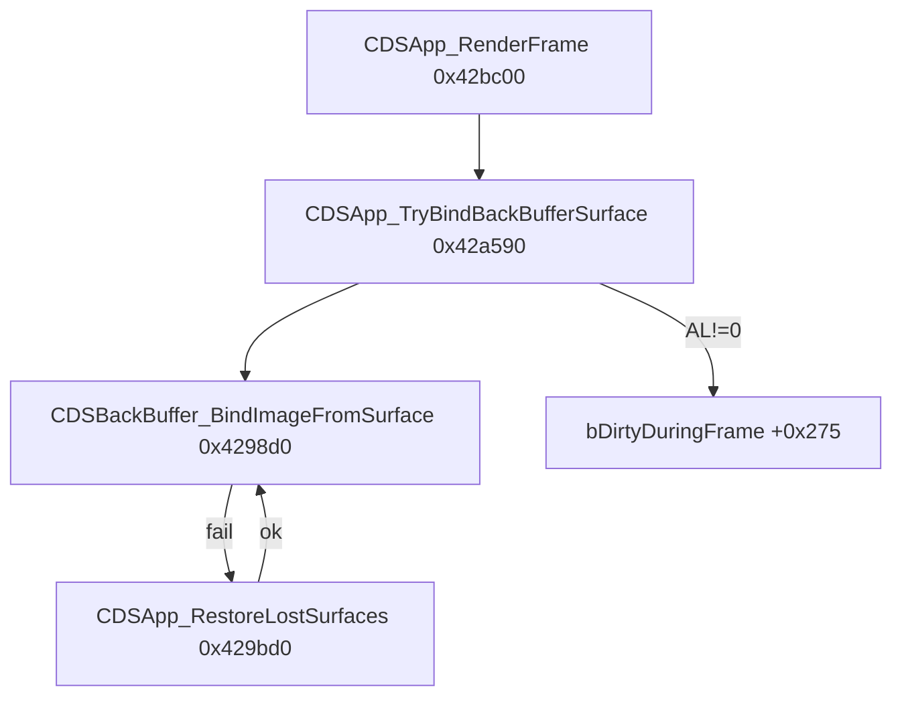

# Round 7 FUN — Task 15 Report

## Task

| Field | Value |
|-------|-------|
| **id** | 15 |
| **round** | 7 |
| **band** | sim |
| **seed_address** | `0x0042a590` |
| **title** | FUN recovery: FUN_0042A590 @ 0x0042a590 (xrefs=1) |
| **prior_hint** | R6 task 15: pre-render gate in `CDSApp_RenderFrame`; non-zero → `bDirtyDuringFrame` @ `+0x275`; R5 worker 06 BLOCKED |

## Status

**DONE** — Disasm + decompile + sole-caller xref prove a unique `CDSApp_*` pre-render surface-bind gate; Ghidra renamed, prototype fixed (`uchar` in `AL`), saved.

## Function

| Address | Before | After | Role | Evidence |
|---------|--------|-------|------|----------|
| `0x0042a590` | `FUN_0042a590` | `CDSApp_TryBindBackBufferSurface` | `uchar __fastcall`: bind embedded `CDSBackBuffer` @ `this+0x7c` via `CDSBackBuffer_BindImageFromSurface`; on failure call `CDSApp_RestoreLostSurfaces(this)` then tail-retry bind | 1 xref @ `CDSApp_RenderFrame+0x1f`; disasm `LEA EDI,[ESI+0x7c]`; return in `AL` gates dirty-frame path |

### Behavior (proven)

| Step | Action | Return |
|------|--------|--------|
| 1 | `CDSBackBuffer_BindImageFromSurface()` on `CDSApp+0x7c` (`GetSurfaceDesc` + `CDSImage_BindFromSurfaceDesc`) | `AL=1` → success exit |
| 2 | On bind fail: `CDSApp_RestoreLostSurfaces(this)` (vtable `+0x6c` on `this+0x78`, then `CDSBackBuffer_RestoreSurface`) | — |
| 3 | If restore succeeds: tail-call `CDSBackBuffer_BindImageFromSurface()` again | `AL` = second bind result |
| 4 | If restore fails | `AL=0` |

Caller `CDSApp_RenderFrame`: clears `bDirtyDuringFrame` @ `+0x275`, calls this helper; when `AL≠0`, sets `+0x275=1` and runs dirty-rect iteration + view swap + `CDSBackBuffer_Flip`.

### Call graph



### Disassembly

```
0042a590: PUSH ESI
0042a591: MOV  ESI,ECX              ; CDSApp *this
0042a594: LEA  EDI,[ESI+0x7c]       ; &backBuffer
0042a597: MOV  ECX,EDI
0042a599: CALL CDSBackBuffer_BindImageFromSurface
0042a59e: TEST AL,AL
0042a5a0: JNZ  0x0042a5b6           ; bound — return AL=1
0042a5a2: MOV  ECX,ESI
0042a5a4: CALL CDSApp_RestoreLostSurfaces
0042a5a9: TEST AL,AL
0042a5ab: JZ   0x0042a5b6           ; restore failed — return AL=0
0042a5ad: MOV  ECX,EDI
0042a5b1: JMP  CDSBackBuffer_BindImageFromSurface  ; tail retry
```

### Decompile (post-rename)

```c
uchar __fastcall CDSApp_TryBindBackBufferSurface(void)
{
  bool bound;
  undefined4 restore;
  int in_ECX;   /* CDSApp *this */

  bound = CDSBackBuffer_BindImageFromSurface();
  if (!bound) {
    restore = CDSApp_RestoreLostSurfaces(in_ECX);
    bound = false;
    if ((char)restore != '\0') {
      bound = CDSBackBuffer_BindImageFromSurface();
      return bound;
    }
  }
  return bound;
}
```

### Xrefs (1)

| From | Context |
|------|---------|
| `0x0042bc1f` | `CDSApp_RenderFrame` — after `bDrawable` gate, before dirty-rect draw loop |

`mapping.csv` line `;_Globals::FUN_0042a590;0x42a590;0x29;__fastcall;;uchar;int` is commented (no export symbol); rename aligns with R6 `CDSApp_RenderFrame` / R7 task 06 `CDSApp_HandleBitBltHresult` surface-restore band.

## Ghidra deltas

| Action | Target | Result |
|--------|--------|--------|
| `rename_function_by_address` | `0x0042a590` → `CDSApp_TryBindBackBufferSurface` | OK |
| `set_function_prototype` | `uchar CDSApp_TryBindBackBufferSurface(void)` `__fastcall` | OK — fixes prior `void` / missing `AL` |
| `set_function_this_type` | `CDSApp *` | Skipped — Ghidra rejects implicit `this` on `__fastcall` |
| `set_decompiler_comment` | Entry | Pre-render gate + `bDirtyDuringFrame` note |
| `force_decompile` | `0x0042a590` | Caller shows `uchar uVar2 = CDSApp_TryBindBackBufferSurface()` |
| `save_program` | `bulanci.exe` | OK |

## Frida

**none** — sole caller, `AL` return semantics, and `CDSApp+0x7c` / `+0x275` offsets match [round6_logic_task_15_report.md](../logic_recovery/round6_logic_task_15_report.md) statically.

## Remaining UNK

| Item | Reason |
|------|--------|
| `__fastcall` `this` typing | Decompiler uses phantom `in_ECX`; `set_function_this_type` requires `__thiscall` — left as register hint |
| `CDSApp+0x78` object | `CDSApp_RestoreLostSurfaces` vtable `+0x6c` target type not re-proven this pass |
| `IDirectDrawSurface` vtable `+100` | Used inside `CDSBackBuffer_BindImageFromSurface`; exact COM slot name not required for this rename |
