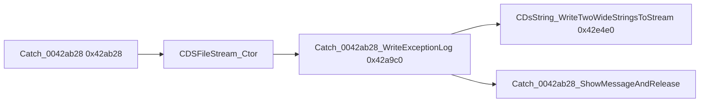

# Round 7 FUN — Task 16 Report

## Task

| Field | Value |
|-------|-------|
| **id** | 16 |
| **round** | 7 |
| **band** | sim |
| **seed_address** | `0x0042a9c0` |
| **title** | FUN recovery: FUN_0042A9C0 @ 0x0042a9c0 (xrefs=1) |
| **prior_hint** | *(empty)* |

## Status

**DONE** — Live MCP decompile/disasm/xrefs disprove the stale R5/R6 “DirectX HRESULT helper” label. Role is an **SEH-wrapped dual wide-string log write** on the `Catch_0042ab28` exception path (crash log to `%s.txt` file stream). Renamed in Ghidra; program saved.

## Function

| Address | Before | After | Role | Evidence |
|---------|--------|-------|------|----------|
| `0x0042a9c0` | `FUN_0042a9c0` | `Catch_0042ab28_WriteExceptionLog` | `__thiscall` SEH thunk: call `CDsString_WriteTwoWideStringsToStream` (`0x0042e4e0`); on exit release non-null `pLogStringObj` via `CDsStringReleaseHeader` | MCP decompile @ `0x0042a9c0`; disasm `RET 0x8`, `CALL 0x0042e4e0`, release @ `0x0042aa07`; **sole xref** `Catch_0042ab28` @ `0x0042ab8d`; caller opens `CDSFileStream`, formats `L"%s.txt"`, passes exception message + `PTR_DAT_004afca4` |

### Caller closure (`Catch_0042ab28` @ `0x0042ab28`)

| Step | API / fact |
|------|------------|
| 1 | `CDSException_GetMessageW` → wide exception text |
| 2 | `CDsStringFormatV(..., L"%s.txt")` → log filename |
| 3 | `CDSFileStream_Ctor` @ `EBP-0x44`, open mode `0xa` |
| 4 | `CDsString_InitFromLiteral` with exception message |
| 5 | **`Catch_0042ab28_WriteExceptionLog`** — writes strings to stream |
| 6 | `CDSFileStream_dtor`; release filename string; `Catch_0042ab28_ShowMessageAndRelease` |

### Disasm highlights (`0x0042a9c0`)

| VA | Instruction | Proof |
|----|-------------|-------|
| `0x0042a9e0` | `MOV EAX, [ESP+0x18]` | Third stack arg (`secondWide`) |
| `0x0042a9e5`–`0x0042a9e6` | `PUSH ECX` / `LEA ECX, [ESP+0x1c]` | `__thiscall` receiver + `&pLogStringObj` for callee |
| `0x0042a9f2` | `CALL 0x0042e4e0` | `CDsString_WriteTwoWideStringsToStream` |
| `0x0042aa07`–`0x0042aa0a` | `LEA ECX, [EAX-0xc]` / `CALL 0x0042d2d0` | `CDsStringReleaseHeader` on out handle |
| `0x0042aa1e` | `RET 0x8` | Two stack parameters besides ECX |

### Xrefs (1)

| From | Context |
|------|---------|
| `0x0042ab8d` | `Catch_0042ab28` — post-`CDSFileStream_Ctor`, pre-stream dtor |

### Control flow

## Ghidra deltas

| Action | Target | Result |
|--------|--------|--------|
| `rename_function_by_address` | `0x0042a9c0` → `Catch_0042ab28_WriteExceptionLog` | Success (PascalCase warnings only) |
| `set_function_prototype` | `void Catch_0042ab28_WriteExceptionLog(void *pLogStringObj, int *pFileStream, wchar_t *secondWide)` `__thiscall` | Success (`LPCWSTR` rejected; used `wchar_t *`) |
| `set_decompiler_comment` | `0x0042a9c0` | Success — corrects DirectX mislabel |
| `save_program` | `bulanci.exe` | Saved |

**Not applied:** `set_function_this_type` — not a class method; decompiler still shows extra `this` slot after prototype fix.

## Frida

**none** — Static decompile + sole-caller xref sufficient.

## Remaining UNK

| Item | Reason |
|------|--------|
| `pLogStringObj` vs `pFileStream` typing | Post-prototype decompile still maps stack slots oddly (`pFileStream` cast to `wchar_t *` at call); disasm proves three-operand pattern but exact slot semantics need callee re-prototype (`0x0042e4e0`, R7 task 23) |
| `PTR_DAT_004afca4` text | Second wide string literal not resolved in static data pass |
| `CDsString_WriteTwoWideStringsToStream` formal args | Ghidra already renamed `0x0042e4e0`; second wide arg still via stack tail / `unaff_retaddr` in older export |

## Cross-links

- [round6_logic_task_13_report.md](../logic_recovery/round6_logic_task_13_report.md) — stale DirectX note @ `0x0042a9c0` (superseded)
- [round6_logic_task_14_report.md](../logic_recovery/round6_logic_task_14_report.md) — `Catch_0042ab28` / `Catch_0042ab28_ShowMessageAndRelease`
- [round6_logic_task_20_report.md](../logic_recovery/round6_logic_task_20_report.md) — `FUN_0042e4e0` dual-string write semantics
- [app_shell.md](../app_shell.md) — `CDSApp_AppMain` SEH / boot path
