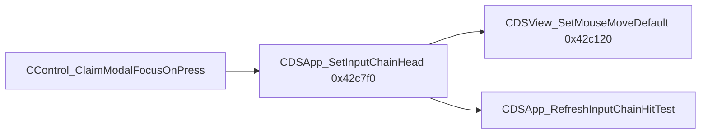

# Round 7 FUN — Task 20 Report

## Task

| Field | Value |
|-------|-------|
| **id** | 20 |
| **round** | 7 |
| **band** | sim |
| **seed_address** | `0x0042c120` |
| **title** | FUN recovery: FUN_0042C120 @ 0x0042c120 (xrefs=1) |
| **prior_hint** | [round6_logic_task_16_report.md](../logic_recovery/round6_logic_task_16_report.md) — `OR [this+0x44], 8`; callee of `CDSApp_SetInputChainHead` |

## Status

**DONE** — Live disasm/decompile + single xref prove `CDSView` input-chain attach sets `flags1` mouse-move-default (`0x08`). Renamed in Ghidra; program saved.

## Function

| Address | Before | After | Role | Evidence |
|---------|--------|-------|------|----------|
| `0x0042c120` | `FUN_0042C120` (Ghidra had `CDSView_InputChain_OnAttach` from prior pass) | `CDSView_SetMouseMoveDefault` | Per-node helper when `CDSApp_SetInputChainHead` walks the mouse-recipient chain: `flags1 \|= 0x08`; if `byte@+0x14 & 8`, invoke primary vtable slot `+0x44` | Disasm `OR word [ECX+0x44], 8`; [app_shell.md](../app_shell.md) `flags1` bit `0x08` = mouse-move-default; sole xref `CDSApp_SetInputChainHead@0x0042c7f0`; paired clear @ `FUN_0042c140` (task 21 band) |

### Disasm

| VA | Instruction | Proof |
|----|-------------|-------|
| `0x0042c120` | `MOV EAX, 0x8` | Mask for `flags1` bit 3 |
| `0x0042c125` | `OR word ptr [ECX+0x44], AX` | `CDSView+0x44` (`flags1`) |
| `0x0042c129` | `TEST byte ptr [ECX+0x14], AL` | Gate on byte @ `+0x14` bit `0x08` |
| `0x0042c12e`–`0x0042c133` | Load vptr, `JMP [EAX+0x44]` | Primary vtable slot 17 (`+0x44`) — [CDSView_vftable.md](../struct_recovery/CDSView_vftable.md) |
| `0x0042c135` | `RET 0x4` | `__fastcall` / member return |

### Decompile (after Ghidra deltas)

```c
void __thiscall CDSView::CDSView_SetMouseMoveDefault(CDSView *this)
{
  this->win.wViewStateFlags |= 8;   /* +0x44 flags1 mouse-move-default */
  if ((this->win.wViewFlags & 8) != 0) {
    (**(code **)((int)(this->win).pVftable_primary + 0x44))();
  }
}
```

### Xrefs (1)

| From | Context |
|------|---------|
| `0x0042c81f` | `CDSApp_SetInputChainHead` — loop while `(node->flags1 & 8) == 0` calls this on each chain node before new head is stored |

### Control flow



## Ghidra deltas

| Action | Target | Result |
|--------|--------|--------|
| `set_function_prototype` | `0x0042c120` | `void CDSView_SetMouseMoveDefault(void)`, `__thiscall` |
| `set_function_this_type` | `0x0042c120` | `CDSView *` — typed `this->win.*` field access |
| `rename_function_by_address` | `0x0042c120` | `CDSView_InputChain_OnAttach` → `CDSView_SetMouseMoveDefault` |
| `set_decompiler_comment` | `0x0042c120` | R7 attach / vtable note |
| `force_decompile` | `0x0042c120` | Refreshed pseudocode |
| `save_program` | `bulanci.exe` | Saved |

## Frida

**none** — Flag OR, vtable gate, and single caller closure are fully static.

## Remaining UNK

| Item | Reason |
|------|--------|
| `FUN_0042c140` @ `0x0042c140` | Symmetric `flags1 &= ~0x08` + vtable `+0x48`; separate R7 task (id 21 is `0x0042c160`) |
| Exact semantics of `byte@+0x14 & 8` | Decompiler maps to `wViewFlags`; not cross-checked against a published `CDSView` field table this pass |
| Jumptable warning @ `0x0042c133` | Indirect tail call; slot 17 documented as `CDSView_NoOpStub` on base class |

## Cross-links

- [app_shell.md](../app_shell.md) — `flags1` `0x08`, `g_pInputChainHead`
- [round6_logic_task_16_report.md](../logic_recovery/round6_logic_task_16_report.md) — input-chain band `0x0042c120`–`0x0042c1c0`
- [round6_logic_task_17_report.md](../logic_recovery/round6_logic_task_17_report.md) — `CDSApp_SetInputChainHead` consumer
