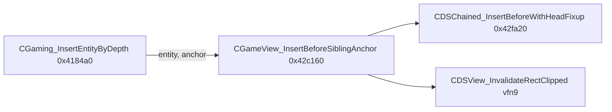

# Round 7 FUN — Task 21 Report

## Task

| Field | Value |
|-------|-------|
| **id** | 21 |
| **round** | 7 |
| **title** | FUN recovery: FUN_0042C160 @ 0x0042c160 (xrefs=1) |
| **band** | sim |
| **seed_address** | `0x0042c160` |

## Status

**DONE** — Live Ghidra MCP decompile + disasm + sole xref prove a **CGameView** depth-sort sibling insert helper (not a generic CDSChain thunk). Renamed to `CGameView_InsertBeforeSiblingAnchor`; `this` typed `CGameView *`; `bulanci.exe` saved.

## Function (single row)

| Address | Ghidra name (before → after) | Role summary | Evidence |
|---------|------------------------------|--------------|----------|
| `0x0042c160` | `FUN_0042c160` → **`CGameView_InsertBeforeSiblingAnchor`** | Insert `this` before `anchor` on parent’s embedded child list (`pChainParent+0x54`) via `CDSChained_InsertBeforeWithHeadFixup@0x0042fa20`; then primary vfn[9] `CDSView_InvalidateRectClipped(0,0)` @ `0x0042ca30` | **Disasm:** `MOV ECX,[ESI+0x4c]; ADD ECX,0x54; PUSH anchor; PUSH ESI; CALL 0x0042fa20`; `CALL [vftable+0x24](0,0)` @ `0x0042c174`–`0x0042c17f`. **Xref:** sole caller `CGaming_InsertEntityByDepth@0x00418589` when forward depth walk finds anchor `pCVar4` (`bulanci.ghidra.exe.c` ~82621). **Vtable:** `CBitmap` primary slot 9 = `CDSView_InvalidateRectClipped` (`vftable_methods.csv`). |

### Call flow



### Decompile (post-mutation)

```c
uchar __thiscall CGameView::CGameView_InsertBeforeSiblingAnchor(CGameView *this, void *anchor)
{
  CDSChained_InsertBeforeWithHeadFixup((CDSChain *)(this->pChainParent + 0x54), this, anchor);
  return (*(code **)(this->vftable_primary + 0x24))(0, 0);  // InvalidateRectClipped
}
```

## Ghidra deltas

| Action | Target | Result |
|--------|--------|--------|
| `rename_function_by_address` | `0x0042c160` | `CGameView_InsertBeforeSiblingAnchor` |
| `set_function_prototype` | `0x0042c160` | `uchar CGameView_InsertBeforeSiblingAnchor(void *anchor)` + `__thiscall` |
| `set_function_this_type` | `0x0042c160` | `CGameView *` (moved into `CGameView` class namespace) |
| `set_decompiler_comment` | `0x0042c160` | Depth-sort / invalidate summary |
| `force_decompile` | `0x0042c160` | `pChainParent+0x54` field access |
| `save_program` | `bulanci.exe` | saved |

## Frida

**none** — Static disasm, xref closure, and vtable catalog pin list head offset (`+0x4c` parent, `+0x54` embedded chain per [CGameView.md](../struct_recovery/CGameView.md)) and invalidate hook.

## Remaining UNK

| Item | Reason |
|------|--------|
| Callee `CDSChained_InsertBeforeWithHeadFixup` still types middle arg as `CBulanek *` | Callee-side `this` on chain head; separate R7 task / struct pass |
| Pair `FUN_0042c190` @ `0x0042c190` | Symmetric remove path in `CGaming_InsertEntityByDepth` @ `0x00418507` — task **22** |
| `mapping.csv` / `CBulanek.h` stub | Still `FUN_0042c160`; update when export pipeline refreshed |

## Cross-links

- [round5_worker_08_report.md](../struct_recovery/round5_worker_08_report.md) — `CDSChained_InsertBeforeWithHeadFixup` cluster
- [round6_logic_task_16_report.md](../logic_recovery/round6_logic_task_16_report.md) — sim band prior hint
- [CGaming.md](../struct_recovery/CGaming.md) — `pDepthInsertHead` / `InsertEntityByDepth`
- [CGameView.md](../struct_recovery/CGameView.md) — `pChainParent` @ `+0x4c`, embedded chain @ `+0x54`
