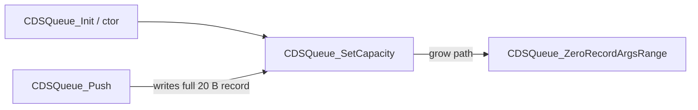

# Round 7 FUN — Task 24 Report

## Task

| Field | Value |
|-------|-------|
| **id** | 24 |
| **round** | 7 |
| **band** | sim |
| **seed_address** | `0x0042ea40` |
| **title** | FUN recovery: FUN_0042EA40 @ 0x0042ea40 (xrefs=1) |
| **prior_hint** | R6 task 21: mechanical zero of `+0xc`/`+0x10` every `0x14` B; xref missing in cache — **re-verified live** |

## Status

**DONE** — Sole caller `CDSQueue_SetCapacity` when growing `g_pEventQueue` storage; zeros `arg0`/`arg1` on newly allocated 20-byte `CDSEventRecord` slots. Renamed to `CDSQueue_ZeroRecordArgsRange`; prototype + comment applied; program saved.

## Function

| Address | Before | After | Role summary | Evidence |
|---------|--------|-------|--------------|----------|
| `0x0042ea40` | `FUN_0042ea40` | `CDSQueue_ZeroRecordArgsRange` | `__cdecl` helper: for `count` consecutive **0x14**-byte event records starting at `records`, if `records != NULL`, zero dword fields at **+0xc** (`arg0`) and **+0x10** (`arg1`); advance `records += 0x14` each iteration | Live decompile/disasm; xref from `CDSQueue_SetCapacity@0x0042ee75`; `CDSQueue_Push`/`PopCopy` field layout; [round6_logic_task_22_report.md](../logic_recovery/round6_logic_task_22_report.md) 20 B record `{target, msg_id, code, arg0, arg1}` |

### Disassembly (`0x0042ea40`–`0x0042ea64`)

```
0042ea40  MOV  ECX, dword ptr [ESP+0x8]   ; count
0042ea44  XOR  EDX, EDX
0042ea46  CMP  ECX, EDX
0042ea48  JZ   0x0042ea64                  ; count==0 → return
0042ea4a  MOV  EAX, dword ptr [ESP+0x4]   ; records
0042ea50  SUB  ECX, 0x1
0042ea53  CMP  EAX, EDX
0042ea55  JZ   0x0042ea5d                  ; skip writes if ptr NULL
0042ea57  MOV  dword ptr [EAX+0xc], EDX    ; arg0 = 0
0042ea5a  MOV  dword ptr [EAX+0x10], EDX   ; arg1 = 0
0042ea5d  ADD  EAX, 0x14                   ; next record (+20)
0042ea60  CMP  ECX, EDX
0042ea62  JNZ  0x0042ea50
0042ea64  RET
```

### Decompile (post-apply)

```c
void __cdecl CDSQueue_ZeroRecordArgsRange(void *records, int count)
{
  while (count != 0) {
    count = count - 1;
    if (records != 0) {
      *(undefined4 *)((int)records + 0xc) = 0;
      *(undefined4 *)((int)records + 0x10) = 0;
    }
    records = (void *)((int)records + 0x14);
  }
}
```

### CDSEventRecord layout (20 B, proven via queue API)

| Offset | Field | Touched by this helper |
|--------|-------|------------------------|
| `+0x00` | `target` (`IDSEventHandler *`) | no |
| `+0x04` | `wMsg_id` | no |
| `+0x08` | `wCode` / sub-fields | no |
| `+0x0c` | `arg0` | **zeroed** |
| `+0x10` | `arg1` | **zeroed** |

### Xref closure

| Direction | Address | Symbol | Notes |
|-----------|---------|--------|-------|
| **Caller (sole)** | `0x0042ee75` | `CDSQueue_SetCapacity` | On grow: `Runtime_ReallocOrThrow(cap * 0x14)` then `CDSQueue_ZeroRecordArgsRange(newBase + oldCap * 0x14, newCap - oldCap)` |
| **Callee** | — | *(leaf)* | No calls; 15 instructions |



## Ghidra deltas

| Action | Target | Result |
|--------|--------|--------|
| `set_function_prototype` | `0x0042ea40` | `void CDSQueue_ZeroRecordArgsRange(void *records, int count)` + `__cdecl` |
| `rename_function_by_address` | `0x0042ea40` | `FUN_0042ea40` → `CDSQueue_ZeroRecordArgsRange` |
| `set_decompiler_comment` | `0x0042ea40` | Role + sole caller + record layout |
| `force_decompile` | `0x0042ea40`, `0x0042ee40` | Caller now shows renamed callee |
| `save_program` | `bulanci.exe` | Saved |

## Frida

**none** — Static xref closure, stride `0x14`, field offsets, and `CDSQueue_SetCapacity` grow path are sufficient.

## Remaining UNK

| Item | Reason |
|------|--------|
| First 12 B of new slots | Grow path only clears `arg0`/`arg1`; `target`/`msg_id`/`code` left untouched until `CDSQueue_Push` overwrites — likely intentional |
| Formal `CDSEventRecord` struct | Not in Ghidra DT manager; layout inferred from `Push`/`PopCopy` |
| `mapping.csv` export | Still `;_Globals::FUN_0042ea40;…` — update on next mapping sync |

## Cross-links

- [round6_logic_task_21_report.md](../logic_recovery/round6_logic_task_21_report.md) — sim band queue slice; prior UNK note
- [round6_logic_task_22_report.md](../logic_recovery/round6_logic_task_22_report.md) — 20 B event record packing
- [app_shell.md](../app_shell.md) — `g_pEventQueue` / `CDSQueue_*` pump wiring
- `config/bulanci/mapping.csv` — `;_Globals::FUN_0042ea40;0x42ea40;0x25;__cdecl;;uchar;int;int`
