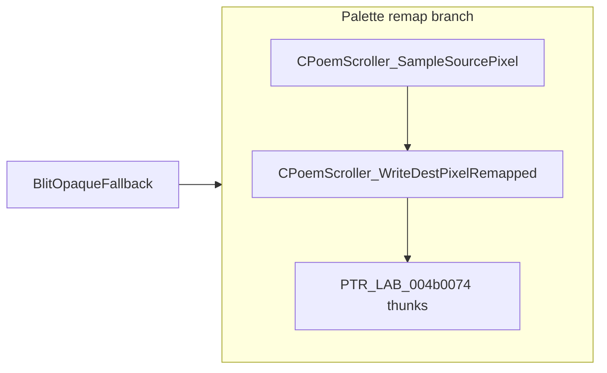

# Round 7 FUN — Task 25 Report

## Task

| Field | Value |
|-------|-------|
| **id** | 25 |
| **round** | 7 |
| **title** | FUN recovery: FUN_00436160 @ 0x00436160 (xrefs=1) |
| **band** | sim |
| **seed_address** | `0x00436160` |
| **prior_hint** | round6_logic_task_37 — blit UNK |

## Status

**DONE** — Disasm + decompile + sole xref prove dest-side `PTR_LAB_004b0074[format*2]` pixel write with caller-supplied remapped palette index; palette-remap branch of `BlitOpaqueFallback` pairs it with `CPoemScroller_SampleSourcePixel`. Renamed and typed in Ghidra.

## Function

| Address | Before | After | Role | Evidence |
|---------|--------|-------|------|----------|
| `0x00436160` | `FUN_00436160` | `CPoemScroller_WriteDestPixelRemapped` | **Dest pixel write dispatch** on embedded `CDSImage` facet: `(*(PTR_LAB_004b0074)[nField_0c*2])(x, y, mappedIndex, stride@+0x10, GetColorPlane(this))`; returns `1` | Disasm `0x00436163`–`0x00436186`: load `nField_0c`, `CALL GetColorPlane`, indirect `CALL [ESI*8+0x4b0074]`, 5 stack args. Decompile matches. **1 xref:** `BlitOpaqueFallback@0x00436847` — after `abStack_104[]` palette remap built, per-pixel `SampleSourcePixel` → `WriteDestPixelRemapped(..., abStack_104[sample])`. Mirrors `CPoemScroller_SampleSourcePixel` (source `PTR_SampleSourcePixel_004b0070`) |

### Disasm highlights

| VA | Instruction | Proof |
|----|-------------|-------|
| `0x00436160` | `MOV EDX, ECX` | `__thiscall` receiver |
| `0x00436163` | `MOV ESI, [EDX+0xc]` | Format index `nField_0c` |
| `0x00436166` | `CALL 0x004360f0` | `GetColorPlane` |
| `0x0043617d` | `MOV ECX, [ESI*8+0x4b0074]` | Dest-format thunk table |
| `0x00436186` | `CALL ECX` | 5-arg write (`x`,`y`,index,stride,plane) |
| `0x0043618b` | `MOV AL, 0x1` | Always returns success byte |

### Caller context (`BlitOpaqueFallback@0x00436770`)

When both source and dest palette entry counts are in `(0, 0x100]`:

1. Pre-pass: for each source palette slot `i`, `abStack_104[i] = FindNearestPaletteIndex(dest, sourceColor[i])`.
2. Per pixel: `SampleSourcePixel(src, sx, sy)` → index into `abStack_104` → `WriteDestPixelRemapped(dest, dx, dy, mappedIndex)`.

Non-palette branch uses `OpaqueBlitPixel_Indexed1` + `BlitPixelViaFormatTable` instead (per-pixel nearest-index path).

## Ghidra deltas

| Action | Detail |
|--------|--------|
| `set_function_prototype` | `undefined4 CPoemScroller_WriteDestPixelRemapped(uint param_1, uint param_2, uint param_3)`, `__thiscall` |
| `set_function_this_type` | `CPoemScroller *` |
| `rename_function_by_address` | `FUN_00436160` → `CPoemScroller_WriteDestPixelRemapped` |
| `set_decompiler_comment` | Dest dispatch + caller pairing |
| `force_decompile` | `0x00436160`, `0x00436770` |
| `save_program` | `bulanci.exe` |

## Frida

**none** — static disasm/decompile + single caller closure sufficient.

## Remaining UNK

| Item | Notes |
|------|--------|
| `PTR_LAB_004b0074` slot index ↔ bpp/format matrix | Inherited from R6 task 37; individual thunks (`Blit_WriteDstPixel_*`, etc.) partially named; full 8×8 matrix not enumerated |
| `BlitOpaqueFallback` inner-loop `iVar3` reuse | Decompiler conflates `SampleSourcePixel` return with row counter; disasm/prototype at call site still passes `abStack_104[sample]` as 3rd arg — cosmetic only |
