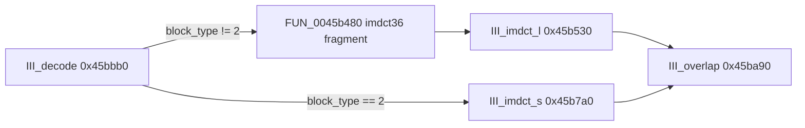

# Round 7 FUN — Task 30 Report

## Task

| Field | Value |
|-------|-------|
| **id** | 30 |
| **round** | 7 |
| **band** | dispatch |
| **seed_address** | `0x0045b530` |
| **title** | FUN recovery: FUN_0045B530 @ 0x0045b530 (xrefs=2) |
| **prior_hint** | round6_logic_task_39 — III_imdct_l window |

## Status

**DONE** — Live Ghidra decompile/disasm/xrefs match libmad 0.15.1b `layer3.c::III_imdct_l` (long-block IMDCT windowing). Renamed `FUN_0045b530` → `III_imdct_l`; prototype `void III_imdct_l(uint block_type)` `__thiscall` (`this` = 36-sample `z` buffer); program saved.

## Function

| Address | Before | After | Role | Evidence |
|---------|--------|-------|------|----------|
| `0x0045b530` | `FUN_0045b530` | `III_imdct_l` | libmad **long-block IMDCT windowing** after split `imdct36` prologue in `FUN_0045b480`; `mad_f_mul` vs `window_l` @ `0x0049c048`/`0x0049c04c`, `window_s` @ `0x0049c0d8`/`0x0049c0f0`; `block_type` switch **0 / 1 / 3** | MCP xrefs (2× `III_decode` only); disasm `SUB EAX` chain @ `0x0045b546`–`0x0045b55a`; decompile branches; libmad source switch cases; R6 pair `III_imdct_s` @ `0x0045b7a0` for `block_type==2` |

### Disasm highlights

| VA | Instruction | Proof |
|----|-------------|-------|
| `0x0045b535` | `MOV EDI, ECX` | `__thiscall` `this` = 36×`mad_fixed_t` output buffer |
| `0x0045b538` | `CALL 0x0045b480` | Split `imdct36` prologue (upstream inlines before window) |
| `0x0045b53d` | `MOV EAX, [ESP+0x1c]` | Second arg = `block_type` |
| `0x0045b546`–`0x0045b55a` | `SUB EAX,0` / `1` / `2` | Switch cases 0, 1, 3 (case 2 → short path uses `III_imdct_s`) |
| `0x0045b5a7` / `0x0045b6a6` / `0x0045b571` | `MOV reg, 0x49c048` / `0x49c0f0` / `0x49c0d8` | `window_l` / `window_s` tables (libmad `.rdata`) |
| `0x0045b595` | `SHRD EAX, EDX, 0x1c` | `mad_f_mul` fixed-point scale |

### Xrefs (2)

| From | Context |
|------|---------|
| `0x0045be8b` | `III_decode` — mixed-block long IMDCT path: `III_imdct_l(output, local_12c8)` |
| `0x0045bf56` | `III_decode` — per-channel loop: `III_imdct_l(output, channel.block_type)` when not short block |

### libmad correspondence

Upstream `III_imdct_l(mad_fixed_t const X[18], mad_fixed_t z[36], unsigned int block_type)` (`layer3.c` ~2062):

1. `imdct36(X, z)` — in bulanci, **`FUN_0045b480`** at entry.
2. `switch (block_type)` cases **0** (normal `window_l` ×4 unroll), **1** (start: `window_l` + `window_s` + zero tail), **3** (stop: zero head + `window_s` + `window_l`) — byte-matched in decompile.

Call graph in `III_decode` (long vs short):

## Ghidra deltas

| Action | Target | Result |
|--------|--------|--------|
| `rename_function_by_address` | `0x0045b530` → `III_imdct_l` | Success (PascalCase warnings only) |
| `set_decompiler_comment` | `0x0045b530` | R7 libmad note set |
| `set_function_prototype` | `void III_imdct_l(uint block_type)` `__thiscall` | Success (after failed `mad_fixed_t *` / two-arg attempts) |
| `force_decompile` | `0x0045b530` | `block_type` switch restored |
| `save_program` | `bulanci.exe` | Saved |

**Not applied:** `set_function_this_type` (`mad_fixed_t[36]` not in DT); stale plate string *"stereo alias reduction path"*; legacy UNCERTAIN pre-comment still visible beside R7 note.

## Frida

**none** — Static xref closure + libmad `layer3.c` switch/table match sufficient; reachable only via `III_decode` / `.mpx` audio.

## Remaining UNK

| Item | Reason |
|------|--------|
| `FUN_0045b480` | Split `imdct36`/`dctIV` prologue; sole caller `III_imdct_l@+8`; separate FUN task |
| `DAT_0049c048` labels | Still `DAT_*`; should be `window_l` / `window_s` globals when data pass runs |
| `this` typing | `void *` buffer; needs `mad_fixed_t` array type in Ghidra DT |
| COFF export proof | Symbol name inferred from libmad source + R6 logic band, not PE symbol table |
