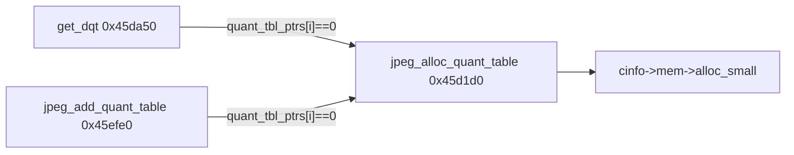

# Round 7 FUN — Task 31 Report

## Task

| Field | Value |
|-------|-------|
| **id** | 31 |
| **round** | 7 |
| **title** | FUN recovery: FUN_0045D1D0 @ 0x0045d1d0 (xrefs=2) |
| **band** | dispatch |
| **seed_address** | `0x0045d1d0` |

## Status

**DONE** — Live Ghidra decompile, disasm, and xref closure match IJG libjpeg-6b **`jcomapi.c::jpeg_alloc_quant_table`**. Renamed; prototype corrected to return `void *`; `bulanci.exe` saved.

## Function (single row)

| Address | Ghidra name (before → after) | Role summary | Evidence |
|---------|------------------------------|--------------|----------|
| `0x0045d1d0` | `FUN_0045d1d0` → **`jpeg_alloc_quant_table`** | Allocate a fresh **`JQUANT_TBL`** (130 B / `0x82`) via `cinfo->mem->alloc_small(cinfo, JPOOL_PERMANENT=0, 0x82)`; zero **`sent_table`** at offset `+0x80`; return table pointer in EAX. | **Disasm:** `PUSH 0x82; PUSH 0; PUSH cinfo; CALL [cinfo+4]->alloc_small`; `MOV byte [EAX+0x80], 0; RET` (pointer left in EAX). **Xrefs (2):** `get_dqt@0x0045db29` when `quant_tbl_ptrs[slot]==NULL`; `jpeg_add_quant_table@0x0045f03c` when `param_1[param_2+0x12]==NULL`. **Upstream:** IJG `jpeg_alloc_quant_table` — same alloc size, pool id, and `sent_table=FALSE` init ([jcomapi.c](https://github.com/libjpeg-turbo/ijg/blob/6b_turbojpeg/jcomapi.c)). **Recovered Rust/C:** `CDSJpegImage.cpp` already labels this stub `jpeg_alloc_quant_table`. |

### Call flow



### Decompile (post-mutation)

```c
void * __cdecl jpeg_alloc_quant_table(void *cinfo)
{
  void *tbl = (*cinfo->mem->alloc_small)(cinfo, 0, 0x82);
  *(byte *)((int)tbl + 0x80) = 0;  /* sent_table = FALSE */
  return tbl;
}
```

### Disassembly

```text
0045d1d0  MOV  EAX, [ESP+4]          ; cinfo
0045d1d4  MOV  ECX, [EAX+4]          ; cinfo->mem
0045d1d7  MOV  EDX, [ECX]             ; alloc_small vfn
0045d1d9  PUSH 0x82
0045d1de  PUSH 0x0                    ; JPOOL_PERMANENT
0045d1e0  PUSH EAX
0045d1e1  CALL EDX
0045d1e3  ADD  ESP, 0xc
0045d1e6  MOV  byte [EAX+0x80], 0
0045d1ed  RET                         ; EAX = JQUANT_TBL *
```

## Ghidra deltas

| Action | Target | Result |
|--------|--------|--------|
| `rename_function_by_address` | `0x0045d1d0` | `jpeg_alloc_quant_table` |
| `set_function_prototype` | `0x0045d1d0` | `void * jpeg_alloc_quant_table(void * cinfo)` + `__cdecl` |
| `set_decompiler_comment` | `0x0045d1d0` | IJG jcomapi.c attribution + callers |
| `force_decompile` | `0x0045d1d0` | return type `void *` (was incorrectly `void`) |
| `save_program` | `bulanci.exe` | saved |

## Frida

**none** — Stock IJG allocator; behavior fully established by disasm match to upstream source and caller field offsets (`quant_tbl_ptrs` @ `cinfo+0x48` / index `+0x12` words in decompiler view).

## Remaining UNK

| Item | Reason |
|------|--------|
| `alloc_small` @ `0x0045d1f0` (30 B, size `0x112`) | Same pattern as `jpeg_alloc_huff_table` sibling — still Ghidra-named `alloc_small`; separate R7 task |
| `mapping.csv` row | Still `_Globals::FUN_0045d1d0` with wrong return type `uchar`; refresh on export pipeline pass |
| `JQUANT_TBL` struct in DT manager | Not created; `void *` prototype sufficient for cdecl |

## Cross-links

- [round6_logic_task_40_report.md](../logic_recovery/round6_logic_task_40_report.md) — prior UNK hint (CRT shim misclassification corrected)
- [round6_logic_task_42_report.md](../logic_recovery/round6_logic_task_42_report.md) — `jpeg_add_quant_table` caller @ `0x0045efe0`
- [jpeg_decoder.md](../../formats/jpeg_decoder.md) — IJG-6b fingerprint
- `src/bulanci/CDSJpegImage.cpp` — recovered quant-table builder using this allocator
