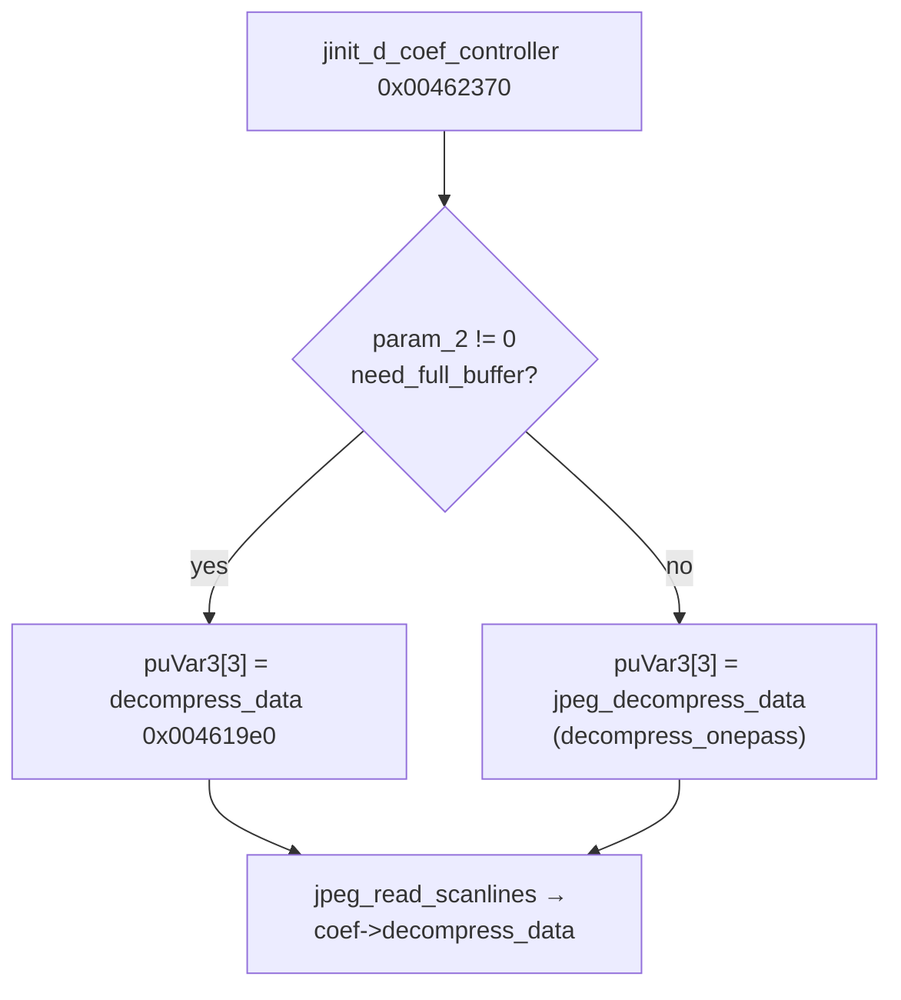

# Round 7 FUN — Task 32 Report

## Task

| Field | Value |
|-------|-------|
| **id** | 32 |
| **round** | 7 |
| **band** | dispatch |
| **seed_address** | `0x004619e0` |
| **title** | FUN recovery: FUN_004619E0 @ 0x004619e0 (xrefs=2) |
| **prior_hint** | round6_logic_task_45 — jdcoef helper |

## Status

**DONE** — IJG `jdcoefct.c` **`decompress_data`** proven via live decompile, disasm, xref closure (`jinit_d_coef_controller` full-buffer branch), and byte-for-byte structural match to libjpeg-6b source. Renamed in Ghidra (was incorrectly `consume_data`); program saved.

## Function

| Address | Before | After | IJG name | Role | Evidence |
|---------|--------|-------|----------|------|----------|
| `0x004619e0` | `consume_data` / `FUN_004619e0` | `decompress_data` | `decompress_data` | Coef-controller **output** method for **multipass / progressive** JPEG (`need_full_buffer` path): wait for input via `inputctl->consume_input`, read coefficient virtual arrays, run per-component `inverse_DCT`, advance `output_iMCU_row`, return `JPEG_ROW_COMPLETED` (3) or `JPEG_SCAN_COMPLETED` (4) | `jinit_d_coef_controller@0x00462370` sets `puVar3[3]=decompress_data` when `param_2!=0` @ `0x00462431`; one-pass path uses `jpeg_decompress_data@0x004615b0` (= IJG `decompress_onepass`); 399 B (`0x18f`); `jdcoefct.c` lines 310–369 |

### Structural proof vs IJG `jdcoefct.c`

| Decompiled pattern @ `0x004619e0` | IJG source |
|-----------------------------------|------------|
| While `input_scan_number < output_scan_number` OR same scan and `input_iMCU_row <= output_iMCU_row`; call `cinfo+0x190` (`inputctl->consume_input`); return 0 on suspend | Lines 324–328 |
| Loop `num_components`; skip if `component_needed` false (`compptr+0x30`) | Lines 332–336 |
| `access_virt_barray` via `mem+0x20` with `output_iMCU_row * v_samp_factor` | Lines 338–341 |
| Last iMCU row: `height_in_blocks % v_samp_factor` block-row count | Lines 343–348 |
| `inverse_DCT[ci]` from `cinfo+0x19c`; inner loop `buffer_ptr++`, coef ptr `+0x80` per block | Lines 350–361 |
| `output_iMCU_row++`; return 3 if more rows else 4 (`4 - (row < total_iMCU_rows)`) | Lines 366–368 |

### Disasm highlights

| VA | Instruction | Proof |
|----|-------------|-------|
| `0x004619e5` | `MOV EDI, [ESP+0x2c]` | Arg0 = `cinfo` |
| `0x004619e5` / `0x00461ab6` | Second arg from stack | `JSAMPIMAGE output_buf` |
| `0x00461a00`–`0x00461a34` | Compare `cinfo+0x7c/0x84/0x80/0x88`; call `[cinfo+0x190]` | Input catch-up loop |
| `0x00461a78` | `CALL [mem+0x20]` | `access_virt_barray` |
| `0x00461af0` | `CALL [inverse_DCT]` | Per-block IDCT |
| `0x00461b00` | `ADD EBX, 0x80` | `JBLOCK` stride (64 coefs × 2 B) |
| `0x00461b4f` | `INC [cinfo+0x88]` | `output_iMCU_row++` |
| `0x00461b64`–`0x00461b67` | `SBB EAX,EAX; ADD EAX,4` | Return 3 or 4 |

### Xrefs (2)

| From | Context |
|------|---------|
| `0x00462431` | `jinit_d_coef_controller` — `puVar3[3] = decompress_data` on `need_full_buffer` (`param_2!=0`) branch; pairs with `puVar3[4]=coef_arrays` |
| `0x00462355` | DATA ref in `.text` immediately before `jinit_d_coef_controller` entry; secondary pointer (same VA as progressive decompress slot) |

### Control flow

## Ghidra deltas

| Action | Target | Result |
|--------|--------|--------|
| `rename_function_by_address` | `0x004619e0` → `decompress_data` | Success (was `consume_data`; PascalCase warnings only) |
| `set_function_prototype` | `int __cdecl decompress_data(int cinfo, int output_buf)` | Success |
| `set_decompiler_comment` | `0x004619e0` | IJG role + wiring comment |
| `force_decompile` | `0x004619e0` | Refreshed |
| `save_program` | `bulanci.exe` | Saved |

## Frida

**none** — Stock libjpeg-6b; static proof via IJG source correspondence and `jinit_d_coef_controller` vtable wiring suffices.

## Remaining UNK

| Item | Notes |
|------|-------|
| `jpeg_decompress_data@0x004615b0` | One-pass coef output (`decompress_onepass` in IJG); mislabeled in `mapping.csv` — separate FUN task |
| `FUN_00461b70@0x00461b70` | Adjacent jdcoefct.c helper; no IJG symbol yet |
| `LAB_004617f0` / `LAB_00462320` | Coef-controller `start_pass` / default `consume_data` slots — not in scope |
