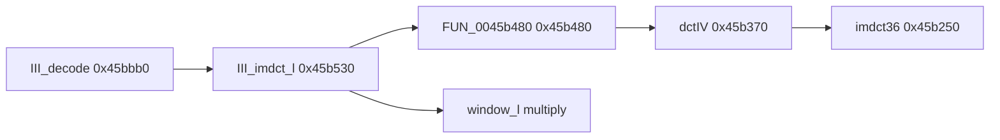

# Round 7 FUN — Task 36 Report

## Task

| Field | Value |
|-------|-------|
| **id** | 36 |
| **round** | 7 |
| **band** | dispatch |
| **seed_address** | `0x0045b480` |
| **title** | FUN recovery: FUN_0045B480 @ 0x0045b480 (xrefs=1) |
| **prior_hint** | round6_logic_task_39 — libmad IMDCT prep; pair with 0x0045b530 |

## Status

**PARTIAL** — Role is **proven**: MSVC-outlined **IMDCT half** of libmad `III_imdct_l()` (`layer3.c`), invoked at the top of `III_imdct_l@0x0045b530` before `window_l` / `window_s` fixed-point multiply. Calls **`dctIV@0x0045b370`** (which calls **`imdct36@0x0045b250`**), then scatters and negates samples into the 36-element `z` buffer. **No rename:** libmad exposes `III_imdct_l`, `imdct36`, and `dctIV` as separate **static** symbols; this 171-byte chunk has **no unique upstream export name** (compiler split of `imdct36(X,z)` inside `III_imdct_l`).

## Function

| Address | Before | After | Role | Evidence |
|---------|--------|-------|------|----------|
| `0x0045b480` | `FUN_0045b480` | `FUN_0045b480` | **III_imdct_l IMDCT stage** — `dctIV(&local_48)`; copy 9×`mad_fixed_t` triplets into `z+8`; negate triplets into `z+0x2c` and `z+0x74` | Live decompile; sole caller `III_imdct_l@0x0045b538`; callee `dctIV` only; `III_decode@0x0045bbb0` → `III_imdct_l` window switch matches libmad 0.15.1b `III_imdct_l` `block_type` 0/1/3 cases |

### Xrefs (1)

| From | Type | Context |
|------|------|---------|
| `0x0045b538` | UNCONDITIONAL_CALL | **`III_imdct_l`** entry — first instruction after prologue; then `param_1` switch multiplies `z[]` by `window_l` / `window_s` @ `0x0049c048` |

### Reachability



Upstream `III_imdct_l` (libmad `layer3.c` ~2068):

```c
imdct36(X, z);
switch (block_type) { /* window_l / window_s */ }
```

Bulanci maps **`imdct36` → `FUN_0045b480` + `dctIV` + `imdct36@0x45b250`** and **`window switch` → `III_imdct_l` tail** — same closure, different object-code layout than a single `imdct36` call site.

### Decompile summary (`bulanci.exe`, post-R7)

1. `dctIV(&local_48)` — DCT-IV + internal `imdct36` on stack staging.
2. Loop `i=0..2`: write 3 dwords from `local_2c` into `z+8` stride 12 (samples 2–35 region setup).
3. Loop `i=0..5`: negate 3 dwords from stack into `z+0x2c` (overlap staging, 18 samples).
4. Loop `i=0..2`: negate 3 dwords into `z+0x74` (upper 36-vector half).

`mapping.csv` lists `0x45b480` size **0xAB** (171 B) — matches Ghidra body `0045b480–0045b52a`.

## Ghidra deltas

| Action | Target | Result |
|--------|--------|--------|
| `set_decompiler_comment` | `0x0045b480` | R7 provenance: III_imdct_l IMDCT half, caller/callee chain |
| `set_plate_comment` | `0x0045b480` | libmad III_imdct_l IMDCT stage (inlined) |
| `set_function_prototype` | `0x0045b480` | `void __thiscall FUN_0045b480(void *z)` |
| `force_decompile` | `0x0045b480` | Refreshed |
| `save_program` | `bulanci.exe` | Saved |

**Not applied:** `rename_function_by_address` — no COFF/libmad export for this fragment ([round6_logic_task_39](../logic_recovery/round6_logic_task_39_report.md) queued same skip).

## Frida

**none** — Single-caller libmad codec closure; static proof sufficient.

## Remaining UNK

| Item | Reason |
|------|--------|
| Canonical symbol name | Could be described as “inlined `imdct36` prologue inside `III_imdct_l`” but **`imdct36` is already named @ `0x0045b250`**; inventing `III_imdct_l_imdct` violates R7 no-guess rule |
| Decompiler `unaff_EDI` | Child inherits `z` pointer in EDI from `III_imdct_l` register allocation; `__thiscall` prototype partially applied — full `mad_fixed_t z[36]` typing deferred |
| `mapping.csv` / `_Globals.h` | Still `FUN_0045b480`; export sync is a separate pass |
| Pair task `0x0045b530` | Already **`III_imdct_l`** in Ghidra; not mutated in this seed scope |
