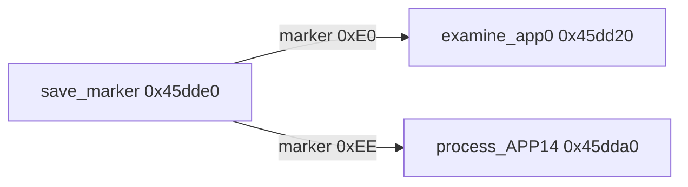

# Round 7 FUN — Task 37 Report

## Task

| Field | Value |
|-------|-------|
| **id** | 37 |
| **title** | FUN recovery: FUN_0045DD20 @ 0x0045dd20 (xrefs=1) |
| **band** | dispatch |
| **seed_address** | `0x0045dd20` |
| **prior_hint** | round6_logic_task_40 (listed as libjpeg marker “writer” — **incorrect**; live proof is **decoder** `jdmarker.c` path) |

## Status

**DONE** — Ghidra MCP verified sole caller, disasm, and decompile against IJG-6b `jdmarker.c::examine_app0`. Renamed `FUN_0045dd20` → **`examine_app0`**; prototype fixed (`__thiscall`, one stack arg); comments updated; program saved.

## Function

| Address | Old name | New name | Role | Evidence |
|---------|----------|----------|------|----------|
| `0x0045dd20` | `FUN_0045dd20` | **`examine_app0`** | IJG-6b **`jdmarker.c::examine_app0`** (JFIF **APP0** core): when `datalen > 14` and payload begins with `"JFIF\0"`, sets `jpeg_decompress_struct` fields at **+0x100..+0x106** (`saw_JFIF_marker`, `JFIF_major/minor_version`, `density_unit`, `X_density`, `Y_density`). Payload pointer passed in **EAX** (MSVC register); `this` = `cinfo` in **ECX**. Binary omits stock 6b **JFXX** branch and **TRACEMS** (optimized/stripped build). | `get_xrefs_to`: single **CALL** from `save_marker` @ **`0x0045df26`** when `cinfo->unread_marker == 0xE0` (`M_APP0`); disasm `CMP [ESP+4],0xe` + `'J'/'F'/'I'/'F'/0` checks; IJG `examine_app0` + `APP0_DATA_LEN==14` ([jpeg-6b jdmarker.c](https://visualizationlibrary.org/docs/2.0/html/jdmarker_8c_source.html)); size **0x7a** per mapping.csv |

### Caller context (`save_marker` @ `0x0045dde0`)

| Step | Detail |
|------|--------|
| Marker | `local_20[0x5f] == 0xe0` → `examine_app0(cinfo, uVar5)` |
| Buffer | Up to **14** bytes copied to stack (`abStack_14`); `uVar5 = min(marker_len, 14)` |
| Sibling | `0xee` → `process_APP14` @ `0x0045dda0` (prior rename; IJG upstream is `examine_app14` — out of scope) |

### `cinfo` field writes (proven offsets)

| Offset | IJG field (6b) | Action |
|--------|----------------|--------|
| `+0x100` | `saw_JFIF_marker` | `= 1` |
| `+0x101` | `JFIF_major_version` | `data[5]` |
| `+0x102` | `JFIF_minor_version` | `data[6]` |
| `+0x103` | `density_unit` | `data[7]` |
| `+0x104` | `X_density` | BE16 `data[8..9]` |
| `+0x106` | `Y_density` | BE16 `data[10..11]` |

### Call graph (marker save path)

## Ghidra deltas

| Action | Target | Result |
|--------|--------|--------|
| `rename_function_by_address` | `0x0045dd20` → `examine_app0` | Applied |
| `set_function_prototype` | `void examine_app0(uint datalen)` + `__thiscall` | Applied (correct 2-param form per GHIDRA_MCP.md) |
| `set_decompiler_comment` | IJG role + EAX payload + stripped JFXX note | Applied |
| `set_plate_comment` | Replaced stale “write marker bytes” header | Applied |
| `force_decompile` | Refresh | Applied |
| `save_program` | `bulanci.exe` | Saved |

## Frida

**none** — Stock IJG-6b marker parser; behavior fully established by disasm, decompile, xref, and upstream `jdmarker.c` attribution.

## Remaining UNK

| Item | Reason |
|------|--------|
| `jpeg_decompress_struct *` `this_type` | Struct not imported in Ghidra DT manager; left `void *this` |
| JFXX / thumbnail / trace paths | Absent from binary body (122 B vs fuller stock `examine_app0`) |
| `process_APP14` @ `0x0045dda0` | Prior round used non-IJG name; should be `examine_app14` on a future FUN task (not task 37 scope) |
| `mapping.csv` row | Still `FUN_0045dd20` / `uchar` return — export sync out of scope |
