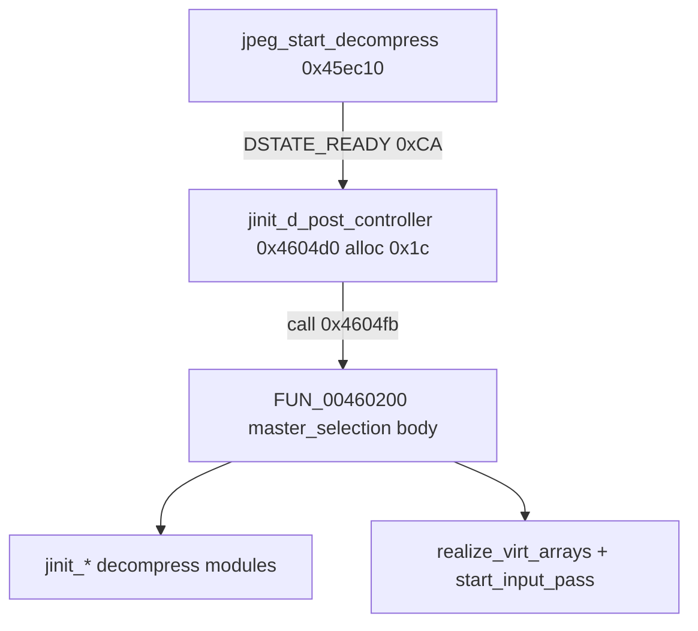

# Round 7 FUN — Task 40 Report

## Task

| Field | Value |
|-------|-------|
| **id** | 40 |
| **round** | 7 |
| **band** | dispatch |
| **seed_address** | `0x00460200` |
| **title** | FUN recovery: FUN_00460200 @ 0x00460200 (xrefs=1) |
| **prior_hint** | round6_logic_task_43/47 — "jpeg compress controller" *(incorrect; re-verified as **decompress**)* |

## Status

**PARTIAL** — Role proven as IJG `master_selection` body (`jdmaster.c`); no rename (compiler-split tail, no unique COFF export; head at `0x004604d0` already `jinit_d_post_controller`). Plate + decompiler comments updated in Ghidra; program saved.

## Function

| Address | Before | After | Role | Evidence |
|---------|--------|-------|------|----------|
| `0x00460200` | `FUN_00460200` | `FUN_00460200` | **IJG decompress `master_selection` body** — module wiring after post-controller alloc: `use_merged_upsample`, quant/colormap flags, `jinit_merged_upsampler` / `jinit_2pass_quantizer`, color/upsample path, `jinit_huff_decoder`, `jinit_d_coef_controller`, `FUN_00461460` main buffers, `realize_virt_arrays`, `start_input_pass` | Live MCP: 1 caller `jinit_d_post_controller@0x004604fb` ← `jpeg_start_decompress@0x0045ec10` (`DSTATE_READY` `0xCA`); 15 callees match `ref/libjpeg6b/jdmaster.c` `master_selection`; disasm `JERR_UNSUPPORTED_MODE` `0x2f` @ `0x0046024e`, `JERR_ARITH_NOTIMPL` `0x1` @ `0x00460300`; `EDI=[ESI+0x180]` post ptr |

### Prior-hint correction

| Source | Claim | Verdict |
|--------|-------|---------|
| R7 manifest / task JSON | "jpeg **compress** controller" | **False** — no `jpeg_start_compress` / `CSTATE_*` xrefs; only decompress API path |
| R6 task 43 | "post-controller init **tail**" | **Partially true** — starts with post-field setup on `[EDI]` (`cinfo+0x180`), but bulk matches **`master_selection`**, not `jdpostct.c` alone |
| R6 task 47 | "compress input-controller helper" | **False** — same decompress closure |

### Disasm highlights

| VA | Instruction | Proof |
|----|-------------|-------|
| `0x00460203` | `MOV EDI,[ESI+0x180]` | `cinfo->post` |
| `0x0046020a` | `CALL 0x0045ff30` | Early `jinit_d_main_controller` / sizing (R6 `FUN_0045ff30`) |
| `0x00460214` | `CALL 0x00460160` | Range-limit table init |
| `0x00460220` | `CALL use_merged_upsample` | `jdmerge.c` gate → `[EDI+0x10]` |
| `0x0046024e` | `MOV [EAX+8],0x2f` | `JERR_UNSUPPORTED_MODE` (raw + quant) |
| `0x004602d0`–`0x004602e4` | `jinit_color_deconverter` / `jinit_upsampler` / `jinit_d_main_controller` | `master_selection` post-process block |
| `0x004602ed` | `CALL 0x00463ee0` | `realize_virt_arrays` |
| `0x00460345` | `CALL jinit_d_coef_controller` | Coef controller + `use_c_buffer` stack arg |
| `0x00460354` | `CALL FUN_00461460` | Main-controller buffers when `!raw_data_out` |
| `0x00460363` / `0x0046036f` | vtable calls | `mem->realize_virt_arrays` + `inputctl->start_input_pass` |

### Callees (MCP)

`jinit_d_main_controller` (`0x0045ff30`, `0x00464230`), `FUN_00460160`, `use_merged_upsample`, `jinit_merged_upsampler` (`0x00467460`, `0x004654f0`), `jinit_2pass_quantizer`, `jinit_color_deconverter`, `jinit_upsampler`, `FUN_00463ee0`, `jinit_huff_decoder` (`0x00463b50`, `0x00462f30`), `jinit_d_coef_controller`, `FUN_00461460`.

### Control flow

### IJG source alignment

`ref/libjpeg6b/jdmaster.c` — `jinit_master_decompress` allocates master then calls `master_selection(cinfo)`. In this PE, `jpeg_start_decompress` calls the **split head** `jinit_d_post_controller@0x004604d0` (alloc + vtable `post_process_1pass`), then this body implements **`master_selection`** logic. Renaming only `0x00460200` to `jinit_master_decompress` or `master_selection` would misrepresent the head; no GLOBAL symbol exists for this split alone.

## Ghidra deltas

| Action | Target | Result |
|--------|--------|--------|
| `set_plate_comment` | `0x00460200` | Success — master_selection body note |
| `set_decompiler_comment` | `0x00460200` | Success — R7 role + prior-hint correction |
| `force_decompile` | `0x00460200` | Refreshed (pre-write) |
| `save_program` | `bulanci.exe` | Saved |

**Not applied:** `rename_function_by_address` — split tail; `jinit_d_post_controller` name on head `0x004604d0` is a separate R7 task; `set_function_prototype` — `cinfo` still `unaff_ESI` in decompiler.

## Frida

**none** — stock libjpeg-6b decompress init; static decompile + xref + IJG source match sufficient.

## Remaining UNK

| Item | Reason |
|------|--------|
| `FUN_00460200` rename | No unique export; paired with `jinit_d_post_controller@0x004604d0` head |
| Head mislabel | `0x004604d0` may be misnamed vs true `jinit_master_decompress` entry (alloc master + call `master_selection`) — out of scope for task 40 |
| `FUN_00460160` / `FUN_00461460` | Helper splits; own FUN tasks |
| Prototype | `__stdcall FUN_00460200(void)` vs implicit `cinfo *` in `ESI` from caller |

## Evidence paths consulted

- [ROUND7_FUN_PROTOCOL.md](../ROUND7_FUN_PROTOCOL.md)
- [GHIDRA_MCP.md](../GHIDRA_MCP.md)
- [logic_recovery/round6_logic_task_43_report.md](../logic_recovery/round6_logic_task_43_report.md)
- [logic_recovery/round6_logic_task_47_report.md](../logic_recovery/round6_logic_task_47_report.md)
- `ref/libjpeg6b/jdmaster.c`, `ref/libjpeg6b/jdpostct.c`
- `config/bulanci/mapping.csv` (`0x460200`, size `0x178`)
- Live Ghidra MCP (`connect_instance bulanci`)
