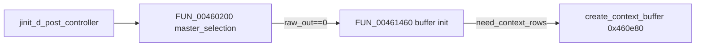

# Round 7 FUN — Task 41 Report

## Task

| Field | Value |
|-------|-------|
| **id** | 41 |
| **round** | 7 |
| **band** | dispatch |
| **seed_address** | `0x00460e80` |
| **title** | FUN recovery: FUN_00460E80 @ 0x00460e80 (xrefs=1) |
| **prior_hint** | *(empty — cross-check [round6_logic_task_44_report.md](../logic_recovery/round6_logic_task_44_report.md))* |

## Status

**DONE** — Behavior matches IJG-6b `jcprepct.c` **LOCAL** `create_context_buffer` (alloc fake row-pointer tables + per-component sample row bases). Renamed in Ghidra; prototype corrected to `void` / `__stdcall`; sole CODE xref and caller disasm prove `cinfo` in **ESI**.

## Function

| Address | Before | After | Role | Evidence |
|---------|--------|-------|------|----------|
| `0x00460e80` | `FUN_00460e80` | `create_context_buffer` | **Context-row buffer setup** for prep/downsample smoothing: `alloc_small` at `prep+0x38`/`+0x3c`, loop `num_components` with `alloc` via `cinfo->mem` (`[cinfo+4]`), row pointer math uses `max_v_samp_factor` @ `cinfo+0x118` and `comp_info` stride `0x15` | Live decompile; disasm uses `[ESI+0x118]`, `[ESI+0x184]`, `[ESI+0x24]`, `[ESI+0xc4]`; matches [IJG `jcprepct.c` `create_context_buffer`](https://github.com/LuaDist/libjpeg/blob/master/jcprepct.c) alloc loop; 1× xref |

### IJG field mapping (this binary)

| Offset | IJG role (compress `jpeg_compress_struct` / shared mem API) |
|--------|---------------------------------------------------------------|
| `cinfo+0x04` | `cinfo->mem->alloc_small` (indirect call) |
| `cinfo+0x24` | `num_components` |
| `cinfo+0xc4` | `comp_info` (loop `+0xc` per component) |
| `cinfo+0x118` | `max_v_samp_factor` (`rgroup_height` in source) |
| `cinfo+0x184` | prep workspace object (`param_1[0x61]` in `FUN_00461460`) |
| `prep+0x38` / `prep+0x3c` | fake `JSAMPROW` pointer tables (`color_buf` setup) |

### Disassembly highlights (`0x00460e80`–`0x00460f29`, 0xAA B)

| VA | Proof |
|----|-------|
| `0x00460e86`–`0x00460e95` | Load `max_v_samp_factor`, prep ptr from `[ESI+0x118]` / `[ESI+0x184]` |
| `0x00460e8b`–`0x00460ea8` | First `alloc_small`; store bases at `[prep+0x38]`, `[prep+0x3c]` |
| `0x00460ec1`–`0x00460f21` | Per-component loop: width `(*piVar6 * piVar6[6]) / max_v_samp_factor`; second alloc; fill pointer arrays |
| `0x00460f29` | `RET` (leaf, no stack args consumed) |

### Decompile (post-rename)

```c
void create_context_buffer(void)
{
  /* cinfo in ESI — see caller FUN_00461460 @ 0x004614c6 */
  int rgroup = *(int *)(cinfo + 0x118);
  int prep   = *(int *)(cinfo + 0x184);
  void *base = (*(code **)cinfo->mem->alloc_small)(...);
  *(int *)(prep + 0x38) = base;
  *(int *)(prep + 0x3c) = base + cinfo->num_components * 4;
  for (ci = 0; ci < cinfo->num_components; ci++) {
    /* alloc row storage; store at prep+0x38[ci], prep+0x3c[ci] */
  }
}
```

*(Ghidra still shows `unaff_ESI` until a register calling convention is modeled; caller passes `cinfo` in ESI — see below.)*

### Xref closure

| Direction | Address | Symbol | Notes |
|-----------|---------|--------|-------|
| **Caller (sole)** | `0x004614c6` | `FUN_00461460` | `CALL create_context_buffer` when `[downsample+8] != 0` and `max_v_samp_factor < 2` guard passed (`CMP [ESI+0x118],2` @ `0x004614aa`) |
| **Caller chain** | `0x00460354` | `FUN_00460200` | Decompress `master_selection` body ([R7 task 40](../fun_recovery/)); calls `FUN_00461460(ESI,'\0')` when `[cinfo+0x41]==0` |
| **Upstream** | `0x004604fb` | `jinit_d_post_controller` | Sole caller of `FUN_00460200` |

Caller disasm @ `0x004614c6` (ESI = `cinfo` throughout `FUN_00461460`):

```
004614a4  CMP byte ptr [EDX+0x8],0x0    ; downsample need_context_rows
004614aa  CMP dword ptr [ESI+0x118],0x2
004614c6  CALL create_context_buffer     ; ESI unchanged
```

### Control flow



## Ghidra deltas

| Action | Target | Result |
|--------|--------|--------|
| `rename_function_by_address` | `0x00460e80` → `create_context_buffer` | Success |
| `set_function_prototype` | `void create_context_buffer(void)` + `__stdcall` | Success (was erroneous `uchar` in `mapping.csv`) |
| `set_decompiler_comment` | `0x00460e80` | Role + xref + ESI convention |
| `force_decompile` | `0x00460e80` | Refreshed |
| `save_program` | `bulanci.exe` | Saved |

**Not applied:** `set_function_this_type` — plain C API; `cinfo` passed in **ESI** by caller, not ECX `this`.

## Frida

**none** — Static disasm/decompile + IJG source line match close the role; no runtime ambiguity.

## Remaining UNK

| Item | Reason |
|------|--------|
| `cinfo` register typing in decompiler | Caller uses ESI; Ghidra shows `unaff_ESI` — optional custom storage / caller prototype on `FUN_00461460` |
| `FUN_00461460` rename | Buffer-init wrapper (0x50 B object @ `cinfo+0x184`, vtable `@0x004613e0`); separate R7 task |
| `FUN_00460f30` | Vtable path @ `0x0046142e` (edge expand / `pre_process_context` homolog), not tail of this function |
| Decompress-only caller chain | Logic matches **compressor** `jcprepct.c` LOCAL; only reached via `FUN_00460200` decompress init — confirm shared IJG object layout vs. mis-labeled caller on next slice |
| `mapping.csv` / `_Globals.cpp` | Still list `FUN_00460e80` / `uchar` — export regen not in scope |
