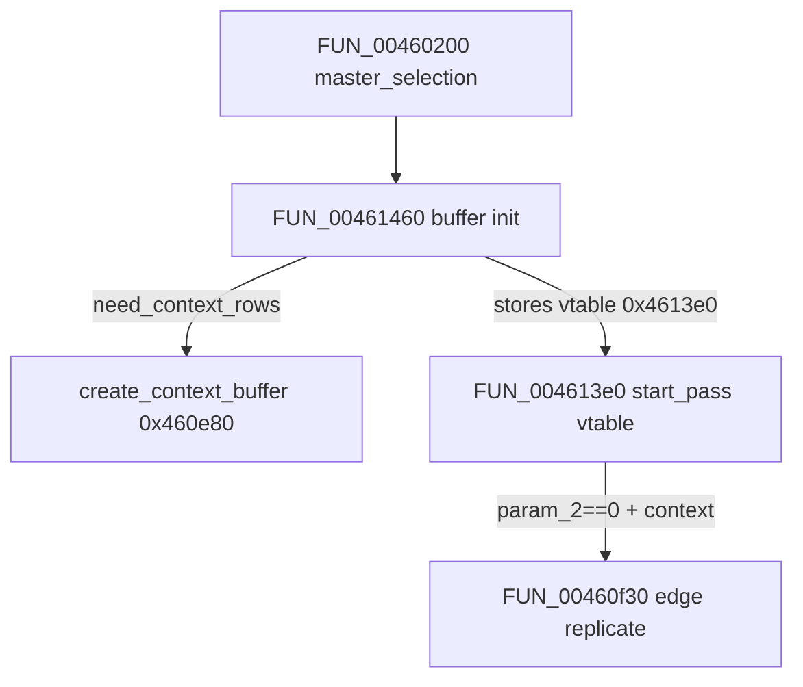

# Round 7 FUN — Task 42 Report

## Task

| Field | Value |
|-------|-------|
| **id** | 42 |
| **round** | 7 |
| **band** | dispatch |
| **seed_address** | `0x00460f30` |
| **title** | FUN recovery: FUN_00460F30 @ 0x00460f30 (xrefs=1) |
| **prior_hint** | [round6_logic_task_44_report.md](../logic_recovery/round6_logic_task_44_report.md) — jcprepct.c local (context edge expand); pairs with [task 41](round7_fun_task_41_report.md) `create_context_buffer` head |

## Status

**PARTIAL** — Role and sole xref closure proven via live Ghidra MCP (`connect_instance bulanci`). **No rename:** compiler-split **LOCAL** from IJG `jcprepct.c` `create_context_buffer`; no standalone COFF/export symbol (Round 7 no-guess rule). Prototype corrected to `void __cdecl FUN_00460f30(int cinfo)`; plate + decompiler comments applied; program saved.

## Function

| Address | Before | After | Role | Evidence |
|---------|--------|-------|------|----------|
| `0x00460f30` | `FUN_00460F30` | **`FUN_00460F30`** *(unchanged)* | **Context-row edge replication** for prep-controller `color_buf`: three per-component loops over fake row-pointer tables at `prep+0x38` / `prep+0x3c` mirroring top/bottom context rows and left edge samples for downsampling smoothing | Live decompile; disasm 322 B (`0x142`); signature hash 105 insns / 18 BB; matches IJG `jcprepct.c` inline edge setup after `create_context_buffer` alloc ([task 41](round7_fun_task_41_report.md)); 1× CODE xref |

### IJG field mapping (this binary)

| Offset | IJG role |
|--------|----------|
| `cinfo+0x24` | `num_components` |
| `cinfo+0xc4` | `comp_info` (loop stride `0x54` / `0x15` dwords; width at `+0xc`) |
| `cinfo+0x118` | `max_v_samp_factor` (`rgroup_height`) |
| `cinfo+0x184` | prep workspace object (`cinfo->prep` in decompress wiring) |
| `cinfo+0x1a0` | `downsample` module; `byte+8` = `need_context_rows` |
| `prep+0x38` / `prep+0x3c` | real vs fake `JSAMPROW` pointer tables |
| `prep+0x08[ci]` | per-component row base used in mirror math |

### Algorithm (decompile, three loops per component)

1. **`(max_v_samp_factor + 2) × samples_per_row`** — copy mirrored samples between paired rows in fake (`+0x3c`) and real (`+0x38`) pointer arrays (top/bottom context padding).
2. **`2 × samples_per_row`** — interleave-copy between row groups inside the fake buffer (vertical context mirroring).
3. **`samples_per_row`** — replicate leftmost sample leftward (horizontal edge expand).

Where `samples_per_row = (width_in_blocks × DCTSIZE) / max_v_samp_factor` from `comp_info`.

### Disassembly highlights (`0x00460f30`–`0x00461071`)

| VA | Proof |
|----|-------|
| `0x00460f37` / `0x00460f40` | Load `max_v_samp_factor`, `num_components` from `[cinfo+0x118]`, `[cinfo+0x24]` |
| `0x00460f44` / `0x00460f4e` | Load prep workspace `[cinfo+0x184]`, `comp_info` `[cinfo+0xc4]` |
| `0x00460f7c`–`0x00460f89` | `samples_per_row = IMUL/DIV` using comp width and `max_v_samp_factor` |
| `0x00460f89`–`0x00460f9c` | Index `prep+0x38[ci]`, `prep+0x3c[ci]` row pointers |
| `0x00460fa6`–`0x00460fd4` | Loop 1: `(max_v+2)*samples` mirror copies |
| `0x00460fe2`–`0x0046101a` | Loop 2: `2*samples` vertical interleave |
| `0x00461028`–`0x0046104a` | Loop 3: left-edge replicate |
| `0x00461055` | Component loop advance `comp_info += 0x54` |

### Xref closure

| Direction | Address | Symbol | Notes |
|-----------|---------|--------|-------|
| **Caller (sole CODE)** | `0x0046142e` | `FUN_004613e0` (prep vtable `@ LAB_004613e0`) | `CALL FUN_00460f30` when `param_2==0` (start_pass) and `[cinfo+0x1a0+8]!=0` (`need_context_rows`); sets `prep+4 = LAB_00461270` first |
| **Vtable install** | `0x00461483` | `FUN_00461460` | `mov [prep], 0x4613e0` stores prep method table ([task 45](round7_fun_task_45_report.md)) |
| **Upstream chain** | `0x00460354` | `FUN_00460200` | Decompress `master_selection` → `FUN_00461460` when `[cinfo+0x41]==0` |
| **Alloc head (sibling)** | `0x004614c6` | `create_context_buffer` | Task 41 — allocates `prep+0x38/+0x3c` before edge replication runs |

Caller disasm @ `0x0046142e`:

```
0046141b  MOV ECX,[EAX+0x1a0]       ; downsample module
00461421  CMP byte ptr [ECX+0x8],0   ; need_context_rows
00461427  MOV [ESI+0x4],0x461270     ; pre_process_context homolog
0046142e  CALL 0x00460f30            ; edge replication (this function)
00461433  ADD ESP,0x4
```

### Control flow (context-buffer cluster)



## Ghidra deltas

| Action | Target | Result |
|--------|--------|--------|
| `set_plate_comment` | `0x00460f30` | Applied (R7 task42 role + sole xref) |
| `set_decompiler_comment` | `0x00460f30` | Applied (create_context_buffer tail + caller proof) |
| `set_function_prototype` | `void __cdecl FUN_00460f30(int cinfo)` | Applied (was erroneous `uchar` in `mapping.csv`) |
| `force_decompile` | `0x00460f30` | Refreshed |
| `save_program` | `bulanci.exe` | Saved |

**Not applied:** `rename_function_by_address` — no unique IJG export; LOCAL split tail, not `expand_bottom_edge` alone.

## Frida

**none** — Static disasm/decompile + IJG source cluster match close the role; runtime hooking would not yield a symbol name.

## Remaining UNK

| Item | Reason |
|------|--------|
| Exact IJG static name | Edge-replication loops are **inline** in `create_context_buffer` in IJG 6b; MSVC split into `create_context_buffer` @ `0x460e80` + this tail — no separate COFF label |
| `FUN_004613e0` / `LAB_00461270` naming | Prep vtable methods (`start_pass`, `pre_process_context` homologs); separate slice |
| `FUN_00461160` ordering | Row-shift helper @ `0x461331` in adjacent unlisted block; related but distinct call site from this xref |
| `mapping.csv` / `_Globals.cpp` | Still list `FUN_00460f30` / `uchar` — export regen not in scope |
