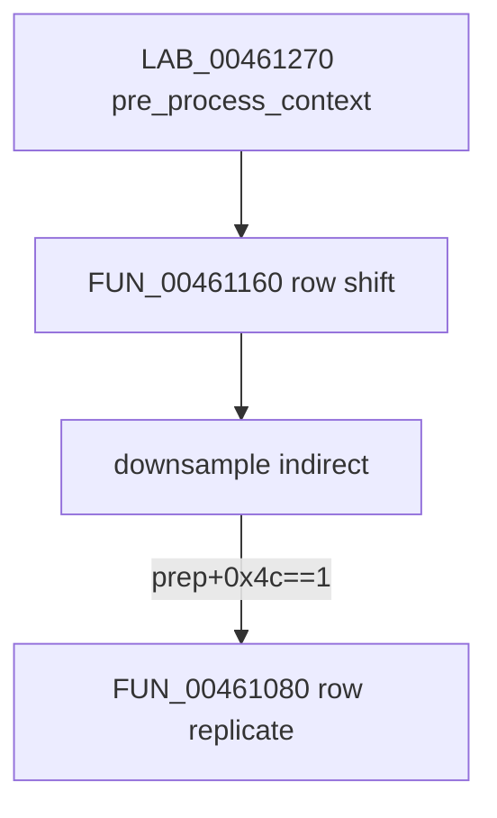

# Round 7 FUN — Task 43 Report

## Task

| Field | Value |
|-------|-------|
| **id** | 43 |
| **round** | 7 |
| **band** | dispatch |
| **seed_address** | `0x00461080` |
| **title** | FUN recovery: FUN_00461080 @ 0x00461080 (xrefs=1) |
| **prior_hint** | [round6_logic_task_44_report.md](../logic_recovery/round6_logic_task_44_report.md) — jcprepct.c local (h/v expand); pairs with [task 41](round7_fun_task_41_report.md) `create_context_buffer`, [task 42](round7_fun_task_42_report.md) edge expand, [task 44](round7_fun_task_44_report.md) row shift |

## Status

**PARTIAL** — Role and sole xref closure proven via live Ghidra MCP (`connect_instance bulanci`). **No rename:** compiler-split **LOCAL** from IJG `jcprepct.c` `pre_process_context` cluster; no standalone COFF/export symbol (Round 7 no-guess rule). Prototype corrected to `void __cdecl`; plate + decompiler comments corrected (stale “FUN_00461460 buffer setup” caller); `bulanci.exe` saved.

## Function

| Address | Before | After | Role | Evidence |
|---------|--------|-------|------|----------|
| `0x00461080` | `FUN_00461080` | **`FUN_00461080`** *(unchanged)* | **Vertical context-row sample replication** in fake `color_buf`: for each component, copy `samples_per_row` dwords from row `max_v+1` → row `-1` and from row `0` → row `max_v+2`, syncing paired real/fake pointer tables at `prep+0x38` / `prep+0x3c` | Live decompile; disasm 215 B (`0xD7`); 1× CODE xref; PE call-site proof @ `0x0046137d` |

### IJG field mapping (this binary)

| Offset | IJG role |
|--------|----------|
| `cinfo+0x24` | `num_components` |
| `cinfo+0xc4` | `comp_info` (loop stride `0x54`; width at `+0xc`, blocks at `+0x18`) |
| `cinfo+0x118` | `max_v_samp_factor` |
| `cinfo+0x184` | prep workspace (`cinfo->prep` in decompress wiring) |
| `prep+0x38` / `prep+0x3c` | real vs fake `JSAMPROW` pointer tables |
| `prep+0x4c` | pass-phase flag; must be `1` before this helper runs |

Where `samples_per_row = (width_in_blocks × DCTSIZE) / max_v_samp_factor` from `comp_info`.

### Algorithm (decompile, per component)

Given `max_v = cinfo+0x118`, row base `puVar9` from `prep+0x3c[ci]`:

- `puVar5 = puVar9 - samples_per_row` — fake row index **−1**
- `puVar8 = puVar9 + (max_v+1)*samples_per_row` — source row above center
- `puVar6 = puVar9 + (max_v+2)*samples_per_row` — fake row index **max_v+2**
- Loop copies dword pairs into both `+0x3c` and mirrored offsets through `prep+0x38[ci]` base delta `iVar4`.

Matches IJG `jcprepct.c` context-mode padding inside `pre_process_context` (not `expand_bottom_edge`, which uses `jcopy_sample_rows` on whole rows).

### Disassembly highlights (`0x00461080`–`0x00461156`)

| VA | Proof |
|----|-------|
| `0x00461088` / `0x0046109c` | Load `max_v_samp_factor`, prep ptr from `[cinfo+0x118]`, `[cinfo+0x184]` |
| `0x00461098` | `num_components` at `[cinfo+0x24]` |
| `0x004610c4`–`0x004610cc` | `samples_per_row = IMUL comp_width / max_v` |
| `0x004610d2`–`0x004610db` | Index `prep+0x38[ci]`, `prep+0x3c[ci]` |
| `0x004610e6`–`0x004610f2` | Row pointer math: `-samples`, `+(max_v+1)*samples`, `+(max_v+2)*samples` |
| `0x00461107`–`0x00461127` | Inner loop: 4-byte copy top mirror + bottom mirror |
| `0x0046113b` | Component loop `comp_info += 0x54` |

### Xref closure

| Direction | Address | Symbol | Notes |
|-----------|---------|--------|-------|
| **Caller (sole CODE)** | `0x0046137d` | `LAB_00461270` (`pre_process_context` homolog) | `CALL FUN_00461080` when `[prep+0x4c]==1` after `FUN_00461160` @ `0x00461331` and downsampler indirect @ `0x00461365` |
| **Sibling calls (same block)** | `0x00461331` | `FUN_00461160` | Row-pointer shift ([task 44](round7_fun_task_44_report.md)) |
| **Vtable install** | `0x00461483` | `FUN_00461460` | Stores prep vtable `@0x004613e0`; does **not** call this function directly |
| **Start-pass edge (related)** | `0x0046142e` | `FUN_004613e0` | Calls `FUN_00460f30` once at pass start ([task 42](round7_fun_task_42_report.md)) |
| **Upstream chain** | `0x00460354` | `FUN_00460200` | Decompress `master_selection` → `FUN_00461460` when `[cinfo+0x41]==0` |

Caller disasm @ `0x0046137d` (EDI = `cinfo`, ESI = prep workspace):

```
00461330  PUSH EDI
00461331  CALL 0x00461160          ; row shift (prep+0x48)
00461365  CALL [downsample+4]      ; downsampler pre_process hook
00461377  CMP dword ptr [ESI+0x4c],1
0046137a  JNE 0x00461385
0046137c  PUSH EDI
0046137d  CALL 0x00461080          ; this function
00461382  ADD ESP,4
```

### Control flow (context-buffer cluster)



## Ghidra deltas

| Action | Target | Result |
|--------|--------|--------|
| `set_plate_comment` | `0x00461080` | Applied — corrected caller (`pre_process_context@0x0046137d`, not `FUN_00461460`) |
| `set_decompiler_comment` | `0x00461080` | Applied — algorithm + xref proof |
| `set_function_prototype` | `void __cdecl FUN_00461080(int cinfo)` | Applied (was erroneous `uchar` in `mapping.csv`) |
| `force_decompile` | `0x00461080` | Refreshed (`param_1` → `cinfo`) |
| `save_program` | `bulanci.exe` | Saved |

**Not applied:** `rename_function_by_address` — no unique IJG export; LOCAL split from `pre_process_context`, not a documented `expand_*` COFF label.

## Frida

**none** — Static disasm/decompile + IJG `jcprepct.c` cluster match close the role; runtime hooking would not yield a symbol name.

## Remaining UNK

| Item | Reason |
|------|--------|
| Exact IJG static name | Replication is **inline** in `pre_process_context` in IJG 6b; MSVC split into `FUN_00461160` + this helper — no separate COFF label |
| `LAB_00461270` / `FUN_004613e0` naming | Prep vtable methods not in this task scope |
| `mapping.csv` / `_Globals.cpp` | Still list `FUN_00461080` / `uchar` — export regen not in scope |

## Evidence paths

- [ROUND7_FUN_PROTOCOL.md](../ROUND7_FUN_PROTOCOL.md), [GHIDRA_MCP.md](../GHIDRA_MCP.md)
- [round6_logic_task_44_report.md](../logic_recovery/round6_logic_task_44_report.md), [jpeg_decoder.md](../../formats/jpeg_decoder.md)
- `config/bulanci/mapping.csv` (`0x461080`, size `0xd7`, `__cdecl`)
- PE disasm `orig/bulanci.exe` (Capstone via pefile, Jun 2026)
