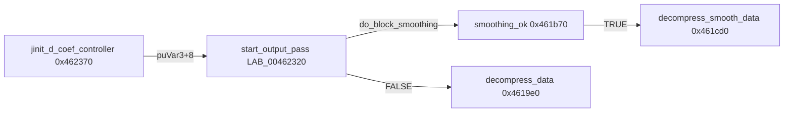

# Round 7 FUN — Task 46 Report

## Task

| Field | Value |
|-------|-------|
| **id** | 46 |
| **round** | 7 |
| **band** | dispatch |
| **seed_address** | `0x00461b70` |
| **title** | FUN recovery: FUN_00461B70 @ 0x00461b70 (xrefs=1) |
| **prior_hint** | round6_logic_task_45 — “adjacent jdcoefct UNK” (address-only; logic was wrong) |

## Status

**DONE** — Stock IJG **`smoothing_ok`** (`jdcoefct.c`, `BLOCK_SMOOTHING_SUPPORTED`). Renamed in Ghidra; prototype + decompiler comment applied; program saved.

## Function

| Address | Before | After | Role | Evidence |
|---------|--------|-------|------|----------|
| `0x00461b70` | `FUN_00461b70` | `smoothing_ok` | `LOCAL(boolean) smoothing_ok`: gates block smoothing on progressive JPEG with `coef_bits`; validates per-component quant table DC+AC entries; latches AC coef bit counts; returns whether any AC coef is still inaccurate | IJG `jdcoefct.c` source match; `CALL` from `start_output_pass` stub `LAB_00462320@0x00462338`; on success stub sets `coef+0xc` → `decompress_smooth_data@0x00461cd0` |

### Xrefs (1)

| From | Type | Context |
|------|------|---------|
| `0x00462338` | **CALL** | `start_output_pass` body at `LAB_00462320` (installed as `puVar3[2]` in `jinit_d_coef_controller@0x0046239b`) when `coef->coef_arrays` (`[ESI+0x10]`) non-null and `cinfo->do_block_smoothing` (`[EDI+0x49]`) set |

### Control flow (block smoothing wiring)

### Offset correspondence (Win32 `jpeg_decompress_struct` / `my_coef_ptr`)

| Binary use | IJG field (conceptual) |
|------------|----------------------|
| `[cinfo+0xc8]` byte gate | `progressive_mode` (early-out if false) |
| `[cinfo+0x8c]` | `coef_bits` pointer array |
| `[cinfo+0x49]` | `do_block_smoothing` (checked in `start_output_pass` stub only) |
| `[cinfo+0x188]` | `cinfo->coef` private controller |
| `[coef+0x70]` | `coef_bits_latch` (alloc via `mem->alloc_small`) |
| `[cinfo+0x24]` / `[cinfo+0xc4]` | `num_components` / `comp_info` (+0x54 stride) |
| Quant `short` tests at `quant_table` | DC + five AC quantizers nonzero (IJG `Q01`…`Q02` positions) |
| `coef_bits[0] >= 0` | DC coefficients “known” for smoothing |
| Latch `coef_bits[1..5]` | AC accuracy bits; any nonzero → `smoothing_useful` |

Size **352 B** (`0x160`) per `config/bulanci/mapping.csv`. Export stub remains `_Globals::FUN_00461b70` in `_Globals.cpp` until pipeline refresh.

## Ghidra deltas

| Action | Target | Result |
|--------|--------|--------|
| `rename_function_by_address` | `0x00461b70` → `smoothing_ok` | Success (PascalCase warnings — IJG upstream name kept) |
| `set_function_prototype` | `int __cdecl smoothing_ok(int * cinfo)` | Success |
| `set_decompiler_comment` | `0x00461b70` | IJG `smoothing_ok` / `start_output_pass` note |
| `force_decompile` | `0x00461b70` | Refreshed |
| `save_program` | `bulanci.exe` | Saved |

## Frida

**none** — Stock libjpeg-6b block-smoothing path; static IJG correspondence + xref/disasm proof sufficient.

## Remaining UNK

| Item | Reason |
|------|--------|
| `LAB_00462320` label | `start_output_pass` stub not renamed (out of seed scope); only documented |
| `decompress_smooth_data@0x00461cd0` | Separate FUN task — not created in Ghidra yet |
| Decompiler `unaff_EDI` | Param `cinfo` not fully bound despite prototype; disasm uses `EDI` from caller stub |
| `_Globals.cpp` / `mapping.csv` | Still `FUN_00461b70` export name until delinker pass |
| Prior R6 “jdcoef adjacency” note | **Incorrect role** — not a mystery coef helper; IJG-local `smoothing_ok` |
