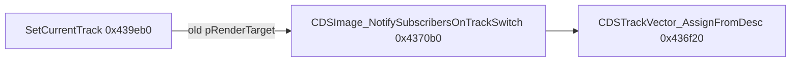

# Round 8 FUN — Task 03 Report

## Task

| Field | Value |
|-------|-------|
| **id** | 3 |
| **round** | 8 |
| **band** | sim |
| **seed_address** | `0x004370b0` |
| **title** | FUN recovery: FUN_004370B0 @ 0x004370b0 (xrefs=1) |
| **prior_hint** | R7 task 26/27 — track-switch iterator; caller SetCurrentTrack |

## Status

**DONE** — Live Ghidra MCP confirms **`CDSImage`** subscriber fan-out on **`m_slotVector` / `m_slotCount` @ `+0x38..+0x40` before `SetCurrentTrack` swaps `pRenderTarget` (`+0x30`). Renamed **`CDSImage_NotifySubscribersOnTrackSwitch`**; typed `CDSImage *` / `__thiscall`; program saved. R7 “audio bank” label was stale (same 3-word copy path as `CDSTrackVector_AssignFromDesc`, but runtime `this` is the outgoing render target, not `CDSAudioBank`).

## Function

| Address | Ghidra name (before → after) | Role summary | Evidence |
|---------|------------------------------|--------------|----------|
| `0x004370b0` | `FUN_004370b0` → **`CDSImage_NotifySubscribersOnTrackSwitch`** | Stack-local `CDSTrackVector`; **`CDSTrackVector_AssignFromDesc(&local, &this->m_slotVector.pSlots)`** (descriptor = `{pSlots, nCapacity, m_slotCount}`); reverse-walk subscribers, **`CALL [obj+8](this, trackSwitchCookie, cookie)`**; **`CDSPtrSlotVec_Resize(&local, 0)`** | **Disasm:** `LEA EAX,[EDI+0x38]` / `CALL 0x00436f20`; loop `MOV EAX,[EDX+0x8]` with `PUSH EDI` (consumer). **Xref (1):** `SetCurrentTrack@0x00439f04` → `CDSImage_NotifySubscribersOnTrackSwitch(*(CDSImage**)this+0x30, trackSwitchCookie)` where `trackSwitchCookie = newTrack->vtable+0x24()` |

### Caller chain

### Sibling notify APIs (same consumer layout)

| API | vtable slot | Trigger |
|-----|-------------|---------|
| `NotifyDirtyRect@0x00436e40` | `+0x00` | dirty rect fan-out |
| `NotifyMove@0x00436e80` | `+0x04` | FLX tag 10 |
| `NotifyRegionList@0x00436eb0` | `+0x0c` | FLX tag 11 |
| `BroadcastFrameTimeHint@0x00436ef0` | `+0x10` | FLX opcode 0x0C |
| **this task** | **`+0x08`** | **`SetCurrentTrack` render-target swap** |

## Ghidra deltas

| Action | Target | Result |
|--------|--------|--------|
| `set_function_prototype` | `0x004370b0` | `void CDSImage_NotifySubscribersOnTrackSwitch(void * trackSwitchCookie)` + `__thiscall` |
| `set_function_this_type` | `0x004370b0` | `CDSImage *` (class-scoped) |
| `rename_function_by_address` | `0x004370b0` | `CDSImage_NotifySubscribersOnTrackSwitch` |
| `set_decompiler_comment` | `0x004370b0` | caller + slot layout |
| `force_decompile` | `0x004370b0`, `0x00439eb0` | `this->m_slotVector`; caller shows typed call |
| `save_program` | `bulanci.exe` | saved |

## Frida

**none** — sole xref, loop bounds, and vtable offset closed from disasm/decompile.

## Remaining UNK

| Item | Reason |
|------|--------|
| Subscriber `vtable+8` symbol | Shared with teardown `vfn[8]` in `anim_runtime.md` (unsubscribe); no per-class plate rename in this task |
| `SetCurrentTrack` namespace | Still `_Globals::SetCurrentTrack` in export; `CDSVideoPlayer *` typing deferred |
| `mapping.csv` / `_Globals.cpp` stub | Still `FUN_004370b0` until next export pass |

## Cross-links

- [round7_fun_task_27_report.md](round7_fun_task_27_report.md) — `CDSTrackVector_AssignFromDesc` callee
- [round7_fun_task_26_report.md](round7_fun_task_26_report.md) — `CDSPtrSlotVec_AssignFromDesc` core copy
- [CDSImage.md](../struct_recovery/CDSImage.md) — subscriber list `+0x38` / `+0x40`
- [CDSVideoPlayer.md](../struct_recovery/CDSVideoPlayer.md) — `pRenderTarget` @ `+0x30`
- [anim_runtime.md](../anim_runtime.md) — `SetCurrentTrack` / track-manager layout
