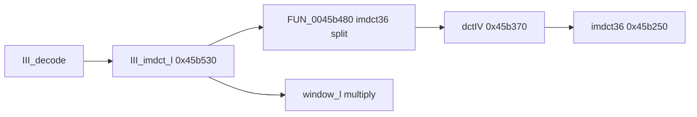

# Round 8 FUN — Task 04 Report

## Task

| Field | Value |
|-------|-------|
| **id** | 4 |
| **round** | 8 |
| **band** | dispatch |
| **seed_address** | `0x0045b480` |
| **title** | FUN recovery: FUN_0045B480 @ 0x0045b480 (xrefs=1) |
| **prior_hint** | R7 task 36 — libmad IMDCT half before III_imdct_l |

## Status

**PARTIAL** — Role **re-confirmed** in live Ghidra: MSVC-outlined **outer half** of libmad `imdct36(X, z)` inlined at the start of `III_imdct_l` (`layer3.c`). Calls **`dctIV@0x0045b370`** (which calls **`imdct36@0x0045b250`**), then copies/negates fixed-point triplets into the 36-element `z` buffer before `III_imdct_l` applies `window_l` / `window_s`. **No rename:** `imdct36` is already the libmad symbol @ `0x0045b250`; this 171-byte fragment is not a separate COFF/static export and would collide or invent a name if forced to `imdct36`.

## Function

| Address | Before | After | Role | Evidence |
|---------|--------|-------|------|----------|
| `0x0045b480` | `FUN_0045b480` | `FUN_0045b480` | **III_imdct_l `imdct36` split** — `dctIV` staging + scatter/negate into `z[36]`; `X` on stack, `z` in **EDI** from parent | MCP decompile/disasm; 1 xref; callee `dctIV` only; R7/R6 closure unchanged |

### Xrefs (1)

| From | Type | Context |
|------|------|---------|
| `0x0045b538` | UNCONDITIONAL_CALL | **`III_imdct_l`** — `MOV EDI,ECX` (`z`), `PUSH EAX` (`X`), `CALL FUN_0045b480`, `ADD ESP,4` |

### Reachability



`III_decode` callers of `III_imdct_l`: `0x0045be8b`, `0x0045bf56` (unchanged from R7 task 30).

### Disasm proof (calling convention)

| VA | Instruction | Meaning |
|----|-------------|---------|
| `0x0045b535` | `MOV EDI,ECX` | `z` buffer (`__thiscall` `this` on `III_imdct_l`) |
| `0x0045b537` | `PUSH EAX` | `X` — 18 `mad_fixed_t` coeffs for DCT-IV path |
| `0x0045b538` | `CALL 0x0045b480` | Split helper |
| `0x0045b48b` | `MOV EAX,[ESP+0x5c]` | Helper loads pushed `X` before `CALL dctIV` |
| `0x0045b4a7`–`0x0045b517` | `[EDI+…]` stores | Writes into `z` at offsets `+8`, `+0x2c`, `+0x74` |

Body size **0xAB** (171 B), `0045b480`–`0045b52a` — matches `mapping.csv`.

### Decompile summary (post-R8)

1. `dctIV(&local_48)` — type-IV DCT path; inner `imdct36(local_48, param_1)` inside `dctIV`.
2. Loop ×3: copy stack triplets → `z+8` stride 12.
3. Loop ×6: negate stack triplets → `z+0x2c`.
4. Loop ×3: negate stack triplets → `z+0x74`.

Upstream libmad (`layer3.c` ~2062):

```c
imdct36(X, z);
switch (block_type) { /* window_l / window_s */ }
```

Bulanci object code maps that single call to **`FUN_0045b480` + `dctIV` + `imdct36@0x45b250`** plus the **`III_imdct_l`** tail @ `0x0045b530`.

## Ghidra deltas

| Action | Target | Result |
|--------|--------|--------|
| `set_decompiler_comment` | `0x0045b480` | R8: imdct36 split, X stack / z EDI, rename rationale |
| `set_plate_comment` | `0x0045b480` | `libmad III_imdct_l imdct36 split (inlined); z=EDI, X=stack arg` |
| `set_function_prototype` | `0x0045b480` | `void FUN_0045b480(int *X)` (cdecl stack arg for `X`) |
| `force_decompile` | `0x0045b480` | Refreshed; `unaff_EDI` for `z` remains (register inherited from caller) |
| `save_program` | `bulanci.exe` | Saved |

**Not applied:** `rename_function_by_address` — `imdct36` taken @ `0x0045b250`; no unique libmad export for this MSVC-outlined wrapper ([R7 task 36](round7_fun_task_36_report.md), [R6 logic task 39](../logic_recovery/round6_logic_task_39_report.md)).

## Frida

**none** — Static xref/disasm closure under `III_decode` is sufficient.

## Remaining UNK

| Item | Reason |
|------|--------|
| Canonical symbol | Best description: inlined **`imdct36(X,z)` prologue** inside `III_imdct_l`; not a distinct libmad symbol in this PE |
| `unaff_EDI` in decompiler | `z` passed in EDI from `III_imdct_l`; Ghidra does not model register-arg `z` on this helper |
| `mapping.csv` / `_Globals.h` | Still `FUN_0045b480` / stub `uchar` — export sync out of scope |
| `__thiscall` artifact | Decompiler may still show spurious `this` after prototype fix; disasm is authoritative |
