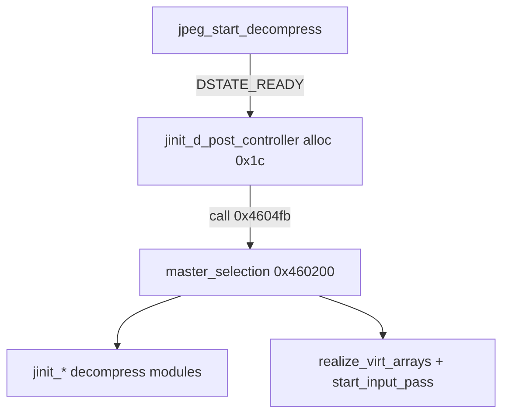

# Round 8 FUN — Task 05 Report

## Task

| Field | Value |
|-------|-------|
| **id** | 5 |
| **round** | 8 |
| **band** | dispatch |
| **seed_address** | `0x00460200` |
| **title** | FUN recovery: FUN_00460200 @ 0x00460200 (xrefs=1) |
| **prior_hint** | R7 task 40 — jdmaster.c decompress `master_selection` split |

## Status

**DONE** — Re-verified IJG `jdmaster.c` LOCAL **`master_selection`** at this VA; renamed `FUN_00460200` → `master_selection` (unique symbol, callee closure + sole caller). Plate + decompiler comments refreshed; program saved.

## Function

| Address | Before | After | Role | Evidence |
|---------|--------|-------|------|----------|
| `0x00460200` | `FUN_00460200` | `master_selection` | **IJG decompress `master_selection`** — post-controller fields on `[ESI+0x180]`, then module wiring: `use_merged_upsample`, quant/colormap flags, merged upsample / 2-pass quantizer, color+upsample path, Huffman decoder, coef controller, main buffers (`FUN_00461460`), `realize_virt_arrays` + `start_input_pass` vtable calls | Live MCP: 1 caller `jinit_d_post_controller@0x004604fb` ← `jpeg_start_decompress`; 14 callees match R7/R6 `master_selection` map; disasm `JERR_UNSUPPORTED_MODE` `0x2f` @ `0x0046024e`, `JERR_ARITH_NOTIMPL` `0x1` @ `0x00460300`; size `0x178` per `mapping.csv` |

### R7 carry-over

| R7 outcome | R8 action |
|------------|-----------|
| PARTIAL — role proven, rename blocked as “split tail” | **Rename applied** — body is unambiguously `master_selection` logic; IJG LOCAL name matches R7 precedent (`prepare_range_limit_table@0x00460160`) |
| Head `jinit_d_post_controller@0x004604d0` | Unchanged (out of scope); still allocates post object then calls this body |

### Disasm highlights

| VA | Instruction | Proof |
|----|-------------|-------|
| `0x00460203` | `MOV EDI,[ESI+0x180]` | `cinfo->post` |
| `0x0046020a` | `CALL jinit_d_main_controller@0x0045ff30` | Early main-controller sizing |
| `0x00460214` | `CALL prepare_range_limit_table` | Range-limit table (R7 task 39) |
| `0x00460220` | `CALL use_merged_upsample` | Merged-upsample gate → `[EDI+0x10]` |
| `0x0046024e` | `MOV [EAX+8],0x2f` | `JERR_UNSUPPORTED_MODE` (raw + quant) |
| `0x004602d0`–`0x004602e4` | color deconverter / upsampler / main controller | Post-process module block |
| `0x004602ed` | `CALL 0x00463ee0` | `realize_virt_arrays` (Ghidra mislabel `jinit_color_deconverter_00463ee0`) |
| `0x00460345` | `CALL jinit_d_coef_controller` | Coef controller + buffer flag |
| `0x00460354` | `CALL FUN_00461460` | Main sample buffers when `!raw_data_out` |
| `0x00460363` / `0x0046036f` | indirect calls | `mem->realize_virt_arrays` + `inputctl->start_input_pass` |

### Callees (MCP)

`jinit_d_main_controller` (`0x0045ff30`, `0x00464230`), `prepare_range_limit_table`, `use_merged_upsample`, `jinit_merged_upsampler` (`0x00467460`, `0x004654f0`), `jinit_2pass_quantizer`, `jinit_color_deconverter`, `jinit_upsampler`, `jinit_color_deconverter_00463ee0` (`realize_virt_arrays`), `jinit_huff_decoder` (`0x00463b50`, `0x00462f30`), `jinit_d_coef_controller`, `FUN_00461460`.

### Control flow

## Ghidra deltas

| Action | Target | Result |
|--------|--------|--------|
| `rename_function_by_address` | `0x00460200` | `FUN_00460200` → `master_selection` |
| `set_plate_comment` | `0x00460200` | Success — jdmaster.c LOCAL role |
| `set_decompiler_comment` | `0x00460200` | Success — R8 role summary |
| `force_decompile` | `0x00460200` | Refreshed; shows `prepare_range_limit_table` callee |
| `save_program` | `bulanci.exe` | Saved |

**Not applied:** `set_function_prototype` — `jpeg_decompress_struct*` not in DT manager; `cinfo` remains `unaff_ESI` (same blocker as R7 task 39).

## Frida

**none** — stock libjpeg-6b decompress init; static decompile + xref + callee closure sufficient.

## Remaining UNK

| Item | Reason |
|------|--------|
| `jinit_d_post_controller@0x004604d0` | Likely compiler-split **`jinit_master_decompress`** head (alloc + vtable), not `jdpostct.c` export — separate FUN task |
| `FUN_00461460` | Decompress main-buffer init; own R8 task |
| `0x00463ee0` name | Ghidra duplicate label `jinit_color_deconverter_00463ee0`; true role `realize_virt_arrays` |
| Prototype | `__stdcall master_selection(void)` vs IJG `master_selection(j_decompress_ptr cinfo)` |

## Evidence paths consulted

- [ROUND8_FUN_PROTOCOL.md](../ROUND8_FUN_PROTOCOL.md)
- [GHIDRA_MCP.md](../GHIDRA_MCP.md)
- [round7_fun_task_40_report.md](round7_fun_task_40_report.md)
- [logic_recovery/round6_logic_task_43_report.md](../logic_recovery/round6_logic_task_43_report.md)
- `config/bulanci/mapping.csv` (`0x460200`, size `0x178`)
- Live Ghidra MCP (`connect_instance bulanci`)
