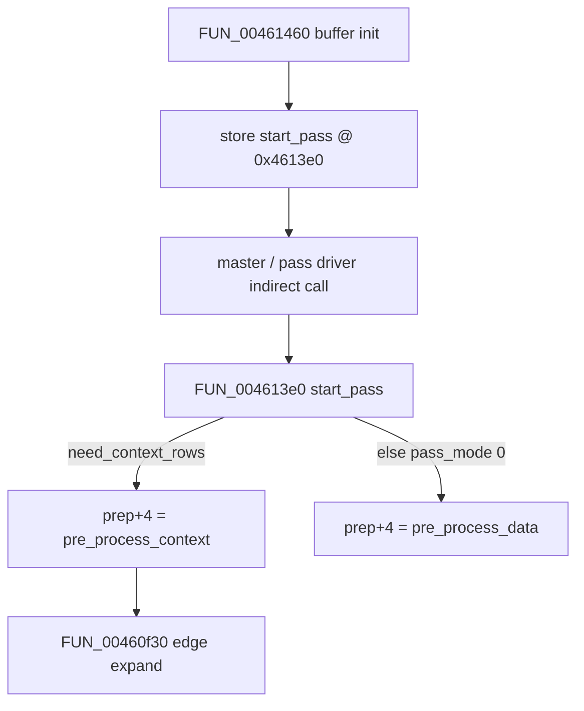

# Round 8 FUN — Task 09 Report

## Task

| Field | Value |
|-------|-------|
| **id** | 9 |
| **round** | 8 |
| **band** | dispatch |
| **seed_address** | `0x004613e0` |
| **title** | FUN recovery: FUN_004613E0 @ 0x004613e0 (xrefs=1) |
| **prior_hint** | R7 task 42/43 — prep vtable `start_pass` homolog |
| **carry_over** | [round7_fun_task_42_report.md](round7_fun_task_42_report.md), [round7_fun_task_45_report.md](round7_fun_task_45_report.md), [round8_fun_task_06_report.md](round8_fun_task_06_report.md) |

## Status

**PARTIAL** — Live Ghidra MCP (`connect_instance bulanci`, 2026-06-03) proves role and xref closure. **No rename:** IJG `jcprepct.c` **METHODDEF** `start_pass_prep` is `LOCAL` (vtable slot `start_pass`, not a standalone COFF/export); MSVC build inlines context edge setup via `FUN_00460f30` on pass start. Prototype, plate, and decompiler comments applied; `bulanci.exe` saved.

## Function

| Address | Before | After | Role | Evidence |
|---------|--------|-------|------|----------|
| `0x004613e0` | `FUN_004613E0` | **`FUN_004613E0`** | **Prep-controller `start_pass` (vtable slot 0)** — homolog of IJG `jcprepct.c` `start_pass_prep`; dispatches `J_BUF_MODE` and wires `prep+4` (`pre_process_data` method) | 120 B (`0x78`, body `004613e0`–`00461457`); 1× DATA xref; decompile + disasm match IJG `J_BUF_MODE` + context-row cluster |

### IJG `J_BUF_MODE` mapping (this binary)

| `pass_mode` (`param_2`) | IJG enum | Behavior |
|-------------------------|----------|----------|
| `0` | `JBUF_PASS_THRU` | Start pass: reset prep counters; set `prep+4` to context or simple preprocessor |
| `2` | `JBUF_CRANK_DEST` | Set `prep+4 = 0x004613b0` (crank-dest preprocessor homolog) |
| other | — | `err->msg_code = 4` (`JERR_BAD_BUFFER_MODE`) + `error_exit` |

### `JBUF_PASS_THRU` branches

| Condition | `prep+4` target | Extra |
|-----------|---------------|-------|
| `[cinfo+0x1a0+8] != 0` (`need_context_rows`) | `0x00461270` (`pre_process_context` homolog) | `CALL FUN_00460f30` @ `0x0046142e` (edge replication, [R8 task 6](round8_fun_task_06_report.md)); zero `prep+0x30/+0x34/+0x40/+0x44/+0x4c` |
| else | `0x00461200` (`pre_process_data` homolog) | zero `prep+0x30`, `prep+0x34` only |

### IJG field mapping (this binary)

| Offset | IJG role |
|--------|----------|
| `cinfo+0x184` (`cinfo[0x61]`) | prep workspace (`cinfo->prep`) |
| `cinfo+0x1a0` (`cinfo[0x68]`) | `downsample` module |
| `cinfo+0x1a0+8` | `need_context_rows` |
| `prep+0` | vtable / method table head → this function @ install |
| `prep+4` | `pre_process_data` method pointer (runtime switch) |
| `prep+0x30` / `+0x34` / `+0x40` / `+0x44` / `+0x4c` | pass counters / context row-group state (zeroed on context start) |

### Disassembly highlights

| VA | Proof |
|----|-------|
| `0x004613ee` | `prep = [cinfo+0x184]` |
| `0x004613f4` | `pass_mode == 0` → start-pass path |
| `0x004613f9` | `pass_mode == 2` → `mov [prep+4], 0x4613b0` |
| `0x004613fd`–`0x00461409` | bad mode → `msg_code=4`, indirect `error_exit` |
| `0x0046141b`–`0x00461424` | `need_context_rows` test on `[cinfo+0x1a0+8]` |
| `0x00461427` | `prep+4 = 0x461270` |
| `0x0046142e` | `CALL FUN_00460f30` (edge expand) |
| `0x0046144e` | no context: `prep+4 = 0x461200` |

### Xref closure

| Direction | Address | Symbol | Notes |
|-----------|---------|--------|-------|
| **Reference (sole)** | `0x00461483` | `FUN_00461460` | **DATA** — `mov [prep], 0x4613e0` installs vtable / `start_pass` entry ([R7 task 45](round7_fun_task_45_report.md)) |
| **Callee (context path)** | `0x0046142e` | `FUN_00460f30` | Edge replication at pass start when context rows enabled |
| **Upstream init** | `0x00460354` | `FUN_00460200` | Decompress `master_selection` → `FUN_00461460` when `[cinfo+0x41]==0` |

Invocation at runtime is **indirect** through the prep controller vtable (`start_pass` slot); no additional direct CODE xrefs.

### Control flow (prep cluster)

## Ghidra deltas

| Action | Target | Result |
|--------|--------|--------|
| `set_function_prototype` | `0x004613e0` | `void __cdecl FUN_004613e0(int *cinfo, int pass_mode)` |
| `set_plate_comment` | `0x004613e0` | Applied (R8 task9 role + xref + pass_mode branches) |
| `set_decompiler_comment` | `0x004613e0` | Applied (`start_pass_prep` homolog + MSVC variant note) |
| `force_decompile` | `0x004613e0` | Refreshed (`param_1` → `cinfo`, `param_2` → `pass_mode`) |
| `save_program` | `bulanci.exe` | Saved |

**Not applied:** `rename_function_by_address` — `start_pass_prep` is IJG `METHODDEF` / `LOCAL`; no `mapping.csv` entry (contrast `start_pass_huff_decoder` / `start_pass_dcolor` globals).

## Frida

**none** — Static decompile/disasm + IJG `jcprepct.c` `start_pass_prep` / `jinit_c_prep_controller` wiring close the role.

## Remaining UNK

| Item | Reason |
|------|--------|
| Exact export symbol | `start_pass_prep` is **LOCAL** in IJG 6b; vtable stores code pointer, not a COFF label |
| `LAB_00461200` / `LAB_004613b0` | `pre_process_data` / crank-dest bodies live in same module slice — separate FUN tasks |
| Indirect callers | Pass driver that invokes `prep->start_pass` not enumerated in this single-VA slice |
| `mapping.csv` / `_Globals.cpp` | No `0x4613e0` row — export regen out of scope |

## Evidence paths

- [ROUND8_FUN_PROTOCOL.md](../ROUND8_FUN_PROTOCOL.md), [GHIDRA_MCP.md](../GHIDRA_MCP.md)
- [IJG `jcprepct.c` `start_pass_prep`](https://github.com/LuaDist/libjpeg/blob/master/jcprepct.c) (`prep->pub.start_pass = start_pass_prep`)
- [round6_logic_task_44_report.md](../logic_recovery/round6_logic_task_44_report.md)
