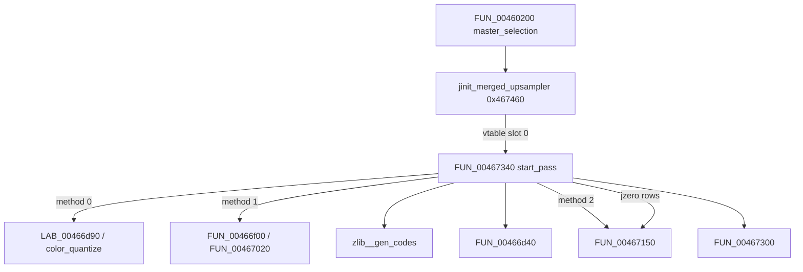

# Round 8 FUN — Task 12 Report

## Task

| Field | Value |
|-------|-------|
| **id** | 12 |
| **round** | 8 |
| **band** | dispatch |
| **seed_address** | `0x00467340` |
| **ghidra_name (before)** | `FUN_00467340` |
| **xref_count** | 1 |
| **prior_hint** | R7 task 34 — caller of row alloc (`FUN_00467300`); merged-upsampler `start_pass` family UNK |

## Status

**PARTIAL** — Role, `cinfo` field gates, vtable install, and callee closure proven via live Ghidra MCP (disasm + xrefs + decompile). Matches IJG **merged upsampler `start_pass`** control flow; no COFF/upstream export name in repo — **`FUN_00467340` kept**.

## Function

| Address | Ghidra (before) | Ghidra (after) | Role | Evidence |
|---------|-----------------|----------------|------|----------|
| `0x00467340` | `FUN_00467340` | `FUN_00467340` | **IJG libjpeg-6b merged-upsampler `start_pass`:** copies upsample workspace fields into `cinfo`, then installs the upsample/quantize method at `upsample+4` from `cinfo+0x4c` and `cinfo+0x64`; may call `zlib__gen_codes`, `FUN_00466d40`, `FUN_00467300`, `IJG_jzero_far` | Sole **DATA** xref `jinit_merged_upsampler@0x00467479` → `mov [upsample], 0x467340`; 0xe3 B; `__cdecl` `int *cinfo` |

### Vtable install (proven)

| Site | Instruction | Meaning |
|------|-------------|---------|
| `0x00467479` | `MOV dword ptr [EAX],0x467340` | `upsample->start_pass = FUN_00467340` after `alloc_large(cinfo,1,0x58)` |
| `0x0046747f` | `MOV [EAX+8],0x467430` | slot 2 = `CDSApp_PreCreateHook` (shared no-op flush) |
| `0x00467486` | `MOV [EAX+0xc],0x467440` | slot 3 = `LAB_00467440` |

Caller chain: `FUN_00460200` (`master_selection`) → `jinit_merged_upsampler` when merged upsample path active (R6/R7 task 40).

### `cinfo` / upsample field gates

| `cinfo+0x4c` (`param_1[0x13]`) | `cinfo+0x64` / other | `*(upsample+4)` method | Side effects |
|-------------------------------|----------------------|------------------------|--------------|
| `0` (separate upsample) | `!= 3` | `LAB_00466d90` | — |
| `0` | `== 3` (8bpp indexed) | `color_quantize` | — |
| `1` (merged, non-fancy) | `== 3` | `FUN_00467020` | `upsample+0x30 = 0`; if `upsample+0x1c==0` → `zlib__gen_codes`; if `upsample+0x34==0` → `FUN_00466d40` (EBX=cinfo) |
| `1` | `!= 3` | `FUN_00466f00` | same as above |
| `2` (fancy merged) | — | `FUN_00467150` | `upsample+0x54 = 0`; if `upsample+0x44[0]==0` → `FUN_00467300`; loop `IJG_jzero_far` each `color_buf[i]` size `2*cinfo+0x5c+4` |
| other | — | — | `err->msg_code = 0x30`; `err->emit_message(cinfo)` |

Always at entry: `cinfo+0x74 = *(upsample+0x10)`, `cinfo+0x70 = *(upsample+0x14)` (disasm `MOV [ESI+0x74]` / `[ESI+0x70]`).

### Disassembly (dispatch core)

```
00467352: MOV EAX,[ESI+0x4c]     ; upsample method id
0046735e: JZ  0x00467409         ; method == 0
00467364: SUB EAX,1
00467368: JZ  0x004673cc         ; method == 1
0046736a: SUB EAX,1
0046736d: JZ  0x00467386         ; method == 2 (fancy)
0046736f: ... msg 0x30 ...
00467386: MOV [EDI+4],0x467150   ; FUN_00467150
0046738a: CMP [EDI+0x44],0
0046739a: CALL 0x00467300        ; row alloc if color_buf empty
004673b4: CALL 0x0045f880        ; IJG_jzero_far per row
```

### Callees (from disasm)

| Callee | Site | When |
|--------|------|------|
| `zlib__gen_codes` | `0x004673f0` | `cinfo+0x4c==1` and `upsample+0x1c==0` |
| `FUN_00466d40` | `0x00467400` | `cinfo+0x4c==1` and `upsample+0x34==0` (`MOV EBX,ESI` first) |
| `FUN_00467300` | `0x0046739a` | `cinfo+0x4c==2` and `upsample+0x44[0]==0` |
| `IJG_jzero_far` | `0x004673b4` | fancy path after alloc; per `num_components` |

### Call graph



### Xrefs to (`get_xrefs_to`)

| From | Type | Context |
|------|------|---------|
| `0x00467479` | DATA | `jinit_merged_upsampler` — `start_pass` vtable slot |

No direct `CALL` xrefs (invoked only through upsampler vtable during decompress pass start).

### Decompile (post-R8 prototype)

```c
void FUN_00467340(int *cinfo)
{
  upsample = cinfo[0x6a];  /* cinfo+0x1a8 */
  cinfo[0x1d] = *(int *)(upsample + 0x10);
  cinfo[0x1c] = *(int *)(upsample + 0x14);
  switch (cinfo[0x13]) {   /* cinfo+0x4c */
  case 0: /* sep upsample + quant */
  case 1: /* merged upsample */
  case 2: /* fancy merged — FUN_00467150, FUN_00467300, jzero */
  default: err 0x30;
  }
}
```

(`FUN_00467300` call still shows `unaff_EBX` in decompiler — callee expects **ESI=cinfo**; disasm passes it implicitly via register.)

## Ghidra deltas

| Action | Target | Result |
|--------|--------|--------|
| `set_function_prototype` | `0x00467340` → `void FUN_00467340(int *cinfo)` | OK (was `uchar` in mapping.csv stub) |
| `set_decompiler_comment` | Entry | OK — role + xref + method table + UNK symbol |
| `force_decompile` | `0x00467340` | OK (pre-write refresh) |
| `save_program` | `bulanci.exe` | OK |

**Not applied:** `rename_function_by_address` — no unique COFF/`ref/libjpeg6b` export for this 0xe3 B vtable method (R6 task 48 / R7 task 34 UNK stands).

## Frida

**none** — Static IJG decompressor vtable plumbing; no gameplay-visible state.

## Remaining UNK

| Item | Status |
|------|--------|
| Exact IJG `jdmerge.c` symbol (e.g. `start_pass_merged_upsample` family) | **UNK** — control-flow + vtable slot match only |
| Rename to descriptive alias | **Deferred** — not an upstream export; protocol forbids guess |
| Decompiler `FUN_00467300(unaff_EBX)` vs ESI=cinfo | **Cosmetic** — register-arg convention (same as R7 task 34) |
| `LAB_00466d90` / `LAB_00467440` naming | **Out of scope** — separate FUN tasks |
