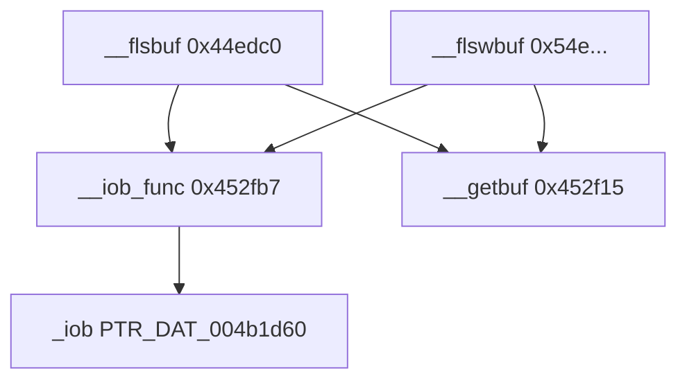

# Round 8 FUN — Task 15 Report

## Task

| Field | Value |
|-------|-------|
| **id** | 15 |
| **round** | 8 |
| **band** | dispatch |
| **seed_address** | `0x00452fb7` |
| **title** | FUN recovery: FUN_00452FB7 @ 0x00452fb7 (xrefs=4) |
| **prior_hint** | R6 — sim cluster (R5 worker 15: CRT-only xref closure; mis-bucketed — not game/sim) |

## Status

**DONE** — Live Ghidra MCP (`connect_instance bulanci`, 2026-06-03) proves MSVC CRT **`__iob_func`**: 6-byte `MOV EAX, &_iob; RET`, sole callers `__flsbuf` / `__flswbuf`, `FILE` size `0x20` matches `+8` / `+0x10` pointer-index compares. Renamed, prototype fixed, saved.

## Function

| Address | Before | After | Role | Evidence |
|---------|--------|-------|------|----------|
| `0x00452fb7` | `FUN_00452fb7` | **`__iob_func`** | **MSVCRT 2005 `__iob_func`** — returns pointer to static `_iob` table (`PTR_DAT_004b1d60` @ `0x004b1d60`) for `stdin`/`stdout`/`stderr` macros | 4× CODE xref (2× `__flsbuf`, 2× `__flswbuf`); disasm 6 B; decompile `return (FILE *)&PTR_DAT_004b1d60`; adjacent band all `Runtime::MSVCRT::*` in `mapping.csv` |

### Behavior (proven)

| Step | Action |
|------|--------|
| 1 | Load immediate `0x004b1d60` into `EAX` |
| 2 | `RET` — caller receives `FILE *` to `_iob[0]` |

`__flsbuf` / `__flswbuf` call twice per path to compare `_File` against `(iob + 8)` and `(iob + 0x10)` typed as `undefined **` → **+0x20** and **+0x40** byte offsets with `sizeof(FILE)=0x20` → **`&_iob[1]` (stdout)** and **`&_iob[2]` (stderr)** — skips `__getbuf` for those standard streams when not a TTY (classic CRT buffering rule).

### Assembly listing

```
00452fb7  MOV  EAX,0x4b1d60    ; &_iob
00452fbc  RET
```

### Decompile (post-rename)

```c
FILE * __cdecl __iob_func(void)
{
  return (FILE *)&PTR_DAT_004b1d60;
}
```

### Xref closure

| Direction | Address | Symbol | Notes |
|-----------|---------|--------|-------|
| **Caller** | `0x0044ee36` | `__flsbuf` | `CALL __iob_func` — compare `_File` vs `_iob[1]` / `_iob[2]` before `__getbuf` |
| **Caller** | `0x0044ee42` | `__flsbuf` | second `CALL` in same guard |
| **Caller** | `0x00454e5c` | `__flswbuf` | wide-char flush buffer twin |
| **Caller** | `0x00454e68` | `__flswbuf` | second `CALL` |
| **Data** | `0x004b1d60` | `PTR_DAT_004b1d60` / `_iob` | `MOV EAX,0x4b1d60` operand; also loaded @ `0x0045300f` (CRT init) |

No game/jpeg/libmad callers — corrects R6 “sim cluster” hint ([round5_worker_15_report.md](../struct_recovery/round5_worker_15_report.md) CRT-only list).

### Call graph



## Ghidra deltas

| Action | Target | Result |
|--------|--------|--------|
| `rename_function_by_address` | `0x00452fb7` | `FUN_00452fb7` → **`__iob_func`** |
| `set_function_prototype` | `0x00452fb7` | `FILE * __cdecl __iob_func(void)` (was `undefined ** __stdcall`) |
| `set_plate_comment` | `0x00452fb7` | MSVCRT role + R8 task id |
| `set_decompiler_comment` | `0x00452fb7` | `_iob[1]`/`_iob[2]` offset proof |
| `force_decompile` | `0x00452fb7` | Refreshed |
| `save_program` | `bulanci.exe` | Saved |

## Frida

**none** — Static disasm + CRT xref closure + MSVCRT catalog match sufficient.

## Remaining UNK

| Item | Reason |
|------|--------|
| `PTR_DAT_004b1d60` data label | `_iob` array not renamed in this slice (function-only scope) |
| `_Globals::` namespace in export | Ghidra groups with `_Globals` thunk; symbol is CRT not game — `mapping.csv` still `_Globals::FUN_00452fb7` until regen |
| `0x0045300f` direct `MOV ECX,0x4b1d60` | CRT init path; no separate FUN task |

## Cross-links

- [`config/bulanci/mapping.csv`](../../../config/bulanci/mapping.csv) — `0x452fb7`, was `uchar** __stdcall`
- [`round5_worker_15_report.md`](../struct_recovery/round5_worker_15_report.md) — CRT-only skip list
- MSVC 2005 Release — Library Function `__iob_func` (paired with `__flsbuf`, `__fileno`, `__getbuf` in same VA band)
