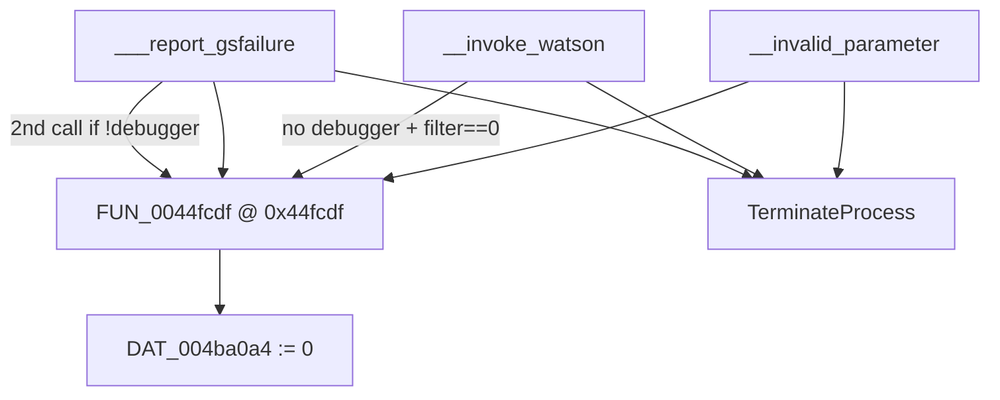

# Round 8 FUN — Task 16 Report

## Task

| Field | Value |
|-------|-------|
| **id** | 16 |
| **round** | 8 |
| **band** | sim |
| **seed_address** | `0x0044fcdf` |
| **title** | FUN recovery: FUN_0044FCDF @ 0x0044fcdf (xrefs=4) |
| **prior_hint** | R6 — sim cluster |

## Status

**PARTIAL** — R8 re-verify: role proven (clears `DAT_004ba0a4` on MSVCRT fatal-exit paths). **No rename** — global semantics unknown (sole writer, zero static readers); not a documented bulanci game symbol or CRT export name.

## Function

| Address | Ghidra name | Role | Evidence |
|---------|-------------|------|----------|
| `0x0044fcdf` | `FUN_0044fcdf` | `void`: `AND dword ptr [DAT_004ba0a4], 0` then `RET` — hook invoked before `TerminateProcess` on CRT invalid-parameter / Watson / GS-failure paths | **Disasm:** `0044fcdf AND [0x004ba0a4],0` / `0044fce6 RET`. **Decompile:** `_DAT_004ba0a4 = 0`. **Xrefs_to (4):** `__invalid_parameter@0x0044aa60`; `__invoke_watson@0x0044aa1a` (only when `UnhandledExceptionFilter==0` and `!IsDebuggerPresent`); `___report_gsfailure@0x0044be72` (after `IsDebuggerPresent` snapshot); `___report_gsfailure@0x0044be96` (second call when saved `DAT_004b87b0==0`). **Xrefs_from:** sole write to `DAT_004ba0a4` |

### Caller closure (MSVCRT fatal termination)

| Caller | Call site | When invoked |
|--------|-----------|--------------|
| `Runtime::MSVCRT::__invalid_parameter` | `0x0044aa60` | Default handler null; before tail `__invoke_watson` |
| `Runtime::MSVCRT::__invoke_watson` | `0x0044aa1a` | After synthetic `UnhandledExceptionFilter`; filter returned 0 and no debugger at entry |
| `Runtime::MSVCRT::___report_gsfailure` | `0x0044be72` | Immediately after `IsDebuggerPresent` → `DAT_004b87b0` |
| `Runtime::MSVCRT::___report_gsfailure` | `0x0044be96` | After `UnhandledExceptionFilter`; only if entry `IsDebuggerPresent` was false |

All four paths continue to `TerminateProcess` with status `0xC000000D` (`__invoke_watson`) or `0xC0000409` (`___report_gsfailure`).

### Global `DAT_004ba0a4`

| Fact | Detail |
|------|--------|
| Location | BSS @ `0x004ba0a4` (4 bytes before CRT `_nhandle` / `DAT_004ba0a8`) |
| Writers | **Only** `FUN_0044fcdf` |
| Readers | **None** in static xref closure |
| Decl | `unsigned char DAT_004ba0a4` in `include/bulanci/_externs.h` (disasm uses dword clear) |

### Control flow

## Ghidra deltas

| Action | Target | Result |
|--------|--------|--------|
| `set_function_prototype` | `void FUN_0044fcdf(void)` (was `undefined __stdcall`) | Success |
| `set_decompiler_comment` | `0x0044fcdf` | Success — R8 xref/disasm proof |
| `save_program` | `bulanci.exe` | Saved |

**Not applied:** `rename_function_by_address` — no unique bulanci/CRT symbol; `DAT_004ba0a4` purpose still UNK.

## Frida

**none** — Static xref closure on MSVCRT library functions sufficient.

## Remaining UNK

| Item | Reason |
|------|--------|
| `DAT_004ba0a4` semantic name | No readers; may be dead store, packed CRT state, or runtime-only consumer |
| Why double-call in `___report_gsfailure` | Pre- and post-`UnhandledExceptionFilter` hook; intent unclear without global meaning |
| `uchar __stdcall` in `mapping.csv` | Disproven — no return value in `AL`, plain `RET`, zero stack args |

## Cross-links

- R6 sim cluster manifest entry (`_gen_r8_fun_manifest.py`)
- Neighbor global `DAT_004ba0a8` — CRT `SetHandleCount` / `_nhandle` (file handle table size)
