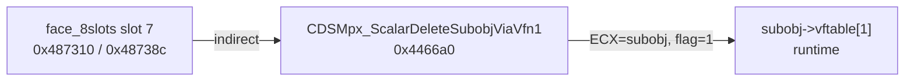

# Round 8 FUN — Task 21 Report

## Task

| Field | Value |
|-------|-------|
| **id** | 21 |
| **round** | 8 |
| **band** | sim |
| **seed_address** | `0x004466a0` |
| **title** | FUN recovery: FUN_004466A0 @ 0x004466a0 (xrefs=2) |
| **prior_hint** | R6 — sim UNK |

## Status

**DONE** — Live Ghidra MCP disasm + vtable catalog + xref closure prove a **26 B** MPX-specific `face_8slots` slot-7 thunk: null-safe tail-call to **`subobj->vftable[1]`** with MSVC scalar-delete flag **`1`**. Renamed `FUN_004466A0` → **`CDSMpx_ScalarDeleteSubobjViaVfn1`**; `bulanci.exe` saved.

## Function

| Address | Ghidra name (before → after) | Role summary | Evidence |
|---------|------------------------------|--------------|----------|
| `0x004466a0` | `FUN_004466A0` → **`CDSMpx_ScalarDeleteSubobjViaVfn1`** | **`CDSMpx` / `CDSMpxStream` `face_8slots` vtable slot 7** (`__stdcall`): if `subobj` non-null, tail-`JMP` **`[subobj->vftable + 4]`** with **`ECX = subobj`** and **`[ESP+4] = 1`** (scalar-deleting-dtor delete flag). MPX-only slot — **`CDSWav` / `CDSWavStream` slot 7 = `CDSView_NoOpStub`**. | **Disasm** @ `0x004466a0`–`0x004466b7` (see below). **Xrefs (2 DATA, no CALL):** `CDSMpx` vtable `0x004872f4` slot 7 @ **`0x00487310`**; `CDSMpxStream` vtable `0x00487370` slot 7 @ **`0x0048738c`**. **Size:** `0x1a` (26 B) per `mapping.csv`. **Not libmad** — corrects stale `libmad_function_map.md` WRAPPER tag. |

### Disassembly (`0x004466a0`–`0x004466b7`)

```
004466a0  MOV  ECX, dword ptr [ESP + 0x4]    ; subobj
004466a4  TEST ECX, ECX
004466a6  JZ   0x004466b7
004466a8  MOV  EAX, dword ptr [ECX]         ; vtable
004466aa  MOV  EDX, dword ptr [EAX + 0x4]   ; vftable[1]
004466ad  MOV  dword ptr [ESP + 0x4], 0x1   ; scalar-delete flag
004466b5  JMP  EDX                          ; tail-call deleting dtor
004466b7  RET  0x4                          ; __stdcall, 1 arg
```

Same tail-`JMP`/`MOV [ESP+4],1` pattern as MSVC **`scalar deleting destructor`** thunks elsewhere (cf. `CDSMpx_vDtor@0x00432fc0`); distinct from **`CDSObject_EhReleaseOwnedPtr@0x004344c0`** which tail-calls **`vftable[+8]`** (Release).

### Vtable install (proven)

| Class | Vtable base | Slot | VA in `.rdata` | Target |
|-------|-------------|------|----------------|--------|
| `CDSMpx` | `0x004872f4` (`face_8slots`) | 7 | `0x00487310` | `CDSMpx_ScalarDeleteSubobjViaVfn1` |
| `CDSMpxStream` | `0x00487370` (`face_8slots`) | 7 | `0x0048738c` | same |

Slots 0–6 shared with `CDSWav` audio face; slot 7 diverges (WAV → no-op hit-test stub).

### Decompile (post-mutation)

```c
uchar __stdcall CDSMpx_ScalarDeleteSubobjViaVfn1(void *subobj)
{
  if (subobj != NULL)
    return subobj->vftable[1](subobj);  /* tail-JMP; [ESP+4] forced to 1 */
  return 0;
}
```

(`subobj->vftable[1]` runtime target is the **argument object's** slot 1 — typically an `IDSReferenced` scalar-deleting dtor when destroying an owned subobject.)

### Call graph



No direct `.text` `CALL` xrefs — invoked only through the MPX audio-resource vtable.

## Ghidra deltas

| Action | Target | Result |
|--------|--------|--------|
| `rename_function_by_address` | `0x004466a0` | `CDSMpx_ScalarDeleteSubobjViaVfn1` |
| `set_function_prototype` | `0x004466a0` | `uchar CDSMpx_ScalarDeleteSubobjViaVfn1(void *subobj)` + `__stdcall` |
| `set_decompiler_comment` | `0x004466a0` | slot-7 / scalar-delete / MPX-vs-WAV note |
| `force_decompile` | `0x004466a0` | refreshed |
| `save_program` | `bulanci.exe` | saved |

## Frida

**none** — Static vtable + disasm proof; no gameplay `.text` caller to hook.

## Remaining UNK

| Item | Reason |
|------|--------|
| Direct `.text` caller of slot 7 | No `CALL` xref; only vtable DATA entries |
| Exact subobject type at runtime | Thunk is generic on `subobj->vftable[1]` |
| `mapping.csv` / `CDSMpx.h` stub | Still `FUN_004466a0`; refresh on export pipeline |
| R5 w08 “release slot” hint | **Incorrect** — body uses **`+4`** (deleting dtor), not **`+8`** Release |

## Cross-links

- [CDSMpxDecoder.md](../struct_recovery/CDSMpxDecoder.md) — `face_8slots` slot table
- [CDSMpx.md](../struct_recovery/CDSMpx.md) — MI `@+0x04` / libmad overlay
- [round5_worker_08_report.md](../struct_recovery/round5_worker_08_report.md) — deferred MPX slot-7 note
- [ROUND8_FUN_PROTOCOL.md](../ROUND8_FUN_PROTOCOL.md)
