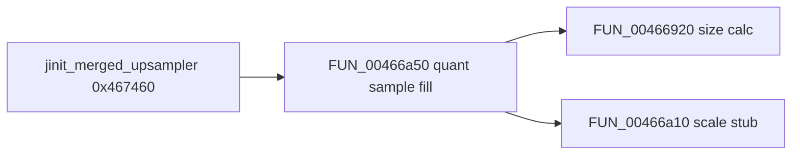

# Round 8 FUN — Task 31 Report

## Task

| Field | Value |
|-------|-------|
| **id** | 31 |
| **round** | 8 |
| **band** | dispatch |
| **seed_address** | `0x00466a10` |
| **title** | FUN recovery: FUN_00466A10 @ 0x00466a10 (xrefs=1) |
| **prior_hint** | — (no R7 task for this VA; R6 logic slice `0x466a` band) |

## Status

**PARTIAL** — Live Ghidra MCP (`connect_instance bulanci`) proves role and xref closure. **No rename:** 21-byte compiler-outlined rounded-scale stub; no unique IJG/zlib COFF export name (R8 no-guess rule).

## Function

| Address | Ghidra name (before → after) | Size | Role | Evidence |
|---------|------------------------------|-----:|------|----------|
| `0x00466a10` | `FUN_00466a10` → **`FUN_00466a10`** (unchanged) | 21 B (`0x15`) | **Rounded index→byte scale** for merged-upsampler ordered-dither sample fill. Computes `(ECX×0xff + ESI/2) / ESI` with **ECX** = row index and **ESI** = `max_idx = bound−1` set by caller immediately before `CALL`. | **Disasm:** `IMUL ECX,0xff`; half-divisor idiom (`MOV EAX,ESI; CDQ; SUB; SAR 1`); `IDIV ESI`. **Xrefs (1):** `UNCONDITIONAL_CALL` from `FUN_00466a50` at `0x00466adb`. **Caller chain:** `jinit_merged_upsampler @ 0x00467460` → `FUN_00466a50`. **mapping.csv:** `__fastcall`, 2×`int`, size `0x15`. |

### Call-site proof (`FUN_00466a50@0x00466adb`)

Inner loop over component bound `iVar2 = *piVar11` (`[ESP+0x1c]`):

| VA | Instruction | Meaning |
|----|-------------|---------|
| `0x00466ad0` | `MOV ECX,[ESP+0x1c]` | `iVar2` = per-component table width |
| `0x00466ad4` | `LEA ESI,[ECX-0x1]` | Divisor **ESI** = `max_idx` |
| `0x00466ad7` | `MOV ECX,[ESP+0x10]` | Index **ECX** = `iStack_20` (0 … `iVar2−1`) |
| `0x00466adb` | `CALL 0x00466a10` | Scaled byte → **AL**, stored in sample rows |
| `0x00466af9` | `MOV byte ptr [ESI+EDX],AL` | Fill dither sample buffer from `alloc` |

Decompiled use in `FUN_00466a50`:

```c
iVar6 = FUN_00466a10(iStack_20);  // Ghidra hides ESI=max_idx; set at 0x466ad4
*(char *)(iVar12 + iVar8) = (char)iVar6;
```

### Assembly listing

```
00466a10  IMUL ECX,ECX,0xff
00466a16  MOV EAX,ESI
00466a18  CDQ
00466a19  SUB EAX,EDX
00466a1b  SAR EAX,0x1
00466a1d  ADD ECX,EAX
00466a1f  MOV EAX,ECX
00466a21  CDQ
00466a22  IDIV ESI
00466a24  RET
```

### Decompiled body

```c
int __fastcall FUN_00466a10(int param_1)  // ECX=index; ESI=max_idx (caller-set)
{
  return (param_1 * 0xff + unaff_ESI / 2) / unaff_ESI;
}
```

### Relation to sibling helpers (`0x466a` band)

| VA | Helper | Caller | Formula |
|----|--------|--------|---------|
| `0x00466a10` | **this task** | `FUN_00466a50` only | `(idx×255 + max/2) / max` |
| `0x00466a30` | R8 task 01 / R7 task 33 | `zlib::gen_codes` (2×) | `(sym×0x1fe + bits−1 + 0xff) / ((bits−1)×2)` |

R6 attributed `FUN_00466a50` to zlib `gen_codes`; R7 task 50 corrected the band to **IJG merged-upsampler** ordered-dither sizing/fill. This helper is on that fill path, **not** `zlib::gen_codes`.



## Ghidra deltas

| Action | Target | Result |
|--------|--------|--------|
| `set_decompiler_comment` | `0x00466a10` | R8 note (replaces stale “upsampler table init” / zlib mis-attribution) |
| `save_program` | `bulanci.exe` | Saved |

**Not applied:** `rename_function_by_address`, `set_function_prototype` (dual-register `__fastcall` already in mapping.csv).

## Frida

**none** — Static disasm + single-caller xref closure sufficient; reachable via JPEG decompress / merged-upsampler init.

## Remaining UNK

| Item | Reason |
|------|--------|
| Exact IJG export name | No COFF/string match for this 21-byte outlined stub |
| `__fastcall` vs caller-set **ESI** | Ghidra models one ECX param + `unaff_ESI`; true use is **ECX** + **ESI** at call |
| `FUN_00466a50` rename | Out of scope (R8 task 13 @ `0x00466a50`) |
| `mapping.csv` / `_Globals.cpp` stub | Still `FUN_00466a10`; export regen out of scope |

## Cross-links

- [`round6_logic_task_47_report.md`](../logic_recovery/round6_logic_task_47_report.md) — initial `0x466a` band slice (R6 zlib attribution superseded)
- [`round7_fun_task_50_report.md`](round7_fun_task_50_report.md) — `FUN_00466920` + `FUN_00466a50` merged-upsampler path
- [`round8_fun_task_01_report.md`](round8_fun_task_01_report.md) — sibling `FUN_00466a30` (`zlib::gen_codes` idiv helper)
- [`config/bulanci/mapping.csv`](../../../config/bulanci/mapping.csv) — `0x466a10`
