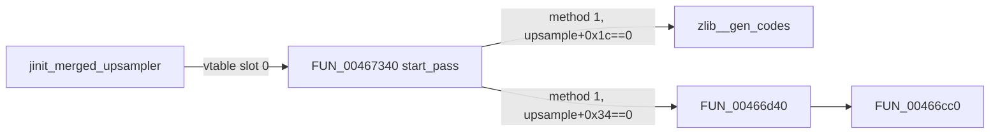

# Round 8 FUN — Task 33 Report

## Task

| Field | Value |
|-------|-------|
| **id** | 33 |
| **round** | 8 |
| **band** | dispatch |
| **seed_address** | `0x00466d40` |
| **ghidra_name (before)** | `FUN_00466D40` |
| **xref_count** | 1 |
| **prior_hint** | — (R6 task 47 listed this VA as an “`__stdcall` wrapper”; live disasm refutes that) |

## Status

**PARTIAL** — Role, register calling convention, upsample field layout, and callee closure proven via live Ghidra MCP (disasm, decompile, xrefs). **No rename:** not a COFF/upstream IJG export; R6 “single-call wrapper” note is incorrect — this is an **0x50 B per-component dedup loop**.

## Function

| Address | Ghidra (before) | Ghidra (after) | Role | Evidence |
|---------|-----------------|----------------|------|----------|
| `0x00466d40` | `FUN_00466D40` | `FUN_00466D40` | **Merged-upsampler `start_pass` quant-table init:** for each component (`cinfo+0x64`), allocate or reuse a scaled quant table pointer in `upsample+0x34[]` via **`FUN_00466cc0`**, deduplicating when an earlier component shares the same quant selector at `upsample+0x20[]` | 0x50 B; 1 caller / 1 callee; `EBX=cinfo` on entry |

### Caller context (`FUN_00467340@0x00467340`)

Sole caller at **`0x00467400`** inside merged-upsampler **`start_pass`** (R8 task 12):

| Gate | Instruction | Meaning |
|------|-------------|---------|
| `cinfo+0x4c == 1` | `JZ 0x004673cc` from method dispatch | merged (non-fancy) upsample path |
| `upsample+0x1c == 0` | `CALL zlib__gen_codes` @ `0x004673f0` | Huffman code tables built first |
| `upsample+0x34 == 0` | `CALL 0x00466d40` @ `0x00467400` | scaled quant table ptr array still empty |

Call site passes **`cinfo` in EBX**:

```
004673fe: MOV EBX,ESI          ; ESI = cinfo (start_pass arg)
00467400: CALL 0x00466d40
```

### Upsample workspace fields (proven)

| Offset | Use in `FUN_00466d40` |
|--------|------------------------|
| `upsample+0x20 + comp*4` | Quant table **selector** for component `comp` (`ECX = [EDI-0x14]` in loop) |
| `upsample+0x34 + comp*4` | **Output:** pointer to scaled quant table (256×`int` block from `FUN_00466cc0`) |

### Dedup algorithm

For `comp = 0 .. num_components-1`:

1. Load selector `qsel = upsample->quant_tbl_no[comp]` (at `+0x20`).
2. Scan `j = 0 .. comp-1`; if `quant_tbl_no[j] == qsel` and `scaled_tbl_ptr[j] != NULL`, reuse `scaled_tbl_ptr[j]`.
3. Else `scaled_tbl_ptr[comp] = FUN_00466cc0(qsel)` with **`EAX=cinfo`** (`MOV EAX,EBX` @ `0x00466d7a`).
4. Store pointer at `upsample+0x34 + comp*4`.

### Assembly listing

```
00466d40  PUSH EBP
00466d41  MOV  EBP,[EBX+0x1a8]       ; upsample = cinfo[0x6a]
00466d47  PUSH ESI
00466d48  XOR  ESI,ESI               ; comp = 0
00466d4a  CMP  [EBX+0x64],ESI          ; num_components
00466d4d  JLE  0x00466d8d
00466d50  LEA  EDI,[EBP+0x34]          ; &scaled_tbl_ptr[comp]
00466d53  MOV  ECX,[EDI-0x14]          ; qsel = quant_tbl_no[comp]
00466d56  XOR  EAX,EAX                 ; j = 0
00466d58  TEST ESI,ESI
00466d5a  JLE  0x00466d78              ; skip dedup if comp==0
00466d5c  LEA  EDX,[EBP+0x20]          ; &quant_tbl_no[0]
00466d60  CMP  ECX,[EDX]               ; qsel == quant_tbl_no[j]?
00466d62  JZ   0x00466d70
00466d64  ADD  EAX,1
00466d67  ADD  EDX,4
00466d6a  CMP  EAX,ESI
00466d6c  JL   0x00466d60
00466d70  MOV  EAX,[EBP+EAX*4+0x34]    ; reuse prior ptr
00466d74  TEST EAX,EAX
00466d76  JNZ  0x00466d7f
00466d78  MOV  EAX,EBX                 ; cinfo for FUN_00466cc0
00466d7a  CALL 0x00466cc0              ; build scaled table
00466d7f  MOV  [EDI],EAX
00466d81  ADD  ESI,1
00466d84  ADD  EDI,4
00466d87  CMP  ESI,[EBX+0x64]
00466d8a  JL   0x00466d53
00466d8d  POP  ESI
00466d8e  POP  EBP
00466d8f  RET
```

### Decompiled body

```c
void FUN_00466d40(void)   /* EBX = cinfo */
{
  upsample = *(int **)(cinfo + 0x1a8);
  for (comp = 0; comp < cinfo[0x19]; comp++) {
    qsel = upsample->quant_tbl_no[comp];          /* +0x20 */
    ptr = NULL;
    for (j = 0; j < comp; j++) {
      if (upsample->quant_tbl_no[j] == qsel) {
        ptr = upsample->scaled_tbl_ptr[j];        /* +0x34 */
        if (ptr) break;
      }
    }
    if (!ptr)
      ptr = FUN_00466cc0(qsel);                   /* EAX=cinfo via fastcall */
    upsample->scaled_tbl_ptr[comp] = ptr;
  }
}
```

(`FUN_00466cc0` scales JPEG std quant bytes `DAT_0049de50..0x49df50` by selector — R8 task 32 scope.)

### Xrefs

| From | Type | Context |
|------|------|---------|
| `0x00467400` | UNCONDITIONAL_CALL | `FUN_00467340` merged path after `zlib__gen_codes` |

No other callers; not vtable-invoked directly.

### Call graph



## Ghidra deltas

| Action | Target | Result |
|--------|--------|--------|
| `set_decompiler_comment` | `0x00466d40` | OK — R8 task-33 proof (replaces incorrect “progressive Huffman” note) |
| `force_decompile` | `0x00466d40` | OK |
| `save_program` | `bulanci.exe` | OK |

**Not applied:** `rename_function_by_address` — no unique COFF/`ref/libjpeg6b` export; protocol forbids guessed IJG alias.

## Frida

**none** — Static IJG decompressor setup; no gameplay-visible state.

## Remaining UNK

| Item | Reason |
|------|--------|
| Exact IJG symbol (`jdmerge.c` / `jquant1.c` family) | Control-flow + field offsets match merged 1-pass quant setup; no export byte-match |
| `mapping.csv` stub `__stdcall` / `uchar` | Disasm shows zero stack args; **`EBX=cinfo`** register convention (same pattern as R8 task 12 callee notes) |
| R6 task 47 “80 B wrapper, single call” | **Superseded** — inner dedup loop + conditional `FUN_00466cc0` per component |
| `FUN_00466cc0` upstream name | R8 task 32 — scales std quant table, not Huffman bits |

## Cross-links

- [`round8_fun_task_12_report.md`](round8_fun_task_12_report.md) — caller `FUN_00467340`, call-site gates
- [`round6_logic_task_47_report.md`](../logic_recovery/round6_logic_task_47_report.md) — dispatch band (outdated wrapper note for this VA)
- [`config/bulanci/mapping.csv`](../../../config/bulanci/mapping.csv) — `0x466d40`, size `0x50`, `__stdcall`
