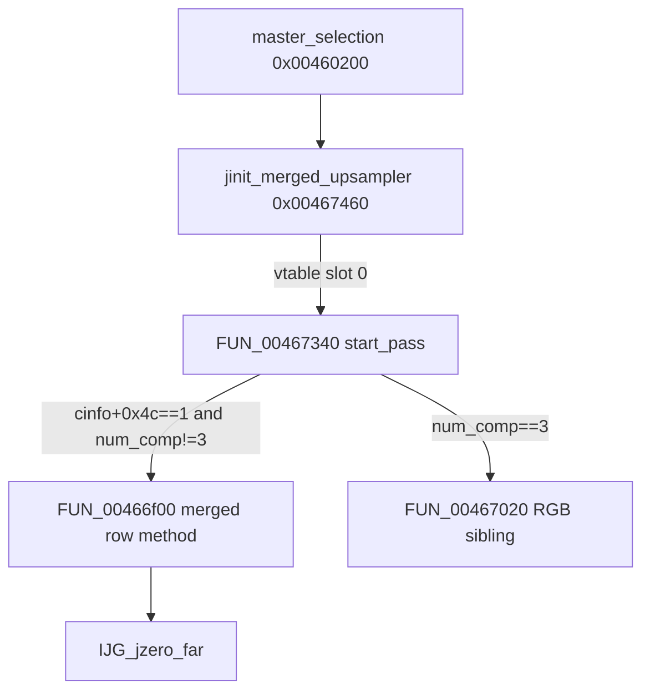

# Round 8 FUN — Task 34 Report

## Task

| Field | Value |
|-------|-------|
| **id** | 34 |
| **round** | 8 |
| **band** | dispatch |
| **seed_address** | `0x00466f00` |
| **ghidra_name (before)** | `FUN_00466F00` |
| **xref_count** | 1 |
| **prior_hint** | R6 logic task 48 slice — merged-upsampler row worker (non-RGB); exact IJG `jdmerge.c` export UNK |

## Status

**PARTIAL** — Role, parameter contract, install gate, and inner loop proven via live Ghidra MCP (disasm + xrefs + decompile). Matches IJG **merged upsampler row method** for `cinfo+0x4c==1` when `num_components!=3`; no COFF/upstream export name in repo — **`FUN_00466f00` kept**. Prototype + entry comment applied; program saved.

## Function

| Address | Ghidra (before) | Ghidra (after) | Role | Evidence |
|---------|-----------------|----------------|------|----------|
| `0x00466f00` | `FUN_00466F00` | `FUN_00466f00` | **IJG libjpeg-6b merged-upsampler row worker (non-RGB):** for each output row, `IJG_jzero_far` then per-component AC-table gather with column ring `& 0xf` at `upsample+0x30` | Sole **DATA** xref `FUN_00467340@0x004673db` → `mov [upsample+4],0x466f00`; 0x118 B; `__cdecl`; callee `IJG_jzero_far@0x0045f880` |

### Install gate (proven)

| Condition | Site | Action |
|-----------|------|--------|
| `cinfo+0x4c == 1` (merged upsample) | `FUN_00467340@0x004673cc` | Branch into merged method picker |
| `cinfo+0x64 == 3` | `0x004673d2` | Install `FUN_00467020` (RGB sibling) |
| `cinfo+0x64 != 3` | `0x004673db` | Install **`FUN_00466f00`** at `upsample+4` |

Also on merged path: `upsample+0x30 = 0`; optional `zlib__gen_codes` / `FUN_00466d40` (documented in R8 task 12 / `FUN_00467340`).

### Behavior (proven)

| Step | Action |
|------|--------|
| 1 | `num_components = cinfo[0x19]` (`cinfo+0x64`); `row_bytes = cinfo[0x17]` (`cinfo+0x5c`); `upsample = cinfo[0x6a]` (`cinfo+0x1a8`) |
| 2 | Outer loop `num_rows`: zero `*output_buf` via `IJG_jzero_far(row, row_bytes)` |
| 3 | `ring = *(upsample+0x30)`; for each component `ci`: `table_base = upsample->component_base[ci]` (`+0x18`); `ac_ptr = upsample->ac_tables[ci]` (`+0x34` stride 4) |
| 4 | Inner pixel loop: stride input by `num_components`; `*out += ac_table[ring*0x40 + (col&0xf)][sample + table_base]`; advance out/col with `col = (col+1) & 0xf` |
| 5 | After row: `*(upsample+0x30) = (ring+1) & 0xf`; advance `output_buf++` |

Invoked only through **`upsample+4` vtable slot** during decompress scan (no direct `CALL` xrefs).

### Disassembly (core loop)

```
00466f07: MOV ECX,[EAX+0x64]     ; num_components
00466f0a: MOV EDX,[EAX+0x5c]     ; row_bytes
00466f0e: MOV ESI,[EAX+0x1a8]    ; upsample
00466f4d: CALL 0x0045f880        ; IJG_jzero_far(*output_row, row_bytes)
00466f52: MOV EBP,[ESI+0x30]     ; ring index
00466f6c: SHL EBP,0x6            ; ring * 0x40
00466f84: MOV ESI,[ESI+0x18]     ; component_base[]
00466fb0: MOVZX EDX,byte ptr [EAX] ; input sample
00466fb3: MOV EBX,[EDI+ESI*4]    ; ac table cell
00466fc3: ADD byte ptr [ECX],DL  ; accumulate into output row
00466fcb: AND ESI,0xf            ; col ring
00466ff8: AND EBP,0xf            ; advance ring after row
00467003: MOV [upsample+0x30],EBP
```

Install site:

```
004673cc: CMP dword ptr [ESI+0x64],0x3
004673d2: MOV dword ptr [EDI+4],0x467020   ; FUN_00467020 (RGB)
004673db: MOV dword ptr [EDI+4],0x466f00   ; FUN_00466f00 (this task)
```

### Call graph



### Xrefs to (`get_xrefs_to`)

| From | Type | Context |
|------|------|---------|
| `0x004673db` | DATA | `FUN_00467340` — `*(upsample+4) = FUN_00466f00` when merged upsample + non-RGB |

### Decompile (post-R8 prototype)

```c
void FUN_00466f00(int *cinfo, int input_buf, undefined4 *output_buf, int num_rows)
{
  upsample = cinfo[0x6a];
  for (each row in num_rows) {
    IJG_jzero_far(*output_buf, cinfo[0x17]);
    ring = upsample[0xc];  /* +0x30 */
    for (ci = 0; ci < cinfo[0x19]; ci++)
      /* AC-table gather with ring*0x40 + (col&0xf) */;
    upsample[0xc] = (ring + 1) & 0xf;
    output_buf++;
  }
}
```

(Field indices are decompiler offsets into `int *cinfo`; descriptive only.)

## Ghidra deltas

| Action | Target | Result |
|--------|--------|--------|
| `set_function_prototype` | `0x00466f00` → `void FUN_00466f00(int *cinfo, int input_buf, undefined4 *output_buf, int num_rows)` | OK (was `uchar`/generic params in mapping.csv stub) |
| `set_decompiler_comment` | Entry | OK — role + install site + sibling + UNK symbol |
| `force_decompile` | `0x00466f00` | OK — readable param names |
| `save_program` | `bulanci.exe` | OK |

**Not applied:** `rename_function_by_address` — no unique COFF/`ref/libjpeg6b` export (R6 task 48 UNK; bodies match `jdmerge.c` family only).

## Frida

**none** — Static IJG decompressor upsampler method pointer; no gameplay-visible state.

## Remaining UNK

| Item | Status |
|------|--------|
| Exact IJG `jdmerge.c` export name (e.g. `h2v1_merged_upsample` non-RGB variant) | **UNK** — control-flow + install gate match only |
| Rename to descriptive alias | **Deferred** — not an upstream export; protocol forbids guess |
| `FUN_00467020` / `FUN_00467150` upstream names | **Out of scope** — R8 tasks 35–36 band |
| Runtime invocation trace (vtable `upsample+4` during JPEG decode) | **Optional** — blocked on sample assets per [formats/status.md](../../formats/status.md) |
