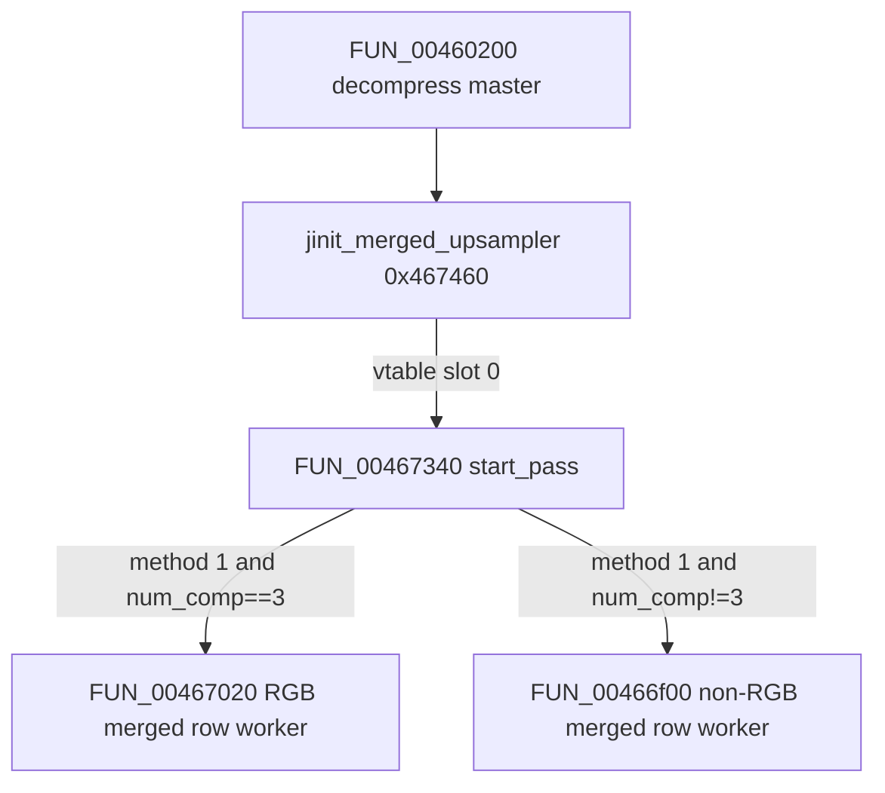

# Round 8 FUN — Task 35 Report

## Task

| Field | Value |
|-------|-------|
| **id** | 35 |
| **round** | 8 |
| **band** | dispatch |
| **seed_address** | `0x00467020` |
| **ghidra_name (before)** | `FUN_00467020` |
| **xref_count** | 1 |
| **prior_hint** | R6 task 48 — merged-upsampler RGB row worker in `jdmerge.c` cluster; no COFF symbol |

## Status

**PARTIAL** — libjpeg-6b **merged-upsampler row worker for RGB (`num_components==3`)** proven via live Ghidra xrefs, disasm, and decompile. Installed only as a **method pointer** at `upsample+4` by `FUN_00467340` when `cinfo+0x4c==1` and `cinfo+0x64==3`. **No unique IJG export symbol** in repo — **`FUN_00467020` kept**.

## Function

| Address | Ghidra (before) | Ghidra (after) | Role | Evidence |
|---------|-----------------|----------------|------|----------|
| `0x00467020` | `FUN_00467020` | `FUN_00467020` | **IJG libjpeg-6b merged-upsampler row worker (RGB / 3 components):** for each output row, walks input bytes **3 at a time** (Y,Cb,Cr), sums three AC-table lookups from ring-indexed pointer tables at `upsample+0x34/+0x38/+0x3c`, writes one output byte per pixel; advances ring index `upsample+0x30` (`& 0xf`) per pixel and per row. Does **not** zero the output row (unlike sibling `FUN_00466f00`). | Sole **DATA** xref `FUN_00467340@0x004673d2` → `mov [upsample+4], 0x467020` when `cinfo+0x4c==1` && `cinfo+0x64==3`; 0x12d B; `__cdecl` |

### Install gate (`FUN_00467340` disasm)

| VA | Instruction | Meaning |
|----|-------------|---------|
| `0x00467352` | `MOV EAX,[ESI+0x4c]` | Upsample method id (`cinfo+0x4c`) |
| `0x00467368` | `JZ 0x004673cc` | Branch when method == **1** (merged, non-fancy) |
| `0x004673cc` | `CMP [ESI+0x64], 3` | `num_components` gate |
| `0x004673d2` | `MOV [EDI+4], 0x467020` | **Install `FUN_00467020`** at upsample method slot |
| `0x004673db` | `MOV [EDI+4], 0x466f00` | Else install non-RGB sibling `FUN_00466f00` |

Caller chain: `FUN_00460200` (decompress master) → `jinit_merged_upsampler@0x00467460` → vtable `start_pass=FUN_00467340` → (pass start) stores method ptr → runtime indirect call through `upsample+4`.

### `cinfo` / upsample fields used

| Offset | Field | Use in body |
|--------|-------|-------------|
| `cinfo+0x1a8` (`cinfo[0x6a]`) | upsample object ptr | Base for tables and ring state |
| `cinfo+0x5c` (`cinfo[0x17]`) | `output_width` | Inner pixel loop count |
| `upsample+0x18` | color-conversion table triple | `*piVar3`, `piVar3[1]`, `piVar3[2]` — Y/Cb/Cr AC bases |
| `upsample+0x30` | ring row index | Loaded per row; `+1 & 0xf` after each row |
| `upsample+0x34/+0x38/+0x3c` | AC pointer ring tables | Indexed by `(ring*0x40 + col&0xf)*4` |

### Disassembly (inner pixel loop)

| VA | Instruction | Meaning |
|----|-------------|---------|
| `0x00467027` | `MOV EDX,[ECX+0x1a8]` | Load upsample from cinfo |
| `0x0046702d` | `MOV EAX,[EDX+0x18]` | Color table triple |
| `0x00467030` | `MOV ECX,[ECX+0x5c]` | `output_width` |
| `0x00467084` | `MOV ECX,[EDX+0x30]` | Ring index for this row |
| `0x00467097` | `SHL ECX,0x6` | `ring * 0x40` table stride |
| `0x004670c0`–`0x004670ff` | 3× `MOVZX` + table adds | Sum Y + Cb + Cr lookups |
| `0x0046710d` | `ADD EAX,0x1` (×3) | Advance input 3 bytes (Y,Cb,Cr) |
| `0x00467110` | `AND ECX,0xf` | Column ring mask |
| `0x0046712d` | `AND EAX,0xf` | Row ring advance |

### Sibling comparison

| Function | When installed | Row init | Input stride | Components |
|----------|----------------|----------|--------------|------------|
| `FUN_00466f00` | merged + `num_components != 3` | `IJG_jzero_far` each row | `+num_components` per pixel | variable loop |
| **`FUN_00467020`** | merged + `num_components == 3` | none | **+3** per pixel | fixed Y,Cb,Cr |
| `FUN_00467150` | merged fancy (`cinfo+0x4c==2`) | `IJG_jzero_far` + short workspace | fancy colormap path | separate task |

### Call graph

### Xrefs to (`get_xrefs_to`)

| From | Type | Context |
|------|------|---------|
| `0x004673d2` | DATA | `FUN_00467340` — `upsample->upsample_method = FUN_00467020` |

No direct `CALL` xrefs (invoked only through upsampler method pointer during decompress upsample pass).

## Ghidra deltas

| Action | Target | Result |
|--------|--------|--------|
| `connect_instance` | `bulanci` | 202 tools registered |
| `set_function_prototype` | `0x00467020` → `void FUN_00467020(int *cinfo, int input_buf, int *output_buf_ptr, int num_rows)` | OK (replaces mapping.csv `uchar` return stub) |
| `set_decompiler_comment` | `0x00467020` | OK — role + install gate + UNK symbol |
| `set_plate_comment` | `0x00467020` | OK — Parameters / Algorithm / Returns / Caller |
| `force_decompile` | `0x00467020` | OK — named params `cinfo`, `output_buf_ptr`, `num_rows` |
| `save_program` | `bulanci.exe` | OK |

**Not applied:** `rename_function_by_address` — no COFF/`ref/libjpeg6b` export for this 0x12d B method body (R6 task 48 / R8 task 12 UNK stands). Named upstream `h2v2_merged_upsample@0x00466300` is a **different** entry (mapping.csv); not byte-identical.

## Frida

**none** — Static IJG decompressor method pointer; no gameplay-visible state.

## Remaining UNK

| Item | Status |
|------|--------|
| Exact IJG `jdmerge.c` export symbol for RGB merged row worker | **UNK** — control-flow matches family; no COFF-exact map |
| Relationship to `h2v2_merged_upsample@0x00466300` | **Distinct** — separate VA/size; this fn is vtable-installed method for `cinfo+0x4c==1` RGB path only |
| `FUN_00466d40` / `zlib__gen_codes` prep (same install block) | **Out of scope** — shared setup in `FUN_00467340`; see R8 task 12 |

## Cross-links

- [round6_logic_task_48_report.md](../logic_recovery/round6_logic_task_48_report.md) — band slice row for `0x00467020`
- [round8_fun_task_12_report.md](round8_fun_task_12_report.md) — `FUN_00467340` install table including this method
- [jpeg_decoder.md](../../formats/jpeg_decoder.md) — libjpeg-6b identity; `jdmerge.c` cluster
