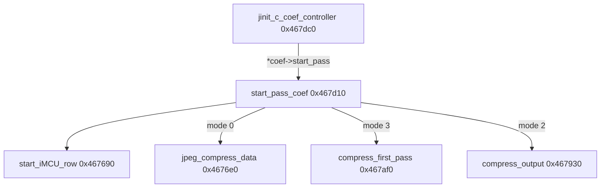

# Round 8 FUN — Task 37 Report

## Task

| Field | Value |
|-------|-------|
| **id** | 37 |
| **round** | 8 |
| **band** | dispatch |
| **seed_address** | `0x00467d10` |
| **title** | FUN recovery: FUN_00467D10 @ 0x00467d10 (xrefs=1) |
| **prior_hint** | *(empty)* |
| **carry_over** | [round6_logic_task_48_report.md](../logic_recovery/round6_logic_task_48_report.md), [round7_fun_task_29_report.md](round7_fun_task_29_report.md), [round7_fun_task_35_report.md](round7_fun_task_35_report.md) |

## Status

**DONE** — Live Ghidra MCP re-verify (`connect_instance bulanci`, 2026-06-03) confirms IJG libjpeg-6b `jccoefct.c::start_pass_coef`. Symbol was already renamed `FUN_00467D10` → **`start_pass_coef`**; R8 refreshed prototype (`void __cdecl start_pass_coef(int *cinfo, int pass_mode)`), replaced stale UNCERTAIN plate/decompiler comments, force-decompiled, saved.

## Function

| Address | Before | After | Role | Evidence |
|---------|--------|-------|------|----------|
| `0x00467d10` | `FUN_00467D10` | **`start_pass_coef`** | **IJG coef-controller `start_pass` (METHODDEF):** zeros `coef->iMCU_row_num`, calls **`start_iMCU_row`**, then installs `coef->compress_data` vfn by `J_BUF_MODE` (`pass_mode` arg) | Decompile + disasm; sole DATA xref from `jinit_c_coef_controller`; switch/calls match libjpeg-6b `jccoefct.c` `start_pass_coef` byte-for-byte |

### `J_BUF_MODE` dispatch (proven)

| `pass_mode` | IJG enum | `whole_image[0]` check (`coef+0x40`) | `compress_data` installed (`coef+0x4`) |
|-------------|----------|--------------------------------------|----------------------------------------|
| `0` | `JBUF_PASS_THRU` | must be **NULL** (else `JERR_BAD_BUFFER_MODE`) | **`jpeg_compress_data`** @ `0x004676e0` |
| `2` | `JBUF_CRANK_DEST` | must be **non-NULL** | **`compress_output`** @ `0x00467930` (R7 task 35) |
| `3` | `JBUF_SAVE_AND_PASS` | must be **non-NULL** | **`compress_first_pass`** @ `0x00467af0` |
| other | — | — | `ERREXIT` via `cinfo->err` (`msg_code = 4`) |

Mode `1` (`JBUF_SAVE_SOURCE`) is not handled here (falls through to error), matching stock coef-controller usage.

### Field map

| Offset | IJG field | Use |
|--------|-----------|-----|
| `cinfo+0x148` (`cinfo[0x52]`) | `cinfo->coef` | coef controller object |
| `coef+0x8` | `iMCU_row_num` | zeroed at pass start |
| `coef+0x4` | `pub.compress_data` | method pointer installed per mode |
| `coef+0x40` | `whole_image[0]` | NULL ⇒ single-pass MCU buffer; non-NULL ⇒ multipass virt arrays |

### Disassembly highlights (`0x00467d10`–`0x00467dbb`, size **0xac**)

```
00467d16  MOV EDI,[ESI+0x148]       ; coef = cinfo->coef
00467d1e  MOV [EDI+0x8],0           ; iMCU_row_num = 0
00467d25  CALL start_iMCU_row         ; ECX=cinfo
00467d31  JZ  pass_mode_0             ; pass_mode == 0
00467d36  JZ  pass_mode_2             ; pass_mode == 2
00467d53  ...                         ; pass_mode == 3 → compress_first_pass @ 0x467af0
00467d8f  MOV [EDI+0x4],0x467930      ; compress_output
00467db2  MOV [EDI+0x4],0x4676e0      ; jpeg_compress_data
```

### Xref closure (1)

| From | Type | Context |
|------|------|---------|
| `0x00467de2` | **DATA** | **`jinit_c_coef_controller`** — `*puVar2 = start_pass_coef` (vtable slot 0 / `pub.start_pass`) |

No direct CODE callers; invoked only through coef-controller vtable during compressor pass setup.

### Call graph (coef cluster)



## Ghidra deltas

| Action | Target | Result |
|--------|--------|--------|
| *(pre-existing)* `rename_function_by_address` | `0x00467d10` | `FUN_00467D10` → **`start_pass_coef`** (verified on connect) |
| `set_function_prototype` | `0x00467d10` | `void start_pass_coef(int *cinfo, int pass_mode)` + `__cdecl` |
| `set_decompiler_comment` | `0x00467d10` | IJG role + `J_BUF_MODE` table + `whole_image[0]` guard |
| `set_plate_comment` | `0x00467d10` | `libjpeg-6b jccoefct.c :: start_pass_coef` |
| `force_decompile` | `0x00467d10` | Refresh (param names `cinfo` / `pass_mode`) |
| `save_program` | `bulanci.exe` | Saved |

## Frida

**none** — Static IJG compressor coef-controller vtable plumbing; no gameplay-visible state.

## Remaining UNK

| Item | Reason |
|------|--------|
| `mapping.csv` / `_Globals.h` / `_Globals.cpp` | Still list `FUN_00467d10` / `uchar` return — export regen out of scope |
| `jpeg_compress_struct *` typing | Prototype uses `int *cinfo`; full struct not in Ghidra DT manager |
| `start_iMCU_row(cinfo)` decompile | Ghidra shows zero-arg tail-call; disasm passes ECX — cosmetic only |
| `JBUF_SAVE_SOURCE` (mode 1) | Not wired in this binary body; unused on coef-controller path |

## Evidence paths

- [ROUND8_FUN_PROTOCOL.md](../ROUND8_FUN_PROTOCOL.md), [GHIDRA_MCP.md](../GHIDRA_MCP.md)
- [round6_logic_task_48_report.md](../logic_recovery/round6_logic_task_48_report.md)
- libjpeg-6b `jccoefct.c` `start_pass_coef` (upstream control-flow reference)
- `config/bulanci/mapping.csv` (`0x467d10`, size `0xac`)
