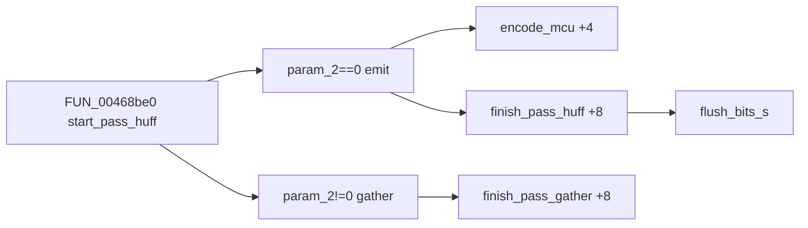

# Round 8 FUN — Task 39 Report

## Task

| Field | Value |
|-------|-------|
| **id** | 39 |
| **round** | 8 |
| **band** | dispatch |
| **seed_address** | `0x00468590` |
| **title** | FUN recovery: FUN_00468590 @ 0x00468590 (xrefs=1) |
| **prior_hint** | *(empty — cross-check [round6_logic_task_49_report.md](../logic_recovery/round6_logic_task_49_report.md) `finish_pass_huff` candidate)* |

## Status

**DONE** — IJG **`finish_pass_huff`** (`jchuff.c` LOCAL) proven: non-progressive entropy pass tail — save `dest` + `entropy->saved`, `flush_bits_s`, restore; `JERR_CANT_SUSPEND` (`0x18`) on suspend failure. Installed as `entropy->pub.finish_pass` (+8) from `FUN_00468be0` when `param_2==0` (emit mode), sibling `finish_pass_gather` when gather. Renamed in Ghidra; program saved.

## Function

| Address | Before | After | IJG name | Role | Evidence |
|---------|--------|-------|----------|------|----------|
| `0x00468590` | `FUN_00468590` | `finish_pass_huff` | `finish_pass_huff` | **Huffman encode pass finish** — flush trailing bits via `working_state` + `flush_bits_s`, update `cinfo->dest` and `entropy->saved` | Live decompile + disasm; 177 B (`0xB1`); xref DATA install @ `FUN_00468be0+0x0c0`; algorithm matches IJG `jchuff.c` non-`progressive_mode` branch |

### Decompile (live, post-rename)

```c
void __cdecl finish_pass_huff(int *cinfo)
{
  /* cinfo[6]   = dest (next_output_byte, free_in_buffer) */
  /* cinfo[0x57]= entropy @ cinfo+0x15c; +0xc..+0x20 = saved bit-emitter state */
  save dest + entropy.saved to stack working_state;
  if (!flush_bits_s(&state)) {
    cinfo->err->msg_code = 0x18;  /* JERR_CANT_SUSPEND */
    error_exit(cinfo);
  }
  restore dest + entropy.saved from stack;
}
```

### Disasm highlights (`0x00468590`–`0x00468641`, 0xB1 B)

| VA | Instruction | Proof |
|----|-------------|-------|
| `0x00468598`–`0x004685b2` | Load `[EBX+0x18]` → dest ptrs | `cinfo->dest` (`cinfo[6]`) |
| `0x004685a2`–`0x004685da` | Load/save `[EDI+0xc..0x20]` | `entropy->saved` bit state |
| `0x004685ce`–`0x004685de` | `LEA ESI,[ESP+0xc]`; store `cinfo` on stack | `working_state` for `flush_bits_s` |
| `0x004685e2` | `CALL flush_bits_s@0x004681d0` | IJG suspendable flush |
| `0x004685ed` | `MOV [EAX+8],0x18` | `JERR_CANT_SUSPEND` |
| `0x004685fe`–`0x00468638` | Restore dest + entropy.saved | Matches IJG post-flush update |

### IJG field mapping (this binary)

| Offset | IJG role |
|--------|----------|
| `cinfo[6]` (`+0x18`) | `jpeg_destination_mgr *dest` — `next_output_byte`, `free_in_buffer` |
| `cinfo[0x57]` (`+0x15c`) | `huff_entropy_ptr entropy` |
| `entropy+0xc..+0x20` | `entropy->saved` (`bit_buffer`, `put_buffer`, etc. via `ASSIGN_STATE`) |
| `*cinfo` error mgr | `msg_code = 0x18` → `JERR_CANT_SUSPEND` on flush failure |

### Xref closure (1)

| Direction | Address | Symbol | Notes |
|-----------|---------|--------|-------|
| **Installer (sole)** | `0x00468c0d` | `FUN_00468be0` | `*(code **)(entropy+8) = finish_pass_huff` when `param_2=='\0'`; paired `*(entropy+4) = encode_mcu`. Gather path sets `finish_pass_gather` @ +8 instead |
| **Cluster** | `0x004683a0` | `encode_mcu` | MCU encode entry (emit mode +4 slot) |
| `0x00468af0` | `finish_pass_gather` | Gather-mode finish_pass sibling |
| `0x004681d0` | `flush_bits_s` | Callee — suspendable bit flush |

### IJG correspondence

| Check | Match |
|-------|-------|
| File / API | `jchuff.c` `LOCAL(void) finish_pass_huff(j_compress_ptr cinfo)` |
| Vtable install | `entropy->pub.finish_pass = finish_pass_huff` in `start_pass_huff` when not gather |
| Algorithm | Non-progressive branch: load `working_state` from dest + `entropy->saved`, `flush_bits_s`, restore |
| Error path | `ERREXIT(cinfo, JERR_CANT_SUSPEND)` |
| R6 carry-over | [round6_logic_task_49](../logic_recovery/round6_logic_task_49_report.md) listed as **UNK candidate** — now closed |



## Ghidra deltas

| Action | Target | Result |
|--------|--------|--------|
| `rename_function_by_address` | `0x00468590` → `finish_pass_huff` | Success |
| `set_function_prototype` | `void __cdecl finish_pass_huff(int *cinfo)` | Success (corrects export `uchar` in `mapping.csv`) |
| `set_decompiler_comment` | `0x00468590` | IJG role + xref + field map |
| `force_decompile` | `0x00468590` | Refreshed |
| `save_program` | `bulanci.exe` | Saved |

## Frida

**none** — Stock libjpeg-6b Huffman encoder; static IJG source line match + vtable install + disasm close the role.

## Remaining UNK

| Item | Notes |
|------|-------|
| `FUN_00468be0` rename | `start_pass_huff` candidate — R8 task 40 |
| Progressive `finish_pass_huff` branch | IJG uses `emit_eobrun` + `flush_bits_e` when `progressive_mode`; not present in this 177 B body (sequential-only build path) |
| `jpeg_compress_struct*` typing | No struct in Ghidra DB — `int *cinfo` prototype |
| `mapping.csv` / `_Globals.cpp` | Still `FUN_00468590` / `uchar` return — export regen out of scope |

## Cross-links

- [round6_logic_task_49_report.md](../logic_recovery/round6_logic_task_49_report.md) — prior UNK candidate
- [round8_fun_task_40_report.md](round8_fun_task_40_report.md) — installer `start_pass_huff@0x00468be0`
