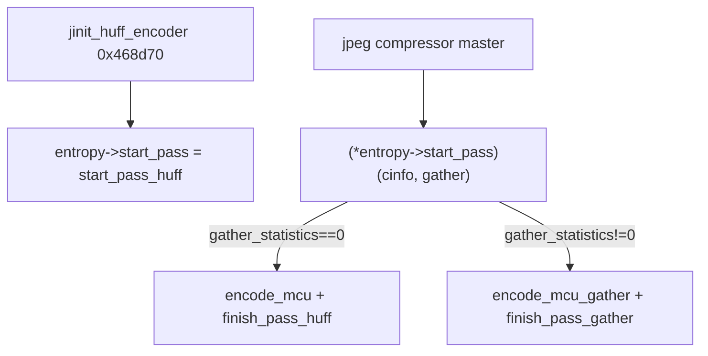

# Round 8 FUN — Task 40 Report

## Task

| Field | Value |
|-------|-------|
| **id** | 40 |
| **round** | 8 |
| **band** | dispatch |
| **seed_address** | `0x00468be0` |
| **title** | FUN recovery: FUN_00468BE0 @ 0x00468be0 (xrefs=1) |
| **prior_hint** | R6 logic task 49 — Huff encoder init helper UNK; may be `start_pass_huff` |

## Status

**DONE** — Live Ghidra MCP confirms IJG **`start_pass_huff`** (`jchuff.c`, METHODDEF). Symbol renamed (or already `start_pass_huff` in DB); prototype `void start_pass_huff(void *cinfo, char gather_statistics)`; plate/decompiler comments; `bulanci.exe` saved.

## Function

| Address | Before | After | Role | Evidence |
|---------|--------|-------|------|----------|
| `0x00468be0` | `FUN_00468be0` | **`start_pass_huff`** | **Huffman entropy encoder pass setup** on compress: installs `entropy->encode_mcu` / `entropy->finish_pass` for baseline emit vs statistics-gather passes; builds derived Huff tables or allocates/zeroes 0x404-byte count tables per component | 389 B (`0x185`); 1× DATA xref `jinit_huff_encoder@0x00468d89` stores fn ptr in entropy vtable slot 0; disasm + decompile match libjpeg-6b `jchuff.c::start_pass_huff` (baseline path only — no progressive branch in this PE) |

### Prior-hint resolution (R6 task 49)

| Source | Claim | Verdict |
|--------|-------|---------|
| R5 worker 15 / R6 task 49 | “init helper” / UNK | **Superseded** — not a separate init helper; **is** `entropy->pub.start_pass` body referenced from `jinit_huff_encoder` |
| R6 task 49 | `FUN_00468590` = `finish_pass_huff` candidate | **Confirmed** — decompiler @ R8 now resolves slot `entropy+8` to **`finish_pass_huff`** when `gather_statistics==0` |

### Disassembly highlights (`0x00468be0`–`0x00468d64`)

| VA | Instruction | Proof |
|----|-------------|-------|
| `0x00468bee` | `MOV EDI,[ESI+0x15c]` | `cinfo->entropy` |
| `0x00468bf4` | `CMP byte [ESP+0x10],0` | `gather_statistics` (`param_2`) |
| `0x00468c06` | `MOV [EDI+4],0x468420` | `encode_mcu` (emit mode) |
| `0x00468c0d` | `MOV [EDI+8],0x468590` | `finish_pass_huff` |
| `0x00468bf6` | `MOV [EDI+4],0x468740` | `encode_mcu_gather` (`LAB_00468740`) |
| `0x00468bfd` | `MOV [EDI+8],0x468af0` | `finish_pass_gather` |
| `0x00468c14` | `CMP [ESI+0xe4],0` | `comps_in_scan` loop bound |
| `0x00468c60` | `MOV [EAX+8],0x32` | `JERR_NO_HUFF_TABLE` (50) on bad DC index |
| `0x00468d06` | `CALL 0x00467ed0` | `jpeg_make_c_derived_tbl` (emit path) |
| `0x00468ca5` | `PUSH 0x404` | Count-table size (257×4) for gather path |
| `0x00468d53` | `MOV [EDI+0x24],[ESI+0xbc]` | `entropy->restarts_to_go = cinfo->restart_interval` |

### Field map (`jpeg_compress_struct` offsets in this binary)

| Offset | IJG field | Use in this function |
|--------|-----------|----------------------|
| `cinfo+0x15c` | `entropy` | `huff_entropy_ptr`; vtable slots `+4` encode_mcu, `+8` finish_pass |
| `cinfo+0xe4` | `comps_in_scan` | Component loop |
| `cinfo+0xe8` | `cur_comp_info[]` | Stride 4; `dc_tbl_no` @ comp `+0x14`, `ac_tbl_no` @ `+0x18` |
| `cinfo+0xbc` | `restart_interval` | Copied to `entropy+0x24` |
| `entropy+0x14` | per-scan workspace | Zeroed each component (`*local_4 = 0`) |
| `entropy+0x2c` / `+0x3c` | `dc_derived_tbls` / `ac_derived_tbls` | Emit: `jpeg_make_c_derived_tbl` |
| `entropy+0x4c` / `+0x5c` | `dc_count_ptrs` / `ac_count_ptrs` | Gather: alloc `0x404`, `memset` |

### Callees (MCP)

| Callee | Address | Role |
|--------|---------|------|
| `jpeg_make_c_derived_tbl` | `0x00467ed0` | Build derived tables (emit pass) |
| `_memset` | `0x00447ce0` | Zero statistics buffers (gather pass) |

### Xref closure

| From | Type | Context |
|------|------|---------|
| `0x00468d89` | **DATA** (proven) | `jinit_huff_encoder`: `MOV [EAX], offset start_pass_huff` — installs `entropy->pub.start_pass` |

Manifest `xref_count=1`; no direct `CALL` sites (vtable dispatch only).

### Control flow

### IJG source alignment

`jchuff.c::start_pass_huff` — baseline branch (this binary has no progressive `encode_mcu_DC_first` tree). `jinit_huff_encoder` sets `entropy->pub.start_pass = start_pass_huff` (same install pattern as upstream @ end of `jinit_huff_encoder`).

**Not** `write_scan_header` @ `0x00460bf0` (R6 renamed from mislabel `start_pass_huff` — `jcmarker.c` scan header writer).

## Ghidra deltas

| Action | Target | Result |
|--------|--------|--------|
| `rename_function_by_address` | `0x00468be0` | `start_pass_huff` (already named in DB; idempotent) |
| `set_function_prototype` | `0x00468be0` | `void start_pass_huff(void *cinfo, char gather_statistics)` |
| `set_plate_comment` | `0x00468be0` | jchuff.c METHODDEF + jinit_huff_encoder install |
| `set_decompiler_comment` | `0x00468be0` | R8 task40 vtable targets + JERR 0x32 |
| `force_decompile` | `0x00468be0` | OK — shows `finish_pass_huff` / `finish_pass_gather` resolves |
| `save_program` | `bulanci.exe` | Saved |

## Frida

**none** — stock IJG compress entropy setup; static disasm + xref + IJG `jchuff.c` match sufficient.

## Remaining UNK

| Item | Reason |
|------|--------|
| `jpeg_compress_struct` typing | No struct in Ghidra DB; `void *cinfo` only |
| `encode_mcu_gather` @ `LAB_00468740` | Label only; separate R8 task if in manifest |
| `mapping.csv` export | Still lists `FUN_00468be0` / `uchar` return — cosmetic vs Ghidra `void` |
| Progressive Huff paths | Absent in this function body (6b baseline build) |

## Evidence paths consulted

- [ROUND8_FUN_PROTOCOL.md](../ROUND8_FUN_PROTOCOL.md), [GHIDRA_MCP.md](../GHIDRA_MCP.md)
- [round6_logic_task_49_report.md](../logic_recovery/round6_logic_task_49_report.md)
- [round5_worker_15_report.md](../struct_recovery/round5_worker_15_report.md)
- `config/bulanci/mapping.csv` (`FUN_00468be0`, `0x185` B)
- IJG `jchuff.c::start_pass_huff` (libjpeg reference; baseline path)
