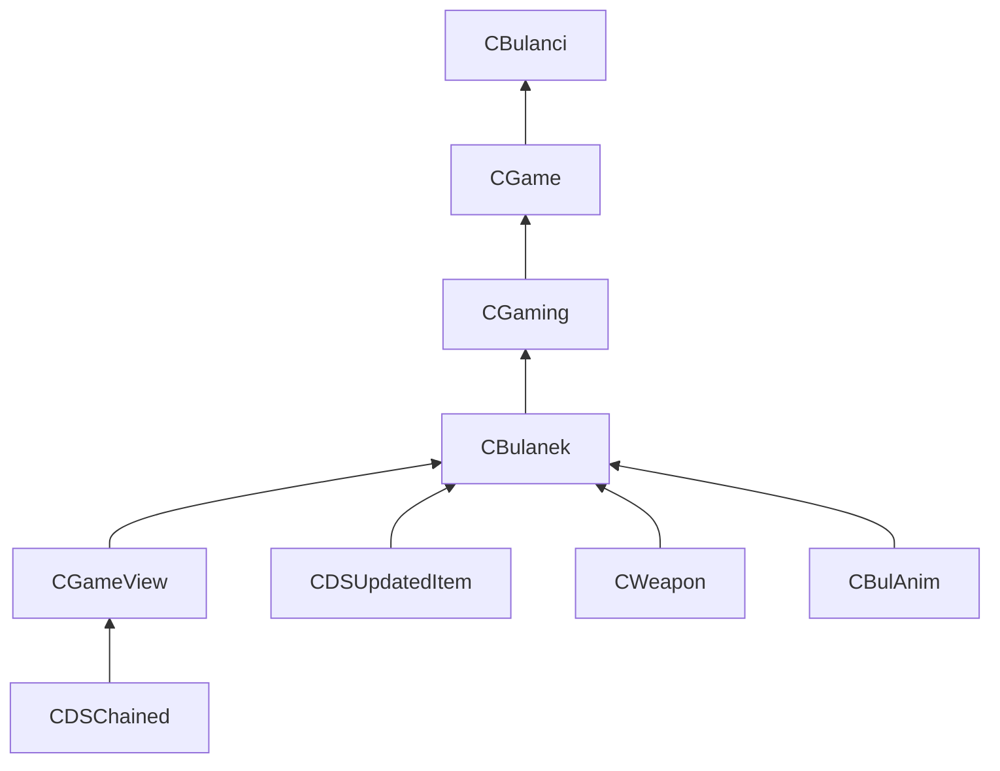

# Gameplay struct recovery — campaign backlog (~50 slices)

Coordinator: bottom-up from leaves → **`CBulanek`** → **`CGaming`** / **`CGame`** → **`CBulanci`**.

**Legend:** `PARTIAL` = doc exists with size anchor; `DOC` = new this round; `MISSING` = no `{Class}.md`; `SKIP` = CRT/EH.

| Slice | Classes | Priority | Status | Notes |
|-------|---------|----------|--------|-------|
| 00 | `CBulanci`, `CDSObject` | P0 | PARTIAL | `CBulanci.md`; **`game` `CGame` @ +0x284 (0x248)** — agent todo 12 |
| 01 | `CDSApp`, `CGameView` | P0 | PARTIAL | **`CDSApp` 644 B**; **`CBulanci`** embeds `CDSApp app` @ 0 (todo 2); `CGameView` 152 B |
| 02 | `CDSScript`, `CAdvertising` | P2 | PARTIAL | VM verified in `status.md` |
| 03 | `CAnim`, `CBitmap` | P1 | PARTIAL | Anim playback; shared 0x98 header with CGameView |
| 04 | `CBulAnim`, `CBulPicture` | P1 | PARTIAL | Player sprites / FLX; Ghidra `CBulAnim` **0xD4** applied (slice 04) |
| 05 | `CColorSet`, `CDeath` | P2 | PARTIAL | Death tournament path |
| 06 | `CDeath2`, `CDirectKeyb` | P2 | PARTIAL | Slice 06: `CDeath` struct 0x108 created; `CDirectKeyb`/`CDeath2` field renames |
| 07 | `CExitDlg`, `CExplosion` | P2 | PARTIAL | Combat FX |
| 08 | `CGameCounter`, `CGameTypeDlg` | P2 | PARTIAL | Lobby UI |
| 09 | `CGunMouse`, `CHelpDlg` | P3 | PARTIAL | Input / help |
| 10 | `CHelpScript`, `CHistoryDlg` | P3 | PARTIAL | |
| 11 | `CHistoryScript`, `CHistoryView` | P3 | PARTIAL | |
| 12 | `CItemInfo`, `CLevelList` | P1 | VERIFIED | Slice 12 + todo 13: `CGame.pLevelResourceTable` / `nLevelResourceCount` in Ghidra |
| 13 | `CLevelScore`, `CListBoxItem` | P2 | VERIFIED | `CLevelScore.md` 0x28; `CListBoxItem.md` 0x14 — Ghidra applied (R3 todo 14): `CLevelScore` 40 B, `CListBoxItem.dwPad_04` @ +0x04 |
| 14 | `CMina`, `CMovieView` | P1 | PARTIAL | Mines from CWeapon::Fire; `CMina.animBase` = `CAnim` in Ghidra (todo 20) |
| 15 | `CMsgDialog`, `CPauseDlg` | P1 | PARTIAL | In-match UI; `pGame` → CGame* |
| 16 | `CPoem`, `CPoemScroller` | P3 | PARTIAL | Blit dispatch |
| 17 | `CScore`, `CScoreItem` | P2 | PARTIAL | |
| 18 | `CSessionItem`, `CSessionList` | P2 | PARTIAL | DirectPlay lobby |
| 19 | `CSetupDlg`, `CSpells` | P3 | VERIFIED | `CSetupDlg.md`, `CSpells.md` — tails typed (`CVolume*`/`CStaticText*`, spell mask); R3 task 20 |
| 20 | `CSwitch`, `CTcpIpConfig` | P3 | PARTIAL | |
| 21 | `CTeleportPoint`, `CDSAnim` | P1 | PARTIAL | Respawn gates @ CBulanek damage |
| 22 | `CDSApiException`, `CDSAudioBank` | P2 | PARTIAL | Audio bank tail in CGame |
| 23 | `CDSAudioBankSample`, `CDSAudioPlayer` | P2 | VERIFIED | Slice 23: structs 0x24/0x58; `CDSAudioPlayer_FillDirectSoundBuffer`, `CBulanek_ReleaseAudioPlayerRef` |
| 24 | `CDSAudioVideoPlayer`, `CDSBackBuffer` | P1 | VERIFIED | Render path; 80 B each; slice 24 Ghidra prototypes + save |
| 25 | `CDSBitmap`, `CDSBmpImage` | P3 | PARTIAL | |
| 26 | `CDSChain`, `CDSChained` | P0 | PARTIAL | View tree / MI base |
| 27 | `CDSCollection`, `CDSDirectSound` | P2 | PARTIAL | `CDSCollection.md` VERIFIED 0x18; `CDSDirectSound.md` VERIFIED 0x54; InitPrimary/InsertKeyed prototype pass |
| 28 | `CDSDirectXException`, `CDSEasyMemStream` | P3 | VERIFIED | Slice 28: structs 72/44 B; leaf FUN_* renamed |
| 29 | `CDSException`, `CDSFilterStream` | P3 | PARTIAL | |
| 30 | `CDSFlxFile`, `CDSFont` | P1 | VERIFIED | FLX ClassID 52 → `DecodeFrame` / `CBulPicture+0x68`; font `0x568` + glyph table |
| 31 | `CDSGZipStreamData`, `CDSImage` | P1 | PARTIAL | Config blob / blit |
| 32 | `CDSImageMouse`, `CDSJpegImage` | P3 | PARTIAL | Jpeg: factory `0x00432070`/`0x64`, `+0x60` quality (todo 36) |
| 33 | `CDSMemoryException`, `CDSMouse` | P3 | PARTIAL | |
| 34 | `CDSMpx`, `CDSMpxDecoder` | P3 | PARTIAL | |
| 35 | `CDSMpxStream`, `CDSQueueStream` | P3 | PARTIAL | |
| 36 | `CDSRegKeyException`, `CDSResInfo` | P2 | PARTIAL | Registry |
| 37 | `CDSResourceException`, `CDSResourceSign` | P2 | VERIFIED | Slice 37: Ghidra structs 0x44/0x28; throw rename `0x4346f0` |
| 38 | `CDSSafeStream`, `CDSSafeStreamInfo` | P2 | PARTIAL | |
| 39 | `CDSSimpleException`, `CDSStreamException` | P3 | PARTIAL | |
| 40 | `CDSStreamStorage`, `CDSStrmResInfo` | P2 | VERIFIED | Pack streams; slice 40 Ghidra renames + method table |
| 41 | `CDSUpdatedItem`, `CDSVideoPlayer` | P0 | PARTIAL | `CBulanek.scheduler` @ +0x88 in Ghidra; ctor/tick xrefs (todo 41); video mgr todo 42 |
| 42 | `CDSWav`, `CDSWavStream` | P2 | PARTIAL | |
| 43 | `ODSImage`, `type_info` | P1 | VERIFIED | Mixin `0x10`; todo 48 namespace cleanup (`CWeapon_ctor` Global, `ODSImage__SetImage`) |
| 44 | `exception`, `bad_exception` | SKIP | SKIP | |
| 45 | `bad_alloc`, `_LocaleUpdate` | SKIP | SKIP | |
| 46 | `_s_CatchableType` | SKIP | SKIP | |
| 47 | `EHExceptionRecord` | SKIP | SKIP | |
| 48 | `EHRegistrationNode` | SKIP | SKIP | |
| 49 | `TranslatorGuardRN` | SKIP | SKIP | |
| **50** | **`CBulanek`, `CWeapon`** | **P0** | **DOC** | **`CBulanek.md`, `CWeapon.md`** — Ghidra field pass |
| **51** | **`CGaming`, `CGame`** | **P0** | **DOC / PARTIAL** | **`CGaming.md`**; deepen `CGame.md` pads |
| **52** | **`CShot`, `CExplosion`** | **P1** | PARTIAL / agent | Projectile chain from CWeapon::Fire |

## Critical path (CBulanci / CBulanek)

## Top blockers

1. ~~**`CGame` embed vs full type**~~ — **done** (todos 1/12): `CBulanci.game` is **`CGame` (584 B)** @ `+0x284`; `CGame_embedded` removed.
2. **`CGameView *` / `CBulanci` extends `CDSApp`** — **`CDSApp app`** @ `CBulanci+0` (todo 2 done); **`CGameView *`** + ctor prototypes (todo 3).
3. **`CGaming` 0x36C** not applied in Ghidra (stack-only type).
4. **Mid-object pads** on `CGame` (+0x08..+0x65, +0x88..+0xBB).
5. **`CShot` / spatial query** leaf sizes for combat parity.

## Agent dispatch (2026-05-30)

| Workstream | Agent type | Result |
|------------|------------|--------|
| CGameView base | explore | Prefix 0x98 documented |
| CGaming modal | explore | 0x36C, slots @ +0xC8 |
| CWeapon leaf | explore | 0x70, vtables 0x481ed4/0x481eec |
| CShot | explore (bg) | Pending |
| Gap inventory | explore (bg) | Pending |

Source manifest: `struct_recovery/batches_50.json` + slices **50–52** (gameplay spine extension).
