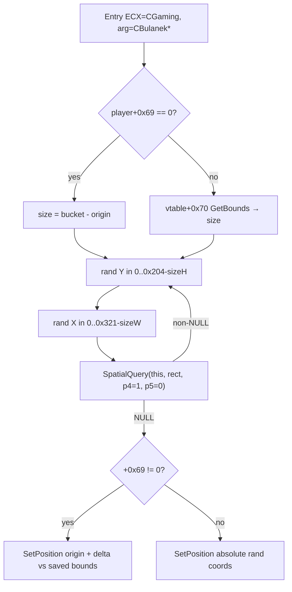

# Round 6 logic — task 09

## 1. Task

| Field | Value |
|-------|-------|
| **id** | 9 |
| **title** | Logic cluster: CGaming_RespawnPlayerAtSafeLocation + scheduler/gaming neighbors |
| **range** | `cluster_41ab` (`0x0041a`–`0x0041b`) |
| **seed_address** | `0x0041a140` |

## 2. Status

**PARTIAL** — Seed `CGaming_RespawnPlayerAtSafeLocation` control flow, callers, and `SpatialQuery` contract are statically proven (Ghidra decompile + disasm + xrefs). Four neighbor `CreateObject` factories (`0x0041bc40`, `0x0041bd20`, `0x0041bd90`, `0x0041be00`) were not decompiled before **user-ghidra-mcp** disconnected; class targets remain **UNK**. Planned `set_function_this_type` on the seed was not applied (no `save_program`).

## 3. Functions

| Addr | Name | Role summary | Evidence |
|------|------|--------------|----------|
| `0x0041a140` | `CGaming_RespawnPlayerAtSafeLocation` | **`__thiscall` on `CGaming*`:** random spawn rect in **800×516** (`0x321`×`0x204`) minus player AABB; **`do/while`** until `_Globals::SpatialQuery` returns NULL with **`param_4=1`, `param_5=0`** (skip tile-overlap gate, include `+0x6a` entities); then `CDSView__SetPosition` on `CBulanek*`. Branch on `CBulanek+0x69` for bounds source (vtable `+0x70` vs `+0x28/2c − +0x20/24`). **No retry cap** — full-map obstacle coverage can hang (`while` @ `0x0041a1e0`). | Decompile + disasm; xrefs below; `damage_pipeline.md` SpatialQuery table |
| `0x0041bb80` | `CLevelScript::CLevelScriptOpExt_DefineTraceArea` | Script opcode **38**: `CDSScript_ReadKindAndRect4` + `ReadSubExpr`; appends danger/trace node via **`CGaming_AppendDangerZoneNode(scriptCtx->pGaming, …)`** (`vecSlotVec_2d8` / `+0x2d8`). Related to spawn safety indirectly (zone list), not respawn. | Decompile; `script_dispatch_table.md` row 83 |
| `0x0041bbe0` | `CDSWav::CDSWav_ScalarDeletingDtor` | Light MI delete (`0x482348` ROM): **`CDSObject__CDSObject_dtor` only** — not authoritative class-43 heap teardown. | Decompile; [CDSWav.md](../struct_recovery/CDSWav.md) |
| `0x0041bc00` | `CDSWavStream::CDSWavStream_ScalarDeletingDtor` | Authoritative **`CDSWavStream_dtor`** → `IDSChainedTail_ClearSubObjStash(+0x34)` → `CDSObject` dtor; `OperatorNew(0x40)` factory path. | Decompile; [CDSWavStream.md](../struct_recovery/CDSWavStream.md) |
| `0x0041bc20` | `CBulanek::CBulanek_DtorScalar` | Scalar deleting dtor: `CBulanek_dtor` + optional `_free`. | Decompile; [CBulanek.md](../struct_recovery/CBulanek.md) |
| `0x0041bc40` | `CreateObject` (UNK class) | Generic **`__stdcall`** factory stub, size **0x67** bytes per `mapping.csv` / `report.json`. **Target class / alloc size not verified** this pass (Ghidra down). | `config/bulanci/mapping.csv`; size only |
| `0x0041bcb0` | `CDeath2::CreateObject` | `OperatorNew(0xfc)` → `CDeath2_SubobjectCtor`; tournament tombstone factory. | [CDeath2.md](../struct_recovery/CDeath2.md) pass_r4 |
| `0x0041bd20` | `CreateObject` (UNK class) | Same 0x67-byte factory pattern as `0x0041bc40`; class **UNK**. | `mapping.csv` |
| `0x0041bd90` | `CreateObject` (UNK class) | Same; class **UNK**. | `mapping.csv` |
| `0x0041be00` | `CreateObject` (UNK class) | Same; class **UNK**. | `mapping.csv` |

### Seed callers (`get_xrefs_to` → `0x0041a140`)

| Caller | Address | Context (from symbols / prior passes) |
|--------|---------|----------------------------------------|
| `CBulanci_RegisterPlayerAndRespawn` | `0x0041b3a3` | Lobby → match player registration + safe spawn |
| `CBulanek_CreateRespawnTeleportPair` | `0x0041d1fe` | Damage teleport gates; positions partner after spawn helper |
| `CGaming_SpawnAndInitializePlayer` | `0x0041f592` | `OperatorNew(0x19c)` + `CBulanekCtor`; initial placement |
| `CGaming_RespawnPlayer` | `0x0041f835` | Post-death / net `0x10` respawn path; local authority uses safe spawn before re-broadcast |

### Seed control flow (proven)

**Disasm anchors:** `this` saved `MOV [ESP+0xc], ECX` @ `0x0041a147`; `SpatialQuery` `PUSH 0` / `PUSH 1` @ `0x0041a1dd`–`0x0041a1e7`; loop `JNZ 0x0041a1b2` @ `0x0041a20f`; `CDSView__SetPosition` @ `0x0042cc80`.

**Relation to `CGaming_RespawnPlayer` (`0x0041f770`):** full respawn (corpse removal, show, weapons, net) calls this helper for **local safe placement**; net `0x10` remote path teleports to packet coords instead (see `damage_pipeline.md`).

## 4. Ghidra deltas

**none applied** (MCP disconnected before `set_function_this_type` / `save_program`).

**Queued (disasm-proof, re-apply when Ghidra is up):**

| Action | Address | Detail |
|--------|---------|--------|
| `set_function_this_type` | `0x0041a140` | `CGaming *` — entry `ECX` is gaming host passed to `SpatialQuery` (`MOV ECX,[ESP+0x20]` before `CALL 0x00418300`) |
| `set_function_prototype` | `0x0041a140` | `void __thiscall CGaming_RespawnPlayerAtSafeLocation(CGaming *this, CBulanek *player)` (decompile already uses `CBulanek *`; `this` still `void *` in namespace `_Globals`) |
| `force_decompile` | `0x0041a140` | After typing — confirm `this->` on gaming fields |

No rename changes proposed; symbol name already matches `mapping.csv` / manifest.

## 5. Frida

**none** — spawn loop, `SpatialQuery` flags, and caller list are sufficient from static analysis. Optional future script: log `SpatialQuery` return and retry count @ `0x0041a140` to observe hang on full-block maps (not required for acceptance).

## 6. Remaining UNK

| Item | Notes |
|------|-------|
| `CreateObject@0x0041bc40` / `0x0041bd20` / `0x0041bd90` / `0x0041be00` | Class id, `OperatorNew` size, and ctor symbol — need `decompile_function` + class-registry xrefs when MCP returns |
| Host authority for first `0x10` emit after death timer | Cross-task (`damage_pipeline.md` open question) |
| Interior field names on `0x20`-byte danger-zone nodes | See `CMina.md` / worker 44 — out of slice except `DefineTraceArea` caller |

## Evidence paths consulted

- [ROUND6_LOGIC_PROTOCOL.md](../ROUND6_LOGIC_PROTOCOL.md)
- [struct_recovery/AGENT_PROTOCOL.md](../struct_recovery/AGENT_PROTOCOL.md)
- [struct_recovery/CGaming.md](../struct_recovery/CGaming.md), [CBulanek.md](../struct_recovery/CBulanek.md), [CDSWav.md](../struct_recovery/CDSWav.md), [CDSWavStream.md](../struct_recovery/CDSWavStream.md), [CDeath2.md](../struct_recovery/CDeath2.md)
- [tick_system.md](../tick_system.md), [gameplay/combat_projectiles.md](../../gameplay/combat_projectiles.md), [gameplay/damage_pipeline.md](../../gameplay/damage_pipeline.md)
- `config/bulanci/mapping.csv` (sizes / calling conventions)
