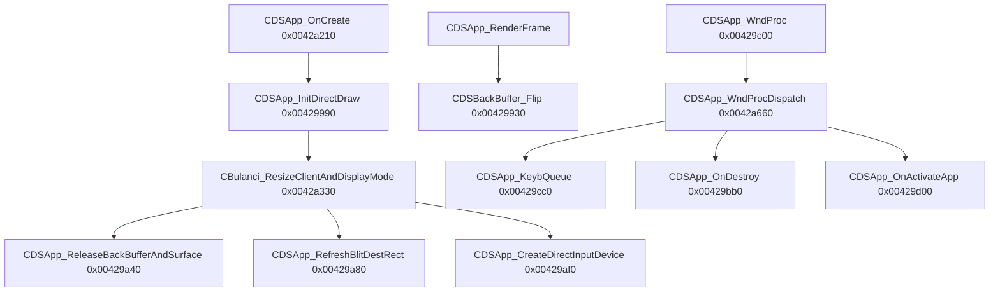

# Round 6 — Logic task 12 report

## Task

| Field | Value |
|-------|-------|
| **id** | 12 |
| **title** | Logic sim_429_436: 0x00429480–0x00429d00 (22 funcs) |
| **range** | sim_429_436 |
| **range_note** | 0x00429–0x00436: game state, simulation, per-frame |
| **seed_address** | — (slice task) |
| **priority** | medium |
| **source** | slice |

## Status

**PARTIAL** — Ghidra MCP verified **11/22** symbols/signatures live, then disconnected before `force_decompile` / xref pass on the app-shell tail. Remaining symbols reconciled via `config/bulanci/mapping.csv`, `CBulanci.cpp` export stubs, and prior R3/R5 struct reports (re-verify in Ghidra when MCP returns). **No** `save_program` this session (no mutations).

## Manifest note

`function_names` lists `CDSApp_InitDirectDraw` at index 11, but the slice **does not** include `0x00429990` (actual `CBulanci::CDSApp_InitDirectDraw` per mapping.csv / Frida `orig/patch_window.js`). Address `0x00429a40` in the slice is **`CDSApp_ReleaseBackBufferAndSurface`** (R5 worker 6), not InitDirectDraw.

## Functions

| Address | Ghidra name (2026-06-03) | Role summary | Evidence |
|---------|--------------------------|--------------|----------|
| `0x00429480` | `CDSAudioBank_Ctor` | Bank facet ctor: install `0x486exx` vtables, `dwInitFlag=1`, `pParentOrBackref=param_1`, zero `slotVector` | Live MCP signature; [CDSAudioBank.md](../struct_recovery/CDSAudioBank.md); mapping.csv |
| `0x004294b0` | `CDSAudioBank_ScalarDeletingDtor` | Scalar-deleting wrapper → bank dtor; optional `operator delete` | Live MCP; mapping.csv |
| `0x00429510` | `CDSAudioBankSample_ScalarDeletingDtor` | Sample MI primary-face delete thunk | Live MCP; [round3_task_24_report.md](../struct_recovery/round3_task_24_report.md) |
| `0x00429530` | `CDSAudioBankSample_ctor` | `OperatorNew(0x24)` body: bind `IDSAudioSource*` decoder, PCM buffer, `dwInitFlag=1` @ `+0x1C` | Live MCP (`pDecoder`, `pPcmByteCount`); disasm @ `0x00429564` in R3 task 24 |
| `0x00429600` | `CDSAudioBank_Deserialize` | Read bank from stream: resize `slotVector`, per-slot `CDSAudioBankSample_ctor`, store **`sample+4`** in vector | Live MCP (`CDSAudioBank_BankDeserializeFacet *this`); [CDSAudioBank.md](../struct_recovery/CDSAudioBank.md) |
| `0x0042985a` | `Catch@0042985a` | MSVC EH cleanup inside deserialize (`CDSAudioBank::Catch_0042985a` in export tree) | mapping.csv; `CDSAudioBank.cpp` stub |
| `0x00429880` | `FUN_00429880` | **UNK** — `__fastcall int *(int *param_1)`; R5 defers as audio-player helper | Live MCP name only; [round5_worker_13_report.md](../struct_recovery/round5_worker_13_report.md) SKIP band |
| `0x004298b0` | `FUN_004298b0` | **UNK** — `__fastcall bool (int param_1)`; same cluster | Live MCP; mapping.csv size `0x11` |
| `0x004298d0` | `FUN_004298d0` | **UNK** — `__fastcall` ~`0x54` bytes; same cluster | Live MCP; mapping.csv |
| `0x00429930` | `CDSBackBuffer_Flip` | `ClearPreFlipFields` + `IDirectDrawSurface::Flip` on `embeddedImage.pDirectDrawSurface` @ `this+0x4c` | Live MCP (`CDSBackBuffer *`); [CDSBackBuffer.md](../struct_recovery/CDSBackBuffer.md); `CDSApp_RenderFrame` consumer |
| `0x00429960` | `CDSBackBuffer_FreeImageMember` | Optional flip if pixels set; release DDraw surface; `CDSImage__FreeBuffers` | Live MCP; CDSBackBuffer.md |
| `0x00429a40` | `FUN_00429a40` *(export)* / **`CDSApp_ReleaseBackBufferAndSurface`** *(R5)* | Teardown: `CDSBackBuffer_FreeImageMember(app+0x7c)`, release `app+0x78`, reset mode fields `+0xdc/+0xe0` | [round5_worker_06_report.md](../struct_recovery/round5_worker_06_report.md); caller `CBulanci_ResizeClientAndDisplayMode` |
| `0x00429a80` | `FUN_00429a80` *(mapping)* → **`CDSApp_RefreshBlitDestRect`** *(R5)* | Windowed: `GetClientRect`/`ClientToScreen` → `physicalRect` @ `+0xcc`; else copy logical `+0x20..+0x2c` | round5_worker_06 |
| `0x00429af0` | **`CDSApp_CreateDirectInputDevice`** *(R5)* | Query `app+0x74` vtable `+0x18` property block; store device @ `+0x78` | round5_worker_06; ties to [player_controls.md](../player_controls.md) DirectInput band |
| `0x00429b90` | `CBulanci_ReleasePrimarySurface` | Release primary DDraw surface on display teardown | `CBulanci.h` / mapping.csv |
| `0x00429bb0` | `CDSApp_OnDestroy` | `WM_DESTROY` handler: app shutdown hook (calls into gaming audio teardown @ `0x0043c9b0` per R5 worker 14) | mapping.csv; [app_shell.md](../app_shell.md) WM table |
| `0x00429bd0` | `FUN_00429bd0` | **UNK** — `__fastcall uint (int param_1)`; not renamed in R5 band | mapping.csv; still `FUN_*` in export tree |
| `0x00429c00` | `CDSApp_WndProc` | Win32 proc: relay to `g_pApp->vtbl[32]` (`CDSApp_WndProcDispatch`); else `DefWindowProcW` | [app_shell.md](../app_shell.md); mapping `__stdcall` |
| `0x00429c8d` | `Catch@00429c8d` | MSVC EH stub in WndProc/dispatch region | mapping.csv |
| `0x00429cc0` | `CDSApp_KeybQueue` | Pack keyboard WM into 20-byte engine events → `CDSEventHandler_EnqueueEvent` | app_shell.md § KeybQueue; mapping.csv |
| `0x00429d00` | `CDSApp_OnActivateApp` | `WM_ACTIVATEAPP`: flip drawable; post gain/lose events to modal focus | Live MCP not reached; vtable slot 33 @ [vftable_methods.csv](../vftable_methods.csv); app_shell.md |

### Adjacent (out of slice, for manifest alignment)

| Address | Name | Note |
|---------|------|------|
| `0x00429990` | `CBulanci::CDSApp_InitDirectDraw` | DirectDrawCreate + cooperative level from `CDSApp+0xe4` `bWindowed`; called from `CDSApp_OnCreate` — **not** in task `addresses[]` |

## Control-flow sketch (app shell tail)

## Ghidra deltas

**none** (MCP disconnected before `rename_function_by_address` / `set_function_this_type` / comments). Prior passes already applied:

- `CDSAudioBank_Deserialize` → `CDSAudioBank_BankDeserializeFacet *` ([CDSAudioBank.md](../struct_recovery/CDSAudioBank.md))
- R5 worker 6: `FUN_00429a40` → `CDSApp_ReleaseBackBufferAndSurface`, `FUN_00429a80` → `CDSApp_RefreshBlitDestRect`, `FUN_00429af0` → `CDSApp_CreateDirectInputDevice` (re-confirm names in DB when MCP returns)

## Frida

**none** — static evidence sufficient for named audio/back-buffer/app-shell symbols. Optional follow-up: hook `0x00429990` pattern in [orig/patch_window.js](../../../orig/patch_window.js) only if `FUN_00429880`/`004298b0`/`004298d0`/`00429bd0` behavior must be proven at runtime.

## Remaining UNK

| Item | Blocker |
|------|---------|
| `FUN_00429880`, `FUN_004298b0`, `FUN_004298d0` | No decompile/xref pass this session; R5 labels “CDSAudioPlayer cluster” without rename |
| `FUN_00429bd0` | No class/export name; no caller proof in this pass |
| `CDSApp_InitDirectDraw` vs slice addresses | Manifest name points at wrong VA; real symbol @ `0x00429990` |
| Fresh `get_xrefs_to` for all 22 | Ghidra MCP connection closed mid-task |

## Evidence paths consulted

- [ROUND6_LOGIC_PROTOCOL.md](../ROUND6_LOGIC_PROTOCOL.md)
- [struct_recovery/AGENT_PROTOCOL.md](../struct_recovery/AGENT_PROTOCOL.md)
- [main_menu.md](../../main_menu.md) (boot → InitDirectDraw)
- [player_controls.md](../player_controls.md)
- [CDSAudioBank.md](../struct_recovery/CDSAudioBank.md), [CDSBackBuffer.md](../struct_recovery/CDSBackBuffer.md), [CDSApp.md](../struct_recovery/CDSApp.md)
- [app_shell.md](../app_shell.md), [round5_worker_06_report.md](../struct_recovery/round5_worker_06_report.md), [round3_task_24_report.md](../struct_recovery/round3_task_24_report.md)
- `config/bulanci/mapping.csv`, `src/bulanci/CBulanci.cpp`, `src/bulanci/CDSAudioBank.cpp`
