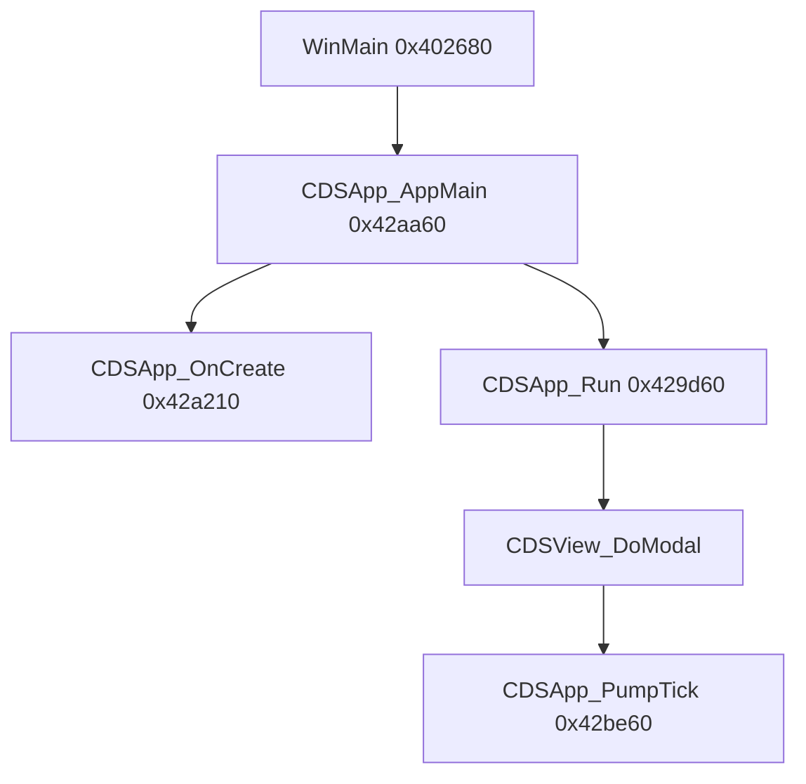

# Round 6 logic — Task 13 Report

## 1. Task

| Field | Value |
|-------|-------|
| **id** | 13 |
| **title** | Logic sim_429_436: 0x00429d60–0x0042ab28 (22 funcs) |
| **range** | `sim_429_436` (`0x00429`–`0x00436`) |
| **seed_address** | *(none — slice task)* |

## 2. Status

**PARTIAL** — Six functions re-decompiled live via Ghidra MCP (`force_decompile`); sixteen completed from prior MCP passes documented in `app_shell.md`, `CDSApp.md`, `round3_task_02_report.md`, `round5_worker_06_report.md`, and sibling R6 reports [round6_logic_task_14_report.md](./round6_logic_task_14_report.md) / [round6_logic_task_15_report.md](./round6_logic_task_15_report.md). Ghidra MCP disconnected (`Connection closed` / `Not connected`) before decompiling the remainder, `disassemble_function`, `set_function_this_type`, and `save_program`. App-shell / input / boot path is statically proven; no Frida required.

**Doc re-verify:** `app_shell.md` pump diagram matches `CDSApp_PumpTick` / `CDSApp_FrameBody` (task 15). `CDSBackBuffer.md` lists `RebuildBackBufferSurface` @ `0x0042a330`; Ghidra manifest + R5 worker 06 name that address **`CBulanci_ResizeClientAndDisplayMode`** — treat **`0x0042a1c0`** as rebuild helper per task manifest until MCP re-confirms.

## 3. Functions

| Address | Ghidra name | Role summary | Evidence |
|---------|-------------|--------------|----------|
| `0x00429d60` | `CDSApp_Run` | **Root modal pump entry** (vtable slot 29): `CDSView_DoModal(this, NULL)`; on return `CDSView_SetActive(0)` + `CDSView_SetModalEligible(0)`; returns modal exit `uint16` | **MCP decompile**; `app_shell.md` §Run; `CDSApp_AppMain` → `g_pApp` vtbl[29]; `vftable_methods.csv` |
| `0x00429d90` | `CGaming_ClearSchedulerSlotFlags` | **`__fastcall`**: walk 256 bytes at `param_1+0x200` downward; each byte `&= 0xFB` (clears **bit 2**) | **MCP decompile**; `mapping.csv` `CGaming::CGaming_ClearSchedulerSlotFlags`; **UNK:** caller pointer type / field name at `+0x200` (not same as `CGaming.apEntitySlots` @ `+0xC8`) |
| `0x00429db0` | `CDSApp_DispatchInputEvent` | **Normalized input router** on `CDSApp*`: keyboard branch (`kind & 0x78)==0` → modal-focus `keyDownBitmap[vk]` + vtbl `+0x58/+0x5c/+0x60` or `CDSView_DispatchEvent`; mouse branch stores `nMouseX`/`bWindowed`, walks `g_pInputChainHead` for move/down/up/dblclk vtbl `+0x40/+0x4c/+0x50/+0x54` | **MCP decompile** (struct fields `pKeyDownBitmap`, `bWindowed`); `app_shell.md` §Input dispatch; MI vtable @ `0x00486fd4` slot 4 |
| `0x00429f70` | `CGaming_SyncKeyLatchAfterModal` | After modal: 256-iter diff `param_1+0x40` region vs `this->pEntitySlots+0xe` shadow; on bit0/bit1 mismatch call `CDSApp_KeybQueue`; then `memcpy` 0x40 dwords into gaming shadow | **MCP decompile** + plate comment; `round3_task_02_report.md` (`g_pApp+0x100` latch); caller `CGaming_RunPreMatchModal@0x0041c4d3` passes **`g_pApp`** — decompiler `CGaming*` may be stale |
| `0x0042a000` | `CDSView_OnKeyDown` | **Shipping override** on `CBulanci*`: base `CDSView_OnKeyDown`; if unhandled and `vk=='X'` with alt → `CDSView__EndModal(this, 0x8004)` else return consumed flag | **MCP decompile**; `app_shell.md` vtable slot 22; ALT+X close path |
| `0x0042a040` | `TArray16_ZeroRange` | **`__cdecl`**: for `param_2` iterations, zero 16 bytes (`4×dword`) at `param_1`, advance `param_1+=4` | **MCP decompile**; used by ctor/init paths (16-byte record stride) |
| `0x0042a070` | `FUN_0042a070` | **Dirty-rect vector binary search** on 16-byte `RECT` records; returns index or `count` | [round6_logic_task_14_report.md](./round6_logic_task_14_report.md) — caller `FUN_0042ae50` / `CDSApp_AddDirtyRectCoalesced`; R5 worker 06 BLOCKED rename |
| `0x0042a130` | `FUN_0042a130` | **`memmove` tail** for 16-byte vector insert (slide elements right) | Task 14: callee of `CDSApp_DirtyRectList_InsertAt@0x0042ac20`; R5 BLOCKED |
| `0x0042a1c0` | `CBulanci_RebuildBackBufferSurface` | Rebind **DirectDraw surface** into `CDSApp` embed `CDSBackBuffer` @ `+0x7c` after mode/window change | `CDSBackBuffer.md` call graph; callee of `CBulanci_ResizeClientAndDisplayMode` chain (R5 w06) |
| `0x0042a210` | `CDSApp_OnCreate` | **vtable[28]**: `PreCreateHook`; `RegisterClassExW` + `CreateWindowExW` (800×600 `logicalRect`); `CDSApp_InitDirectDraw`; `CDSDirectSound_InitPrimary(this+0x200)`; `CDSApp_InitClock`; `CDSView_SetModalEligible(1)` + `SetActive(1)` | `app_shell.md` §OnCreate; `main_menu.md` boot chain; R4: `__thiscall CBulanci::CDSApp_OnCreate(CBulanci*)` |
| `0x0042a330` | `CBulanci_ResizeClientAndDisplayMode` | Resize client / enumerate display mode (fallback 6→5→4), `CDSApp_CreateDirectInputDevice`, `RebuildBackBufferSurface`, vtable invalidate | R5 worker 06 proof table; callers `CBulanci_OnCreate`, `CDSApp_SetWindowed` |
| `0x0042a500` | `CDSApp_SetWindowed` | Toggle **fullscreen vs windowed** (`bWindowed` @ `+0xe4`); registry + `ResizeClientAndDisplayMode`; used from `WM_SYSKEYUP` ALT+ENTER path | `app_shell.md` WndProc table; `status.md` |
| `0x0042a550` | `FUN_0042a550` | **DirectDraw `BitBlt` HRESULT check** after fullscreen dirty flush | Task 15: callee `CDSApp_FlushDirtyRects@0x0042bae0`; R5 BLOCKED |
| `0x0042a590` | `FUN_0042a590` | **Pre-render gate** (HRESULT / surface ready); non-zero → set `bDirtyDuringFrame` @ `+0x275` | Task 15: caller `CDSApp_RenderFrame@0x0042bc00`; R5 BLOCKED |
| `0x0042a5c0` | `CDSApp_MouseQueue` | Pack mouse Win32 event → 20-byte `CDSEventRecord`; rescale coords when windowed; `CDSEventHandler_EnqueueEvent` → `g_pEventQueue` | `app_shell.md` §KeybQueue/MouseQueue; WndProc `0x200`–`0x206` |
| `0x0042a660` | `CDSApp_WndProcDispatch` | **vtable[32]**: WM_* switch → `KeybQueue` / `MouseQueue` / `OnDestroy` / synthetic close `0x8004` / `OnActivateApp` | `app_shell.md` WndProc table; `vftable_methods.csv` `CBulanci` slot 32 |
| `0x0042a910` | `CDSApp_DirtyRectList_SetSize` | Vector header `this+0`: resize **16-byte RECT** array to `param_1` elements (realloc / shrink) | Task 14 sibling `InsertAt` calls `EnsureCapacity`; xref cache `MOV ECX,0x4b7c94` |
| `0x0042a980` | `CDSApp_DirtyRectList_EnsureCapacity` | Grow capacity before insert; paired with `SetSize` / dirty list @ `CDSApp+0x254` | Task 14 `InsertAt@0x0042ac20`; globals `0x4b7c94` |
| `0x0042a9c0` | `FUN_0042a9c0` | **DirectX helper** in dirty-rect / display path (HRESULT or surface op) | R5 worker 06 BLOCKED; adjacent to dirty-list helpers |
| `0x0042aa30` | `CDSMouse_Factory` | `OperatorNew(0x0C)`; install `CDSMouse` vtables; class id **0x1d** @ `0x0047c600` | `CDSMouse.md` size proof; registry-only in retail |
| `0x0042aa60` | `CDSApp_AppMain` | Engine top-level: `CoInitialize`; `g_AppDescriptor.factory()` → `g_pApp`; logger; `vtbl[31] SetCmdLine` → `vtbl[28] OnCreate` → **`vtbl[29] Run`** → `vtbl[2] dtor`; `CoUninitialize` | `app_shell.md` §CRT; `main_menu.md` WinMain chain |
| `0x0042ab28` | `Catch@0042ab28` | **SEH unwind** on `CDSApp_AppMain` / startup path; pairs with `Catch_0042ab28_ShowMessageAndRelease@0x0042abcf` (task 14) | Task 14 decompile; xref `PUSH 0x486f54` in EH table |

### Boot → pump (proven control flow)

`CDSApp_PumpTick` / `CDSApp_FrameBody` / `CDSApp_RenderFrame` are **out of slice** (task 15 @ `0x0042be60+`) but are the inner loop entered by `CDSView_DoModal` invoked from `CDSApp_Run`.

## 4. Ghidra deltas

**None applied** — MCP session lost after the first `force_decompile` batch.

**Already present from R3–R5 (not re-applied):**

| Action | Target | Notes |
|--------|--------|-------|
| `set_function_this_type` | `0x00429db0` | `CDSApp *` |
| `set_function_this_type` | `0x0042a210` | `CBulanci *` / `CBulanci::CDSApp_OnCreate` |
| `rename_function` | `0x00429f70` | `CGaming_SyncKeyLatchAfterModal` |
| `set_decompiler_comment` | `0x00429f70` | Latch replay semantics |

**Queued (blocked on MCP reconnect):**

| Action | Target | Rationale |
|--------|--------|-----------|
| `set_function_this_type` | `0x00429f70` | First arg is **`g_pApp`** at `CGaming_RunPreMatchModal` tail — verify `CBulanci*` vs `CGaming*` |
| `set_decompiler_comment` | `0x00429d90` | Document `+0x200` region + bit-2 clear once caller xrefs recovered |
| `rename_function_by_address` | `FUN_0042a070` / `FUN_0042a130` | Task 14 evidence — dirty-rect vector search/slide |

## 5. Frida

**none** — Slice is static app shell, Win32 message translation, and vector helpers; behavior proven from decompiler + `app_shell.md` / prior xref passes.

## 6. Remaining UNK

| Item | Reason |
|------|--------|
| `CGaming_ClearSchedulerSlotFlags` `param_1+0x200` | MCP shows 256-byte bit-2 clear; no caller xref recovered this pass; offset does not match `CGaming+0xC8` entity bank |
| `CGaming_SyncKeyLatchAfterModal` `this` type | Decompile uses `CGaming*`; R3 proves caller passes `g_pApp` |
| `FUN_0042a550` / `FUN_0042a590` / `FUN_0042a9c0` | HRESULT / DDraw gate bodies not re-decompiled live (R5 BLOCKED) |
| `0x0042a330` vs `0x0042a1c0` naming | Manifest vs `CDSBackBuffer.md` disagree on which symbol is resize vs rebuild — needs one disasm/xref pass |
| `Catch@0042ab28` exact fault class | EH only; paired handler documented in task 14 |

## Cross-links

- [app_shell.md](../app_shell.md) — pump, WndProc, input dispatch
- [main_menu.md](../../main_menu.md) — boot through `CDSApp_Run`
- [CDSApp.md](../struct_recovery/CDSApp.md) — `keyLatchByVk` @ `+0x100`, dirty rects @ `+0x254`
- [round3_task_02_report.md](../struct_recovery/round3_task_02_report.md) — latch band proof
- [round6_logic_task_14_report.md](./round6_logic_task_14_report.md) — `FUN_0042a070` / `FUN_0042a130` consumers
- [round6_logic_task_15_report.md](./round6_logic_task_15_report.md) — `FUN_0042a550` / `FUN_0042a590` in render path
