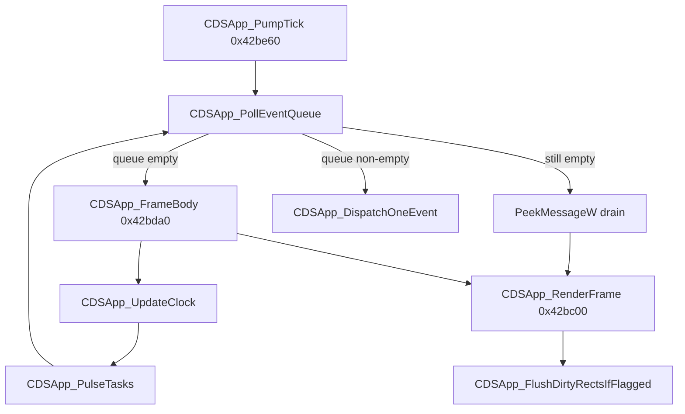

# Round 6 logic — Task 15 Report

## 1. Task

| Field | Value |
|-------|-------|
| **id** | 15 |
| **title** | Logic sim_429_436: 0x0042b39b–0x0042be60 (22 funcs) |
| **range** | `sim_429_436` (`0x00429`–`0x00436`) |
| **seed_address** | *(none — slice task)* |

## 2. Status

**PARTIAL** — All 22 addresses decompiled via Ghidra MCP (`batch_decompile`, `get_function_callers` on `CDSApp_PumpTick` / `CDSApp_RenderFrame`). Ghidra MCP disconnected (`Not connected`) before `disassemble_function`, `set_function_this_type`, and `save_program`. Frame pump / dirty-rect / render path is proven from decompiler + field offsets matching `CDSApp.md` / `app_shell.md`. No Frida: static proof sufficient for acceptance slice.

**Doc re-verify:** `tick_system.md` §PumpTick still shows `PeekMessageW` inside `CDSApp_PumpTick`; live binary matches **`app_shell.md`** (engine queue first, `FrameBody` owns Win32 peek). `app_shell.md` names flip helper `FUN_00429930`; decompile shows **`CDSBackBuffer_Flip`** @ `0x00429930`.

## 3. Functions

| Address | Ghidra name | Role summary | Evidence |
|---------|-------------|--------------|----------|
| `0x0042b39b` | `Catch@0042b39b` | SEH unwind: `Release` on `**(EBP-0x18)` vtable+8; resume `0x0042b3ab` | Decompile |
| `0x0042b3ae` | `FUN_0042b3ae` | SEH epilogue: restore `ExceptionList` from `EBP-0xc` only | Decompile; R5 worker 06 BLOCKED |
| `0x0042b3d0` | `FUN_0042b3d0` | **Scalar-dtor shutdown prefix** (not `CDSApp_dtor@0x42b560`): restore four `CDSApp` vtable words; `CDsStringAssignFromHandle` on `this+0x6c`; HKLM `RegWriteDword(Windowed)`; tail-call `FUN_0042b48c` | Decompile; caller `CDSApp_DtorScalar@0x0042b98a`; `registry.md`; xref cache vtable stores @ `0x0042b400` |
| `0x0042b477` | `Catch@0042b477` | SEH unwind: `Release` on `**(EBP-0x20)` vtable+8; resume `0x0042b487` | Decompile |
| `0x0042b48c` | `FUN_0042b48c` | Member teardown after registry write: `CDSApp_FreeAlphaBlendLut`; clear `g_pApp` / `g_pInputChainHead`; shrink dirty-rect vectors @ `+0x254`/`+0x264`; `~CDSDirectSound` @ `+0x200`; release `+0xec`/`+0xe8` views; `CDSBackBuffer_dtor` @ `+0x7c`; string release `+0x6c`/`+0x68`; `CDSView_dtor` | Decompile; sole caller `FUN_0042b3d0`; ESI = `this` in body |
| `0x0042b560` | `CDSApp_dtor` | Lightweight dtor: `DestroyWindow(g_pHwnd)`; `CDSApp_SetPendingChildView(0)`; `FUN_0042f530`; `(*this->vtbl+4)(1)` release | Decompile; distinct from `FUN_0042b3d0` full teardown |
| `0x0042b5a0` | `CDSApp_AddDirtyRectCoalesced` | Clip incoming `RECT*` to `this+0x20` (`logicalRect`); scan 16-byte rect vector `param_1`; skip duplicate/contained; pick merge candidate by pixel-area heuristic (`FUN_00433200`, `FUN_00429880`, threshold `0x1389`, 40% rule); else `FUN_0042ae50` append | Decompile; xref from `CDSApp_AddDirtyRect`, `CBulanci_BlitAnimFrameToView` |
| `0x0042b8a0` | `CDSApp_AddDirtyRect` | `AddDirtyRectCoalesced(this, this+0x264, rect)` — secondary dirty list | Decompile |
| `0x0042b8c0` | `CBulanci_BlitAnimFrameToView` | `AddDirtyRectCoalesced(this, &app.pDirtyRectArray, rect)` — primary dirty list @ `CDSApp+0x254` | Decompile; `CDSView_Invalidate` caller |
| `0x0042b8e0` | `CDSApp_ChainDtorBody` | MI adjustor: `CDSApp_dtor(this-4)` | Decompile |
| `0x0042b8f0` | `CDSApp_ReferencedDtorBody` | MI adjustor: `CDSApp_dtor(this-0x10)` | Decompile |
| `0x0042b900` | `CDSApp_EventHandlerDtorBody` | MI adjustor: `CDSApp_dtor(this-0x18)` | Decompile |
| `0x0042b910` | `CreateObject` | MSVC factory: `OperatorNew(0x280)` → `FUN_0042afd0` partial shell init; SEH node `LAB_004792eb` | Decompile; size = `CDSApp` 640 B; task 14 notes overlap with `CDSApp_ctor` |
| `0x0042b980` | `CDSApp_DtorScalar` | `FUN_0042b3d0(&vftable_primary)`; `_free(this)` if `param_1&1` | Decompile |
| `0x0042b9a0` | `CDSImageMouse_Draw` | Read `g_pApp+0xf0/+0xf4` mouse; build dirty rect from `pCursorSprite` minus hotspot; ensure `savedBackground` buffer; `BlitDispatch` save-under + cursor over `g_pApp+0x80` backbuffer; `CDSApp_AddDirtyRect` | Decompile; `CDSImageMouse.md` |
| `0x0042ba90` | `CDSImageMouse_Erase` | Restore `savedBackground` over dirty rect via `BlitDispatch`; `CDSApp_AddDirtyRect` | Decompile |
| `0x0042bae0` | `CDSApp_FlushDirtyRects` | If primary count or anim queue (`pPad_260+0xc`): blit queued anim rects via `CBulanci_BlitAnimFrameToView`; fullscreen: per-rect `IDirectDrawSurface` vtable+0x14 BitBlt + `FUN_0042a550` HRESULT check; windowed: single blit of `nPhysicalRect_*`; clear counts | Decompile; R5 worker 06 rename proof; fields `+0x254`/`+0x25c`/`+0xe4` |
| `0x0042bbe0` | `CDSApp_FlushDirtyRectsIfFlagged` | If `*(this+0x78)` and `*(this+0x275)`: call `CDSApp_FlushDirtyRects` (ECX = same `this`) | Decompile; tail of `CDSApp_RenderFrame` |
| `0x0042bc00` | `CDSApp_RenderFrame` | Gate `bDrawable` @ `+0x274`; `FUN_0042a590` → may set `bDirtyDuringFrame` @ `+0x275`; draw pending dirty list via vtable+`0x38`; swap `pPendingView`/`pCurrentView` @ `+0xec`/`+0xe8` with AddRef/Release; `CDSBackBuffer_Flip(this+0x7c)`; stash frame rect in `DAT_004b3b9c`; intersect clip; `FlushDirtyRectsIfFlagged` | Decompile; caller `CDSApp_FrameBody`; offsets match `CDSApp.md` |
| `0x0042bd70` | `CDSView_Invalidate` | If `bDrawable` and (`force` or `wFlags1&0x80`): default rect `app.nRect_left` or `param_1`; `CBulanci_BlitAnimFrameToView` | Decompile |
| `0x0042bda0` | `CDSApp_FrameBody` | `CDSApp_UpdateClock`; `CDSApp_PulseTasks`; if engine queue empty: drain `PeekMessageW` until empty or `WM_QUIT` (synthetic close via `CDSView_PostMessage_NullSafe` on `g_pModalFocus+0x10`); always ends with `CDSApp_RenderFrame` | Decompile; matches `app_shell.md` |
| `0x0042be60` | `CDSApp_PumpTick` | While `CDSApp_PollEventQueue()==0`: `CDSApp_FrameBody`; then `CDSApp_DispatchOneEvent` | Decompile; callers `CDSView_DoModal`, `CBulanci_PollEventsAndRunFrame`, `CGaming_OnCmd`, audio paths |

### Frame pipeline (proven control flow)

### `CDSApp_RenderFrame` field map (decompiler indices → bytes)

| Index×4 | Byte offset | `CDSApp` field | Use in render |
|---------|-------------|----------------|---------------|
| `0x9d` | `+0x274` | `bDrawable` | Early out |
| `+0x275` | `+0x275` | `bDirtyDuringFrame` | Set when `FUN_0042a590` succeeds |
| `0x3a` / `0x3b` | `+0xe8` / `+0xec` | `pCurrentView` / `pPendingView` | View swap + vtable hooks |
| `0x95` / `0x97` | `+0x254` / `+0x25c` | `pDirtyRectArray` / `nDirtyRectCount` | Frame dirty iteration |
| `0x1f` | `+0x7c` | `backBuffer` | `CDSBackBuffer_Flip` |
| `+0x38` | vtable slot 14 | Per-rect draw during flagged frame |

## 4. Ghidra deltas

**None applied** — MCP session lost after decompile/xref pass.

**Queued (evidence-backed, not executed):**

| Action | Target | Rationale |
|--------|--------|-----------|
| `set_function_this_type` | `CDSApp *` @ `0x0042b5a0`, `0x0042b8a0`, `0x0042bc00`, `0x0042bda0`, `0x0042be60`, `0x0042bbe0` | Decompiler shows `_Globals::` + `void *` / `undefined4` but body uses `CDSApp` offsets (`+0x20`, `+0x254`, `+0x274`, …) |
| `set_function_prototype` | `CDSApp_FlushDirtyRects(CDSApp *this)` | Body uses `CBulanci *` with `->app` at offset 0 only — equivalent when `CDSApp` is embedded @ 0 |
| `set_decompiler_comment` | `CDSApp_FlushDirtyRects` / `FlushDirtyRectsIfFlagged` | Remove stale `UNCERTAIN` (R5 renamed; logic proven this pass) |
| `rename_function_by_address` | `FUN_0042b3d0` → `CDSApp_ShutdownFromScalarDtor` *(optional)* | Only if coordinator approves; R5 blocked shutdown renames |

## 5. Frida

**none** — Modal pump, dirty-rect coalescing, and render gating are fully visible statically.

## 6. Remaining UNK

| Item | Reason |
|------|--------|
| `FUN_0042a590` | DirectX / blit-prep gate before dirty pass; R5 worker 06 BLOCKED HRESULT helper; only proven: non-zero → set `+0x275` |
| `FUN_0042a550` | HRESULT handler after `BitBlt`; not in slice |
| `FUN_0042b3d0` / `FUN_0042b48c` public symbols | Shutdown/registry path proven; R5 deferred rename |
| `FUN_0042afd0` vs `CDSApp_ctor` | `CreateObject` uses partial init @ `0x0042afd0`; full ctor @ `0x0042b170` (task 14) |
| `CDSApp_dtor` vs `FUN_0042b48c` | Two teardown depths; which vtable slots call which path not exhaustively xreffed |
| Disasm `ECX` on `__fastcall` frame helpers | Blocked by MCP disconnect; decompiler calling convention + offset proof only |
