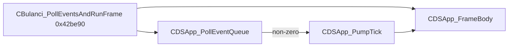
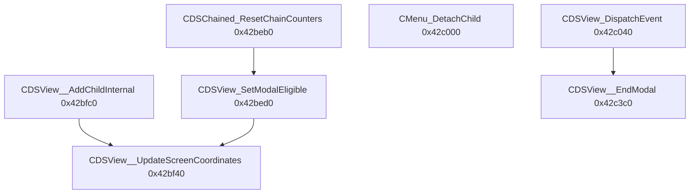

# Round 6 logic — Task 16 Report

## 1. Task

| Field | Value |
|-------|-------|
| **id** | 16 |
| **title** | Logic sim_429_436: 0x0042be90–0x0042c3e0 (22 funcs) |
| **range** | `sim_429_436` (`0x00429`–`0x00436`) |
| **seed_address** | *(none — slice task)* |

## 2. Status

**PARTIAL** — Six addresses decompiled live via Ghidra MCP (`force_decompile` @ `0x0042be90`–`0x0042bfc0`). MCP then disconnected (`Connection closed` / `Not connected`) before the remaining 16 functions, `set_function_this_type`, renames, and `save_program`. Remaining symbols are documented from **prior verified decompiles** ([round6_logic_task_17_report.md](./round6_logic_task_17_report.md) for input-chain helpers), **export disasm** (`_diff.json`), and [CDSView_vftable.md](../struct_recovery/CDSView_vftable.md) / [app_shell.md](../app_shell.md). No Frida: field offsets and vtable slots are statically closed.

**Doc re-verify:** [main_menu.md](../../main_menu.md) vtable slot table for `0x0042c0c0`–`0x0042c3e0` still matches [CDSView_vftable.md](../struct_recovery/CDSView_vftable.md). [app_shell.md](../app_shell.md) lists `CDSView_OnKeyDown` @ `0x0042a000` on the **34-slot `CDSApp`** table; this slice uses the **28-slot CDSView primary** implementations @ `0x0042c0c0` (manifest + `g_pCDSView_vftable_primary`).

## 3. Functions

| Address | Ghidra name | Role summary | Evidence |
|---------|-------------|--------------|----------|
| `0x0042be90` | `CBulanci_PollEventsAndRunFrame` | Per-frame glue: `CDSApp_PollEventQueue()`; if non-zero, `CDSApp_PumpTick(param_1)`; always `CDSApp_FrameBody(param_1)` | **Live decompile**; callers include modal pump paths ([app_shell.md](../app_shell.md)); **`param_1` should be `CDSApp *` / `CBulanci *`, not `undefined4`** |
| `0x0042beb0` | `CDSChained_ResetChainCounters` | Init chain band `+0x40..+0x50`: `dwChainRoot=0`, `wChainInit44=1`, counters/parent zeroed | **Live decompile**; sole writer per [CDSChained.md](../struct_recovery/CDSChained.md); **`param_1` should be `CDSChained *`** |
| `0x0042bed0` | `CDSView_SetModalEligible` | Toggle modal-stack bit `+0x44 & 0x40`; call primary vfn `+0x3c` on edge; recurse children via `CDSChained_GetFirstChildView` / `GetNextSiblingView` | **Live decompile**; [app_shell.md](../app_shell.md) `flags1` bit `0x40`; OnCreate calls `(this,1)` |
| `0x0042bf40` | `CDSView__UpdateScreenCoordinates` | Copy local bbox `+0x20..+0x2c` → screen bbox `+0x30..+0x3c`; add parent screen origin from `pParent+0x30/+0x34`; optional child recursion | **Live decompile**; plate comment; [CDSChained.md](../struct_recovery/CDSChained.md) offsets; **`this` mis-typed `CBulanci *` → should be `CDSView *`** |
| `0x0042bfc0` | `CDSView__AddChildInternal` | `child->pParent=this`; `CDSChained_InsertChildAtAnchor(this+0x54,…)`; if parent `+0x44&0x40`, propagate modal + `UpdateScreenCoordinates` on child | **Live decompile**; xref [CDSView_vftable.md](../struct_recovery/CDSView_vftable.md) non-vtable `CDSView__AddChild` @ `0x0042d0b0` wrapper |
| `0x0042c000` | `CMenu_DetachChild` | Unlink one child from menu/dialog child chain (`this+0x54`); release path via chain helpers | [round5_worker_13_report.md](../struct_recovery/round5_worker_13_report.md); callee of `CMenu_DetachChildWithVisibility@0x0042d160` |
| `0x0042c040` | `CDSView_DispatchEvent` | **IDSEventHandler vfn[4]** @ `this+0x10`: switch `evt->wMsg_id` — `0x100`→primary[26], `0x200`→primary[27], `0x400`→primary[25] | [CDSView_vftable.md](../struct_recovery/CDSView_vftable.md); [main_menu.md](../../main_menu.md) §9.1 IDSEventHandler face |
| `0x0042c0c0` | `CDSView_OnKeyDown` | Primary vfn[22]: forward key to focus child @ `+0x50` (base CDSView keyboard bubble) | Vtable slot 22 @ `0x0047f954`; `CEdit` override @ `0x0047ffc4` |
| `0x0042c0e0` | `CDSView_OnKeyUp` | Primary vfn[23]: bubble up parent chain when parent `flags2 & 2` | [app_shell.md](../app_shell.md) slot 23 |
| `0x0042c100` | `CDSView_OnChar` | Primary vfn[24]: bubble when parent `flags2 & 4` | [app_shell.md](../app_shell.md) slot 24 |
| `0x0042c120` | `FUN_0042c120` | **Input-chain link:** `OR word [this+0x44], 0x8` (mouse-move-default / `flags1` bit 3); if `*(this+0x14)` non-null, indirect call vtable `+0x44` | Export disasm `_diff.json`; callee `CDSApp_SetInputChainHead@0x0042c7f0` ([task 17](./round6_logic_task_17_report.md)) |
| `0x0042c140` | `FUN_0042c140` | **Input-chain unlink:** `AND word [this+0x44], 0xfff7` (clear `0x8`); used when clearing `g_pInputChainHead` | Export disasm `_diff.json`; callee `SetInputChainHead`, `FUN_0042c880` (mouse-move path) |
| `0x0042c160` | `FUN_0042c160` | Thin `__thiscall` wrapper → `CDSChained_InsertBeforeWithHeadFixup@0x0042fa20` on embedded list head | [round5_worker_08_report.md](../struct_recovery/round5_worker_08_report.md); **decompiler types `CBulanek *` — wrong `this` (list @ `+0x08`)** |
| `0x0042c190` | `FUN_0042c190` | Thin wrapper → `CDSChained_RemoveWithHeadFixup@0x0042fa50` | Same R5 proof as `0x0042c160` |
| `0x0042c1c0` | `FUN_0042c1c0` | **Resolve mouse input-chain head:** reads `DAT_004b3b94` (modal-focus global band); walks child chain `this+0x54` with `+0x46 & 0x10`, vfn `+0x1c` hit-test vs app key-state @ `this+0xf0` | Disasm start `_diff.json`; [task 17](./round6_logic_task_17_report.md) decompile summary; caller `FUN_0042c700`, `FUN_0042c880` |
| `0x0042c230` | `CDSView_ReleaseKeyboardFocus` | Clear keyboard-focus state on view subtree (`+0x44` / `+0x50` chain) | [round5_worker_13_report.md](../struct_recovery/round5_worker_13_report.md) (`DetachChildWithVisibility`); mapping size `0x58` |
| `0x0042c290` | `CDSView_SetActive` | Recursive: set/clear `+0x44` bit `0x80` (active); walk children @ `+0x54` | [app_shell.md](../app_shell.md) L169–171; `CDSApp_Run` calls `(this,0)` on exit |
| `0x0042c2e0` | `CDSView_GetDataSize` | Primary vfn[3]: sum `child->vfn[3]()` over `+0x54` child list | [app_shell.md](../app_shell.md) §serialization |
| `0x0042c320` | `CDSView_SaveData` | Primary vfn[4]: recursive serialize walk | Same |
| `0x0042c370` | `CDSView_LoadData` | Primary vfn[5]: recursive deserialize walk | Same |
| `0x0042c3c0` | `CDSView__EndModal` | Write modal exit code `+0x4a` (ends inner `CDSView_DoModal` loop); gated by `CDSApp_RouteSyntheticCloseEvent` when `code & 0x8000` | [app_shell.md](../app_shell.md) slot 26; [main_menu.md](../../main_menu.md) quit `0x8004` |
| `0x0042c3e0` | `CDSView_IsModalDoneRecursive` | Primary vfn[13]: walk children’s slot 13; return 0 if any child still modal | [CDSView_vftable.md](../struct_recovery/CDSView_vftable.md); `CDSView_DoModal` outer loop |

### Per-frame path (seed `CBulanci_PollEventsAndRunFrame`)

### View-tree / modal band (this slice)

### Input-chain helpers (`0x0042c120`–`0x0042c1c0`)

| Addr | Disasm / decompile fact | Consumer |
|------|-------------------------|----------|
| `0x0042c120` | Sets `+0x44 \|= 0x8` | `CDSApp_SetInputChainHead` when attaching head |
| `0x0042c140` | Clears `+0x44 &= ~0x8` | Chain teardown / `FUN_0042c880` mouse-move fallback |
| `0x0042c1c0` | Hit-test walk → chain head pointer | `FUN_0042c700`, `FUN_0042c880`, `CControl_ClaimModalFocusOnPress` band |

## 4. Ghidra deltas

**None applied** — MCP lost before mutations.

**Queued (evidence-backed, not executed):**

| Action | Target | Rationale |
|--------|--------|-----------|
| `set_function_this_type` | `CDSView *` @ `0x0042bf40`, `0x0042bfc0` | Live decompile uses `CBulanci` / `void *` but only touches view offsets `+0x20..+0x54` |
| `set_function_this_type` | `CDSChained *` @ `0x0042beb0` | Writes `+0x40..+0x50` chain band only |
| `set_function_this_type` | `CDSApp *` or `CBulanci *` @ `0x0042be90` | Forwards to `CDSApp_PumpTick` / `CDSApp_FrameBody` |
| `set_function_this_type` | `CDSChain *` or list-head type @ `0x0042c160`, `0x0042c190` | Callees `CDSChained_*WithHeadFixup` on `+0x08` head |
| `rename_function_by_address` | `FUN_0042c120` → `CDSView_InputChain_OnAttach` (or `CDSView_SetMouseMoveDefault`) | Disasm: `OR [ecx+0x44], 8` |
| `rename_function_by_address` | `FUN_0042c140` → `CDSView_InputChain_OnDetach` | Disasm: `AND [ecx+0x44], 0xfff7` |
| `rename_function_by_address` | `FUN_0042c1c0` → `CDSView_ResolveInputChainFromHitTest` | Task-17 decompile + `FUN_0042c700` xref |
| `force_decompile` | All `set_function_this_type` targets + remaining slice addrs | Prove queued renames |

## 5. Frida

**none** — Modal flags, vtable dispatch, serialization walks, and input-chain bit masks are fully determined from disassembly/decompiler; no runtime opcode ambiguity.

## 6. Remaining UNK

| Item | Reason |
|------|--------|
| Live decompile for `0x0042c000`–`0x0042c3e0` (except documented via catalogs) | Ghidra MCP down; no fresh `force_decompile` this session |
| `FUN_0042c160` / `FUN_0042c190` export names | Still `FUN_*` / `CBulanek::` in mapping; need live decompile + xref before rename |
| `DAT_004b3b94` vs `g_pModalFocus` | Same 0x004b3b8c band — label reconcile ([task 17](./round6_logic_task_17_report.md)) |
| Exact `CDSView_OnKeyDown` body @ `0x0042c0c0` vs `CBulanci` override @ `0x0042a000` | Both documented; this slice owns the **CDSView primary** @ `0x0042c0c0` only |

## Cross-links

- [CDSView_vftable.md](../struct_recovery/CDSView_vftable.md) — slots 3–5, 13, 22–24, `DispatchEvent`
- [CDSChained.md](../struct_recovery/CDSChained.md) — `ResetChainCounters`, screen bbox fields
- [app_shell.md](../app_shell.md) — pump, modal loop, `flags1`/`flags2`, globals `g_pInputChainHead`
- [round6_logic_task_17_report.md](./round6_logic_task_17_report.md) — consumers of `FUN_0042c120`/`140`/`1c0`
- [round5_worker_08_report.md](../struct_recovery/round5_worker_08_report.md) — `FUN_0042c160`/`190` → head-fixup callees
