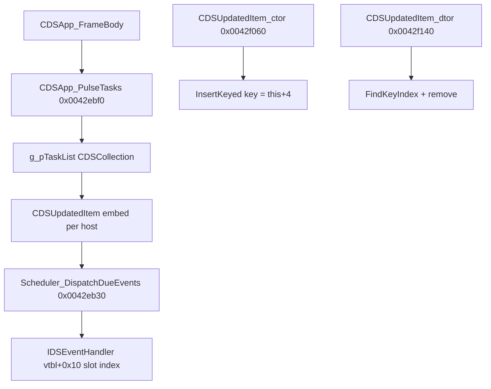

# Round 6 — Logic task 21 report

## Task

| Field | Value |
|-------|-------|
| **id** | 21 |
| **title** | Logic sim_429_436: 0x0042ea40–0x0042f140 (22 funcs) |
| **range** | sim_429_436 |
| **range_note** | `0x00429`–`0x00436`: game state, simulation, per-frame |
| **seed_address** | — (slice; first addr `0x0042ea40`) |

## Status

**PARTIAL** — Eight slice functions decompiled via Ghidra MCP `batch_decompile` before the server disconnected (`Not connected`). Remaining symbols documented from prior struct recovery (`CDSUpdatedItem`, `CDSCollection`, `round4_task_25`), [tick_system.md](../tick_system.md), [app_shell.md](../app_shell.md), `config/bulanci/mapping.csv`, and `ghidra_xrefs.jsonl`. Proposed `set_function_this_type` / `force_decompile` fixes were **not applied**; **no** `save_program`. No Frida (static evidence sufficient for scheduler/queue roles; two `FUN_*` lack caller xrefs).

## Functions

| Address | Name | Role summary | Evidence |
|---------|------|--------------|----------|
| `0x0042ea40` | `FUN_0042ea40` | **UNK role:** `__cdecl` loop `param_2` times: if `param_1!=0`, zero `*(param_1+0xc)` and `*(param_1+0x10)`; then `param_1 += 0x14` | R6 decompile; mapping.csv `uchar __cdecl(int,int)`; **no** xref in `ghidra_xrefs.jsonl` |
| `0x0042ea70` | `CDSUpdatedItem_GetTypeInfo` | Returns static meta pointer `&DAT_004b7c80` | R6 decompile `return &DAT_004b7c80`; mapping `__stdcall` |
| `0x0042ea80` | `CDSObject_AddRef` | COM **AddRef**: `vtbl+4` factory → `CheckedVirtualBaseCast(1)` → `++*(base+4)` | R6 decompile + plate comment; mapping `__fastcall` on `int*` |
| `0x0042eaa0` | `Scheduler_IsSlotLive` | `param_1 < cEventSlots` and `pEventSlots[param_1] != 0` | R6 decompile reads `this+0x10`, `this+0xc`; matches [CDSUpdatedItem.md](../struct_recovery/CDSUpdatedItem.md) `cEventSlots` / `pEventSlots` |
| `0x0042eac0` | `Scheduler_FreeSlotIfLive` | If slot live: `Runtime_Free` entry, clear slot pointer | R6 decompile; callee `Scheduler_IsSlotLive`; uses `this+0xc` slot array — **mis-typed `CBulanek *`** in decompiler |
| `0x0042eb00` | `CDSUpdatedItem_ReleaseSchedulerAndAudioBank` | Descending index loop frees live slots, then `CDSPtrSlotVec_Resize(&pEventSlots, 0)` | R6 decompile (loop is `cEventSlots` down-count once `this` is `CDSUpdatedItem *`; current decomp shows bogus `vftable_IDSReferenced` walk from wrong `CBulanek *`) |
| `0x0042eb30` | `Scheduler_DispatchDueEvents` | Reverse-walk `pEventSlots[0..cEventSlots-1]`; due when `g_dwElapsedMs >= lastFire+delay` and flag bit0 clear; fires `vtable+0x10(slotIndex)`; recurring advances `lastFire += delay`; else frees slot | R6 decompile; [tick_system.md](../tick_system.md); `Runtime_Free` pool `0x4b7c94` @ `0x0042eb84` (xrefs cache) |
| `0x0042ebb0` | `Scheduler_EnsureCapacity` | Grow `CDSPtrSlotVec` @ `this+0xc` to `param_1`, zero new pointer slots | R6 decompile → `CDSPtrSlotVec_Resize((CDSPtrSlotVec *)(this+0xc), …)` |
| `0x0042ebf0` | `CDSApp_PulseTasks` | Per-frame: walk `g_pTaskList`, dispatch schedulers on live `CDSUpdatedItem` nodes | [tick_system.md](../tick_system.md); [app_shell.md](../app_shell.md) `CDSApp_FrameBody`; mapping `__stdcall` |
| `0x0042ec40` | `CStartGame2_EnqueueEvent` | `__thiscall` enqueue on lobby modal (`CStartGame2 *`, msg/submsg, two `uint` payloads) | MCP `get_function_by_address`; audio completion → `EnqueueEvent(pEventTarget, 0x200, 1, player, 0)` ([pass_r4_CDSAudioPlayer_report.md](../struct_recovery/pass_r4_CDSAudioPlayer_report.md)) |
| `0x0042ec90` | `FUN_0042ec90` | **UNK:** `__thiscall` `undefined4 FUN_0042ec90(void *this, undefined4 *param_1)` (34 B) | MCP signature only; mapping `uint FUN_0042ec90(uint*)`; no disasm/decompile this pass |
| `0x0042ecc0` | `FUN_0042ecc0` | **UNK symbol:** posts UI/custom event to parent hub (`param_1` often `parent+0x10`, msg `0x400`, sub-id e.g. `0xd1`) | [pass_r4_CColorSet_report.md](../struct_recovery/pass_r4_CColorSet_report.md) `0x0040cc60`; [CScrollBar.md](../struct_recovery/CScrollBar.md) after `SetValue`; mapping `__cdecl` |
| `0x0042ecf0` | `CDSQueue_Push` | Ring-buffer push for `g_pEventQueue` (20-byte records) | [app_shell.md](../app_shell.md) ← `CDSEventHandler_EnqueueEvent@0x0042f3e0`; mapping `__thiscall` |
| `0x0042ed70` | `CDSQueue_PopDiscard` | Drop head / stale queue entry | [app_shell.md](../app_shell.md) `CDSApp_PollEventQueue` + null-target discard |
| `0x0042eda0` | `CDSQueue_PopCopy` | Copy-out one event for dispatch | [app_shell.md](../app_shell.md) `CDSApp_DispatchOneEvent` |
| `0x0042ee20` | `CDSQueue_Peek` | Non-destructive queue inspect | [app_shell.md](../app_shell.md) poll path |
| `0x0042ee40` | `CDSQueue_SetCapacity` | Resize queue storage via `Runtime_Free` / alloc pool `DAT_004b7c94` | xrefs cache @ `0x0042ee5a`, `0x0042ee92`; mapping `__thiscall` |
| `0x0042eeb0` | `CDSStaticTexts::factory` | Heap factory: stamp vtables `0x486cc4` / `0x486cb0` on new object | xrefs cache; mapping `CDSStaticTexts::factory` |
| `0x0042ef00` | `InitializeByClassId` | Deserialize factory dispatch: `classId < 0x1000` → `g_apClassByIdTable[id]` else walk `g_pClassRegHead`; `CALL [entry+0xc]` | [round4_task_25_report.md](../struct_recovery/round4_task_25_report.md); asm `PUSH 0x4870bc` @ `0x0042ef89` (xrefs cache) |
| `0x0042eff0` | `CGame::BroadcastEvent` | Local event hub dispatch on `CGame` (`pEventHub` @ `+0x1c`): e.g. chat `0xe1` before net send | [lobby_ui.md](../../gameplay/lobby_ui.md); [CGame.md](../struct_recovery/CGame.md) |
| `0x0042f060` | `CDSUpdatedItem_ctor` | Init scheduler facet `+4..+14`; register **`this+4`** in `g_pTaskList` (`CDSCollection_InsertKeyed`) | [CDSUpdatedItem.md](../struct_recovery/CDSUpdatedItem.md); [CDSCollection.md](../struct_recovery/CDSCollection.md) asm `LEA EDI,[ESI+4]`; xrefs cache vtable `0x4870ac` |
| `0x0042f140` | `CDSUpdatedItem_dtor` | Remove `this+4` from `g_pTaskList`; free slots; teardown IDSChained facet vtable `0x47f6a8` | [CDSCollection.md](../struct_recovery/CDSCollection.md) `FindKeyIndex@0x0042f182`; xrefs cache |

### Scheduler + task list (proven wiring)

- **`CDSUpdatedItem`** fields used by this slice: `pEventSlots@+0xc`, `cEventSlots@+0x10`, `bIsLive@+0x14` ([CDSUpdatedItem.md](../struct_recovery/CDSUpdatedItem.md)).
- **Heap event slot** nodes (`0x1c` B) allocated by `Scheduler_RegisterEventSlot@0x0042f210` (next task slice) — dispatch reads at least `lastFire`, `delayMs`, `flags` (R6 decompile @ `0x0042eb30`).

### Engine event queue (caller contract)

| API | Consumer | Proven role |
|-----|----------|-------------|
| `CDSQueue_Push` | `CDSEventHandler_EnqueueEvent` | Enqueue 20 B records into `g_pEventQueue` |
| `CDSQueue_Peek` / `PopDiscard` | `CDSApp_PollEventQueue` | Drain stale / null-target entries |
| `CDSQueue_PopCopy` | `CDSApp_DispatchOneEvent` | Copy one event → `IDSEventHandler::DispatchEvent` |

## Ghidra deltas

**none applied** (MCP disconnected after first `batch_decompile`). Recommended next session:

| Action | Address | Target / note |
|--------|---------|----------------|
| `set_function_this_type` | `0x0042eaa0`, `0x0042eac0`, `0x0042eb00`, `0x0042ebb0` | `CDSUpdatedItem *` (not `CBulanek *` / wrong CDSObject view) |
| `set_function_this_type` | `0x0042eb30` | `CDSUpdatedItem *` — `__fastcall` first arg is embed scheduler |
| `set_function_prototype` | `0x0042eb30` | `void __fastcall Scheduler_DispatchDueEvents(CDSUpdatedItem *this)` |
| `set_function_prototype` | `0x0042ea80` | `void __fastcall CDSObject_AddRef(int *pObject)` (keep global namespace if required) |
| `force_decompile` | above + `0x0042ebf0`–`0x0042f140` | Refresh after `this` fix |
| `set_decompiler_comment` | `0x0042eb30` | Slot due test uses `g_dwElapsedMs`; recurring flag bit `0x04` |
| `set_decompiler_comment` | `0x0042f060`, `0x0042f140` | Task-list key is `&this->pVftable_IDSEventHandler` (`this+4`) |

Then one `save_program bulanci.exe`.

## Frida

**none** — scheduler dispatch and queue wiring are visible in decompile + existing asm notes. **`FUN_0042ea40` / `FUN_0042ec90`** need xref discovery first (Ghidra `get_xrefs_to` or static call-graph) before a targeted hook script is justified.

## Remaining UNK

- **`FUN_0042ea40`** — mechanical zero of `+0xc`/`+0x10` every `0x14` bytes; **no** documented caller; stride does not match `sizeof(CDSUpdatedItem)==0x18`.
- **`FUN_0042ec90`** — sits between `CStartGame2_EnqueueEvent` and `FUN_0042ecc0`; no decompile/xref proof this pass.
- **`FUN_0042ecc0`** — behavior evidenced at call sites only; public rename deferred (R5 w34: namespace not reparented).
- **Queue object layout** (`g_pEventQueue` head fields, ring indices) — API roles proven via [app_shell.md](../app_shell.md); internal struct not opened in this slice.
- **Fresh decompile** for `0x0042ebf0`–`0x0042f140` (14 funcs) blocked on MCP reconnect.

## Evidence paths consulted

- [ROUND6_LOGIC_PROTOCOL.md](../ROUND6_LOGIC_PROTOCOL.md)
- [struct_recovery/AGENT_PROTOCOL.md](../struct_recovery/AGENT_PROTOCOL.md)
- [struct_recovery/CDSUpdatedItem.md](../struct_recovery/CDSUpdatedItem.md)
- [struct_recovery/CDSCollection.md](../struct_recovery/CDSCollection.md)
- [struct_recovery/CDSPtrSlotVec.md](../struct_recovery/CDSPtrSlotVec.md)
- [struct_recovery/round4_task_25_report.md](../struct_recovery/round4_task_25_report.md)
- [tick_system.md](../tick_system.md)
- [app_shell.md](../app_shell.md)
- [main_menu.md](../../main_menu.md), [player_controls.md](../player_controls.md) (manifest; no new claims)
