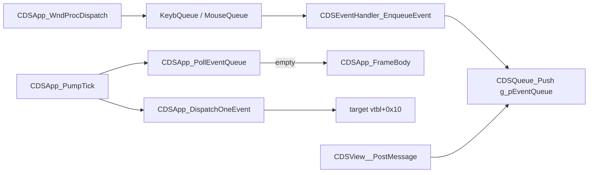

# Round 6 — Logic task 22 report

## Task

| Field | Value |
|-------|-------|
| **id** | 22 |
| **title** | Logic sim_429_436: 0x0042f1e0–0x0042f780 (22 funcs) |
| **range** | sim_429_436 |
| **range_note** | `0x00429`–`0x00436`: game state, simulation, per-frame |
| **seed_address** | — (slice; first addr `0x0042f1e0`) |

## Status

**DONE** — All 22 addresses decompiled via Ghidra MCP `batch_decompile`. Applied three renames and six `set_function_this_type` fixes on scheduler APIs; one `save_program bulanci.exe`. Scheduler arm/ack semantics cross-checked with [main_menu_hover_audio.md](../../gameplay/main_menu_hover_audio.md) (prior Frida). No new Frida script required.

## Functions

| Address | Name | Role summary | Evidence |
|---------|------|--------------|----------|
| `0x0042f1e0` | `Scheduler_GetEventSlot` | Return heap slot pointer when `slotIndex < cEventSlots` and entry non-NULL | Decompile; `this->pEventSlots[slotIndex]`; disasm `EDI+0xc` / `EDI+0x10` @ `0x0042f232` |
| `0x0042f210` | `Scheduler_RegisterEventSlot` | Grow slot vector; alloc `0x1c` B record; seed lastFire (bit1→`g_dwElapsedMs`), delay, flags, pending=1 if flag bit0, owner+index | Decompile after `CDSUpdatedItem *` fix; disasm `PUSH 0x1c` / `MOV [EBX],EAX` @ `0x0042f238`; [anim_runtime.md](../anim_runtime.md) |
| `0x0042f290` | `Scheduler_SetEventLastFireMs` | Write slot `[+0]`; `param_2 == -1` → `g_dwElapsedMs` | Decompile; [CEdit_OnKeyDown.md](../CEdit_OnKeyDown.md) caller |
| `0x0042f2d0` | `Scheduler_SetEventDelayMs` | Write slot `[+4]` delay (ms) | Decompile; [tick_system.md](../tick_system.md) |
| `0x0042f300` | `Scheduler_ArmSlot` | `slot[+8] \|= 1`; `slot[+0xc]++` — suppresses periodic dispatch, enables manual-trigger gates | Decompile + plate comment; [main_menu_hover_audio.md](../../gameplay/main_menu_hover_audio.md) Frida |
| `0x0042f330` | `Scheduler_AckSlot` | If armed: dec pending; at zero clear bit0; if flag bit1 set, stamp `lastFire` from `g_dwElapsedMs` or delta | Decompile; paired with `TM_Play`; Frida doc above |
| `0x0042f390` | `CDSView__PostMessage` | Filter by handler mask `*(this+4) & msg_id`; pack 20 B `{target, msg_id, code, arg0, arg1}` → `CDSQueue_Push(g_pEventQueue)` | Decompile; [app_shell.md](../app_shell.md) |
| `0x0042f3e0` | `CDSEventHandler_EnqueueEvent` | Same mask test on `ECX+4`; store target in record; push to global queue | Disasm `TEST [ECX+4],DX` @ `0x0042f3e8`; caller `CDSApp_KeybQueue` / `MouseQueue` |
| `0x0042f410` | `CDSApp_PollEventQueue` | Walk queue count @ `g_pEventQueue+8`; peek head; discard null-target entries | Decompile; [app_shell.md](../app_shell.md) `CDSApp_PumpTick` |
| `0x0042f460` | `CDSApp_DispatchOneEvent` | `CDSQueue_PopCopy` then `(*target->vtbl+0x10)(record)` | Decompile; pump drains one engine event per tick |
| `0x0042f4b0` | `CBulanci_AssignResourceIndexSlot` | Grow global `DAT_004b7c10` ptr vector; store object at index; bump live count `DAT_004b7bf8` | Decompile; xref `DAT_004b7c10` @ `0x0042f4c4`; [CGunMouse.md](../struct_recovery/CGunMouse.md) |
| `0x0042f530` | `CBulanci_ReleaseResourceIndexSlots` | **Renamed** from `FUN_0042f530`. Release each non-NULL entry via vtable+8; shrink vector to 0 | Decompile; sole caller `CDSApp_dtor@0x0042b57c`; pairs with `AssignResourceIndexSlot` |
| `0x0042f590` | `CDSView_PostMessage_NullSafe` | Null-check wrapper → `CDSView__PostMessage` | Decompile; `CDSApp_FrameBody` WM_QUIT synthetic close |
| `0x0042f5c0` | `CDSQueue_Init` | If queue empty: `CDSQueue_SetCapacity`; zero write index @ `+0xc` | Decompile; called from `CDSEventHandler_ctor` first init |
| `0x0042f5f0` | `Scheduler_PopHook` | Binary-search int list @ `this+4`; remove one matching value | Decompile; disasm pair with PushHook in `CGame_StartGame@0x00413f90` |
| `0x0042f620` | `Scheduler_PushHook` | **Renamed** from `FUN_0042f620`. `CIntListInsertSortedOrAppend(this+4, value, NULL, 1)` on event hub | Disasm `ADD ECX,4` @ `0x0042f629`; xrefs `CGame_StartGame@0x00413f35/0x00413fdc`, `CMenu_ShowLobby@0x004147f3`; [main_menu.md](../../main_menu.md) |
| `0x0042f640` | `CDSEventHandler_ctor` | Zero flags @ `+4`; on first handler: alloc `g_pEventQueue` (16 B) + `CDSQueue_Init(..., 0x100)` | Decompile; ref-count `DAT_004b7bf4` |
| `0x0042f690` | `CDSEventQueue_ClearForTarget` | Scan queue; null records matching target; last handler frees queue | Decompile; dtor paths on views |
| `0x0042f6f0` | `Runtime_MallocOrThrow` | `_malloc`; `Runtime_ThrowBadAlloc` on failure | Decompile; pool arg `this` selects heap tag |
| `0x0042f720` | `Runtime_Free` | `_free` wrapper | Decompile |
| `0x0042f730` | `Runtime_ReallocOrThrow` | **Renamed** from `FUN_0042f730`. `size==0` → free; else `_realloc` or fresh malloc | Decompile; 16+ callers (`CDSPtrSlotVec_Resize`, `CDSQueue_SetCapacity`, …) |
| `0x0042f780` | `CDSChained_LinkIntrusiveNode` | Splice intrusive node: write prev/next @ `+0xc`/`+0x8`; link neighbors | Decompile; disasm @ `0x0042f780`–`0x0042f797` ([round5_worker_08_report.md](../struct_recovery/round5_worker_08_report.md)) |

### Heap event slot layout (`0x1c` bytes, proven @ `Scheduler_RegisterEventSlot`)

| Offset | Field | Set in `RegisterEventSlot` |
|--------|-------|----------------------------|
| `+0x00` | `lastFireMs` | `0` or `g_dwElapsedMs` if `eventKind & 2` |
| `+0x04` | `delayMs` | argument |
| `+0x08` | `flags` | `eventKind` (bits 0/1/2 = arm / stamp / recurring) |
| `+0x0c` | `pendingCount` | `1` if `eventKind & 1`, else `0` |
| `+0x10` | `pOwner` | `this` (`CDSUpdatedItem *`) |
| `+0x14` | `slotIndex` | index |
| `+0x18` | `_pad` | `0` |

Arm/ack manipulate `+0x08` bit0 and `+0x0c` as documented in [main_menu_hover_audio.md](../../gameplay/main_menu_hover_audio.md).

### Engine event pump (proven wiring)

Modal hook stack on `CGame.pEventHub` (`+0x1c`): `Scheduler_PushHook` before nested modal work, `Scheduler_PopHook` after (`CGame_StartGame` disasm @ `0x00413f32`–`0x00413f90`).

## Ghidra deltas

| Action | Address | Detail |
|--------|---------|--------|
| `rename_function_by_address` | `0x0042f620` | `FUN_0042f620` → `Scheduler_PushHook` |
| `rename_function_by_address` | `0x0042f530` | `FUN_0042f530` → `CBulanci_ReleaseResourceIndexSlots` |
| `rename_function_by_address` | `0x0042f730` | `FUN_0042f730` → `Runtime_ReallocOrThrow` |
| `set_function_this_type` | `0x0042f1e0`–`0x0042f330` (6 funcs) | `CDSUpdatedItem *` — fields `pEventSlots@+0xc`, `dwEventSlots@+0x10` |
| `save_program` | — | `bulanci.exe` (once) |

**Not applied (deferred):** `CDSEventHandler_EnqueueEvent@0x0042f3e0` still decompiles with wrong host type (`CBulanci *`); disasm proves `ECX+4` event-handler mask — needs dedicated `IDSEventHandler`/`CDSEventHandler` struct reparent. `Scheduler_EnsureCapacity` / `Scheduler_FreeSlotIfLive` callees remain mis-typed (`CBulanek *`) — task 21 slice.

## Frida

**none** — scheduler arm/ack gate already verified in `scripts/frida/menu_hover_audio_trace.js` (cited by [main_menu_hover_audio.md](../../gameplay/main_menu_hover_audio.md)). Event queue poll/dispatch is fully static from decompile + [app_shell.md](../app_shell.md).

## Remaining UNK

- **`CDSEventHandler_EnqueueEvent` this type** — mask at `+4` proven; Ghidra host class wrong.
- **Event hub object @ `CGame+0x1c`** — PushHook/PopHook list at `+4`; no dedicated struct name in Ghidra.
- **`g_pEventQueue` ring layout** — head fields at `+0/+4/+8/+0xc` inferred from queue helpers (task 21); internal capacity growth not re-opened here.
- **`Scheduler_RegisterEventSlot` callee** `Scheduler_FreeSlotIfLive` — still typed `CBulanek *` in decompiler after partial `this` fix upstream.

## Evidence paths consulted

- [ROUND6_LOGIC_PROTOCOL.md](../ROUND6_LOGIC_PROTOCOL.md)
- [struct_recovery/AGENT_PROTOCOL.md](../struct_recovery/AGENT_PROTOCOL.md)
- [tick_system.md](../tick_system.md)
- [app_shell.md](../app_shell.md)
- [anim_runtime.md](../anim_runtime.md)
- [struct_recovery/CDSUpdatedItem.md](../struct_recovery/CDSUpdatedItem.md)
- [struct_recovery/CDSChain.md](../struct_recovery/CDSChain.md)
- [struct_recovery/CGame.md](../struct_recovery/CGame.md)
- [gameplay/main_menu_hover_audio.md](../../gameplay/main_menu_hover_audio.md)
- [main_menu.md](../../main_menu.md), [player_controls.md](../player_controls.md)
