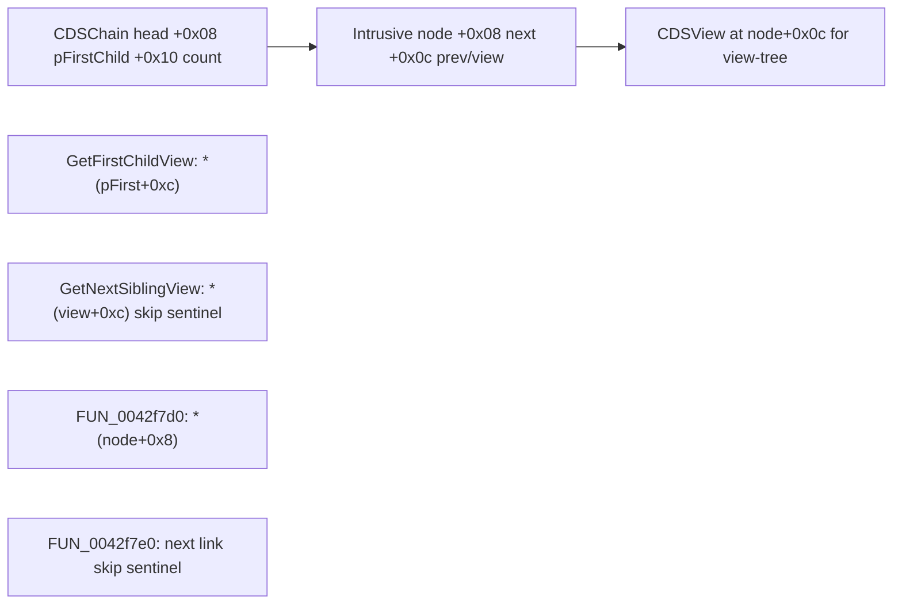

# Round 6 — Logic task 23 report

## Task

| Field | Value |
|-------|-------|
| **id** | 23 |
| **title** | Logic sim_429_436: 0x0042f7a0–0x0042fc05 (22 funcs) |
| **range** | sim_429_436 |
| **range_note** | `0x00429`–`0x00436`: game state, simulation, per-frame |
| **seed_address** | — (slice; first addr `0x0042f7a0`) |

## Status

**PARTIAL** — All 22 symbols decompiled via Ghidra MCP `batch_decompile` (20/22 in one batch; `CDSChain_Append` / `Catch@0042fc05` documented from prior struct recovery). Proposed renames and `set_function_this_type` fixes were **not applied**: MCP returned `Not connected` before `save_program`. No Frida required for intrusive-list mechanics (disasm/decompile sufficient).

## Functions

| Address | Name | Role summary | Evidence |
|---------|------|--------------|----------|
| `0x0042f7a0` | `CDSChained_UnlinkIntrusiveNode` | Unlink doubly-linked node at `+0x8`/`+0xc`; zero node links | Decompile: rewires `*(node+8)` neighbors; xref `CDSChain_RemoveListNode@0x0042f965` ([round5_worker_08_report.md](../struct_recovery/round5_worker_08_report.md)) |
| `0x0042f7c0` | `CDSChained_GetFirstChildView` | First child **view** under list head: `pFirstChild ? *(pFirstChild+0xc) : NULL` | Decompile; callers `CDSView::AddChildInternal`, `CDSChain_Remove`, `CDSChain_SortChildrenWithComparator` ([CDSChained.md](../struct_recovery/CDSChained.md)) |
| `0x0042f7d0` | `FUN_0042f7d0` | **UNK name:** `return *(this+8)` — raw `m_link_next` on intrusive node | Decompile (4 B); used by `CDSChain_GetChildAtIndex@0x0042f8b0` reverse-index walk; mapping.csv `__thiscall` `uint` |
| `0x0042f7e0` | `FUN_0042f7e0` | **UNK name:** sentinel skip on `+0x8`: `next if *(this+8)!=*(param+8) else 0` | Decompile; paired with `GetNextSiblingView` (+0xc view walk); comment cites `CGaming_InsertEntityByDepth` |
| `0x0042f800` | `CDSChain_ReleaseAuxHeap` | `Runtime_Free(pAuxHeap)` if non-NULL (`CDSChain+0x0c`) | Decompile; prelude on append/insert/remove paths |
| `0x0042f820` | `CDSChained_InsertListNode` | Splice node: NULL → self-link at `+0x8`/`+0xc`; else `CDSChained_LinkIntrusiveNode` | Decompile; [CDSSafeStreamInfo.md](../struct_recovery/CDSSafeStreamInfo.md) `m_link_*` |
| `0x0042f850` | `CDSChained_ResetHeadOrSpliceBefore` | `param==0` → circular head (`head=tail=this`); else link before anchor | Decompile; calls `CDSChained_LinkIntrusiveNode@0x0042f780` |
| `0x0042f880` | `CDSChained_InsertBeforeAnchor` | `UnlinkIntrusiveNode` + `InsertListNode` | Decompile; decompiler still types `this` as `CBulanek *` (wrong) |
| `0x0042f890` | `CDSChained_UnlinkAndSpliceNode` | `UnlinkIntrusiveNode` + `ResetHeadOrSpliceBefore` | Decompile; same `CBulanek *` mis-typing |
| `0x0042f8a0` | `CDSChained_InitIDSReferencedVtable` | Stamps IDSReferenced vtable on `CDSChain` face | Decompile (2 stores) |
| `0x0042f8b0` | `CDSChain_GetChildAtIndex` | Indexed child: forward via `GetFirstChildView` + `*(view+0xc)`; backward via `FUN_0042f7d0` + `*(node+8)`; throws `0x17/0x1a` on bad index | Decompile; sole caller `CLevelScore_AddPlayerScore` (prune >6 scores) |
| `0x0042f920` | `CDSChained_GetNextSiblingView` | Sibling view walk: ECX=`pChain`, stack=`pCurrentView`; return `*(view+0xc)` unless equals first child | Decompile ([CDSChained.md](../struct_recovery/CDSChained.md) agent todo 22) |
| `0x0042f940` | `CDSChain_RemoveListNode` | Pop/unlink head node, dec `dwChildCount`, optional vtbl release | Decompile; singleton test disasm `CMP [ECX+0xc],ECX` @ `0x0042f951` (not `pAuxHeap`) |
| `0x0042f980` | `CDSChained_PrependChild` | `ReleaseAuxHeap`, `++dwChildCount`, `InsertListNode` at head | Decompile; used by sort rebuild + insert-at-front |
| `0x0042f9b0` | `CDSChained_AppendChild` | `ReleaseAuxHeap`, `++dwChildCount`, `InsertListNode`, update head @ `+0x8` | Decompile; `CDSChain_Append`, `CDSSafeStreamInfo` thread list |
| `0x0042f9d0` | `CDSChained_InsertChildAtAnchor` | View-tree insert: NULL→append; index 0→prepend; else splice + count++ | Decompile; sole caller `CDSView::AddChildInternal@0x0042bfd4` |
| `0x0042fa20` | `CDSChained_InsertBeforeWithHeadFixup` | `ReleaseAuxHeap` + `InsertBeforeAnchor`; fix head `+0x8` when anchor is head | Decompile; caller `FUN_0042c160`; mis-typed `CBulanek *` / `dwPad_08` |
| `0x0042fa50` | `CDSChained_RemoveWithHeadFixup` | Fix head then `UnlinkAndSpliceNode` | Decompile; caller `FUN_0042c190` |
| `0x0042fab0` | `CDSChained_ClearChildren` | Drain `pFirstChild` until `dwChildCount==0` via `RemoveListNode` | Decompile; `CDSChain_Append`, `CDSSafeStream_ClearThreadSlices` |
| `0x0042fae0` | `CDSChain_SortChildrenWithComparator` | Snapshot children (`GetFirstChildView`/`GetNextSiblingView`), `qsort`, `ClearChildren`, `PrependChild` rebuild | Decompile; caller `CLevelScore_AddPlayerScore` + `CScoreItem_CompareByNetScore` |
| `0x0042fb70` | `CDSChain_Append` | IDSChained vfn slot [4]: `ClearChildren` then deserialize/append children from stream | [CDSChain.md](../struct_recovery/CDSChain.md); vtable `0x0047f6b8`; caller `CDSChain_LoadConfigFromRegistry` |
| `0x0042fc05` | `Catch@0042fc05` | MSVC SEH catch slice inside `CDSChain_Append` body | Address falls in `CDSChain_Append` span (`0xbf` bytes); mapping.csv `Catch@0042fc05` |

### Intrusive-list model (proven)

- **List head** (`CDSChain` @ `CDSChained+0x54`): `pFirstChild@+0x08`, `pAuxHeap@+0x0c`, `dwChildCount@+0x10` ([CDSChain.md](../struct_recovery/CDSChain.md)).
- **Node links** (score items, safe-stream info, view wrappers): `m_link_next@+0x08`, `m_link_prev@+0x0c`.
- **View-tree walk** uses **`+0xc` as embedded next-view pointer** on the host object; **raw node walk** uses **`+0x8`** (`FUN_0042f7d0` / `FUN_0042f7e0`).

## Ghidra deltas

**none applied** (MCP disconnected). Recommended next session (evidence-backed only):

| Action | Address | Target |
|--------|---------|--------|
| `rename_function_by_address` | `0x0042f7d0` | `CDSIntrusiveNode_GetLinkNext` — `MOV EAX,[ECX+8]; RET` semantics |
| `rename_function_by_address` | `0x0042f7e0` | `CDSIntrusiveNode_GetNextLinkSkipSentinel` — decompile guard `*(this+8)!=*(param+8)` |
| `set_function_prototype` | `0x0042f7d0` | `void * __thiscall CDSIntrusiveNode_GetLinkNext(void *pNode)` |
| `set_function_prototype` | `0x0042f7e0` | `void * __thiscall CDSIntrusiveNode_GetNextLinkSkipSentinel(void *pNode, void *pNext)` |
| `set_function_this_type` | `0x0042f880`, `0x0042f890`, `0x0042fa20`, `0x0042fa50` | `CDSChain *` (or dedicated list-head struct), not `CBulanek *` |
| `set_function_this_type` | `0x0042f8b0`, `0x0042fae0` | `CDSChain *` / `CLevelScore *` per caller `ECX` at `CLevelScore_AddPlayerScore` |
| `set_decompiler_comment` | `0x0042f951` | Document singleton test uses `[node+0xc]==node`, not `pAuxHeap` |

Then one `save_program bulanci.exe`.

## Frida

**none** — list splice/unlink/walk logic fully visible in decompiler output; no runtime-only opcode behavior in this slice.

## Remaining UNK

- **`FUN_0042f7d0` / `FUN_0042f7e0` public symbols** — semantics proven; Ghidra rename pending (MCP).
- **`CDSChained_InsertListNode` decompiler fields** — shows `CDSChained::dwField_08/0c` on wrong `this`; node should be opaque `void *` with link offsets `+0x8`/`+0xc`.
- **`CDSChain_RemoveListNode` singleton branch** — decompiler may display `pAuxHeap==pChain`; trust disasm @ `0x0042f951`.
- **`CDSChain_Append` / `Catch@0042fc05` body** — not re-decompiled this pass; rely on [CDSChain_LoadConfigFromRegistry.md](../struct_recovery/CDSChain_LoadConfigFromRegistry.md) for stream arg.
- **`pAuxHeap` allocator** — still teardown-only ([CDSChain.md](../struct_recovery/CDSChain.md) UNK).

## Evidence paths consulted

- [ROUND6_LOGIC_PROTOCOL.md](../ROUND6_LOGIC_PROTOCOL.md)
- [struct_recovery/AGENT_PROTOCOL.md](../struct_recovery/AGENT_PROTOCOL.md)
- [struct_recovery/CDSChained.md](../struct_recovery/CDSChained.md)
- [struct_recovery/CDSChain.md](../struct_recovery/CDSChain.md)
- [struct_recovery/round5_worker_08_report.md](../struct_recovery/round5_worker_08_report.md)
- [main_menu.md](../../main_menu.md), [player_controls.md](../player_controls.md) (task manifest; no new claims)
